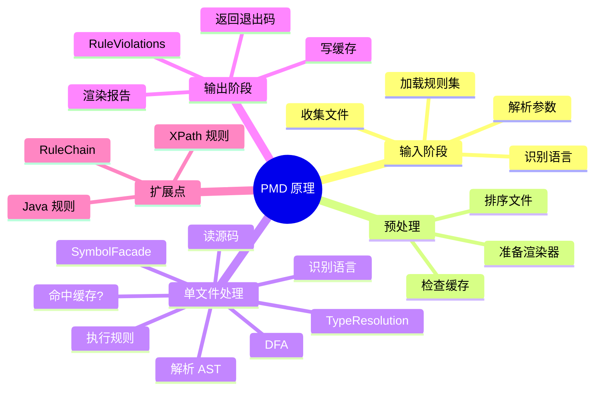

# PMD 静态分析原理与工作流：从源码到 AST、符号表、DFA、规则执行

## 记忆卡片摘要（快速复习版）

### 1. 大纲（压缩版）

- 静态分析到底是什么
- PMD 的工作总流程
- AST、符号表、DFA、类型解析各干什么
- RuleChain 是什么，为什么能提速
- 一条规则是怎样命中文件的
- PMD 的分析边界在哪

### 2. 思维导图（Mermaid）



### 3. 重要知识点（必须记住）

- PMD 的处理主入口是 `PmdAnalysis`，流程包括解析参数、加载规则、确定语言、确定文件、准备渲染器、检查缓存、逐文件分析、输出报告、存储缓存。[来源1]
- 对单个文件，PMD 会先解析源码得到 AST，然后总会执行 `SymbolFacade` 构建作用域和声明/使用关系；如果有规则需要，再执行 DFA 和 TypeResolution。[来源1]
- 规则执行分两类：加入 RuleChain 的规则先跑，只接收自己关心的节点；其他规则再遍历 AST。[来源1][来源2]
- XPath 规则把 AST 看成 XML-like DOM；Java 规则则直接操作具体 AST 节点 API。[来源3][来源2]
- PMD 的本质是“结构化规则检查”，不是把源码当纯字符串搜索，这就是它比简单 grep 更有工程价值的原因。

### 4. 难点 / 易混点

- AST 不是程序运行后的数据结构，而是源码语法结构树。
- 符号表、数据流分析、类型解析是三层不同的语义增强。
- RuleChain 不是另一种规则语法，而是另一种更经济的遍历机制。

### 5. QA 快速复习卡片

- Q: PMD 是先运行代码再分析吗？
  A: 不是。它是静态分析，基于源码解析和规则执行。[来源1]
- Q: 所有规则都要用到 DFA 和类型解析吗？
  A: 不是。官方说明只有至少一条规则需要时才运行这些阶段。[来源1]
- Q: 为什么 `aux-classpath` 会影响结果？
  A: 因为 Java 类型解析需要知道依赖类信息，没有类路径会降低语义精度。[来源4][来源1]

### 6. 快速复现步骤（最短路径）

1. 先读 How PMD Works，记住整体流程。[来源1]
2. 再读 Writing a custom rule，理解 visitor、Node、RuleContext、RuleChain。[来源2]
3. 再读 Your first rule 和 XPath rules，理解 AST 如何映射到 XPath DOM。[来源3][来源5]
4. 最后用 `ast-dump` 看真实 AST。[来源6]

---

## 学习笔记正文（详细版）

## 0. 学习目标、读者画像与假设

- 技术：PMD 分析原理
- 学习目标：让非科班读者理解 PMD 不是“神秘黑盒”，而是一条可分解的静态分析流水线
- 读者水平：初学
- 版本范围：latest 文档体系

## 1. 静态分析先用人话解释

如果把程序比作一本还没上演的话剧，那么“运行程序”像演员真的上台演一遍；“静态分析”像导演先读剧本，检查有没有明显问题，比如台词冲突、角色未定义、道具不可能存在、某段剧情永远不会被用到。

PMD 做的就是“读剧本式分析”。它不启动你的业务系统，不模拟用户点击，也不连接真实数据库。它只是读取源码，理解源码结构，然后拿规则去对照检查。

这种方法的优点是：

- 快
- 稳定
- 易自动化
- 很适合每天跑很多次

缺点是：

- 看不到真实运行时数据
- 不一定知道某条分支在业务上是否真的会发生
- 对跨文件、跨服务、复杂框架反射场景会有限制

所以 PMD 适合做“前置守门员”，不适合被神化为“万能裁判”。

## 2. PMD 的整体工作流

官方 How PMD Works 文档几乎就是一张流程图的文字版。[来源1] 用更白话的方式重述，它大致分成三段。

### 2.1 任务准备阶段

先做几件管理动作：

- 解析命令行参数
- 加载规则集
- 判断这次涉及哪些语言
- 找出要分析的文件
- 准备报告渲染器
- 给文件排序
- 检查缓存能不能用[来源1]

这一阶段做的不是“分析代码”，而是“组织分析任务”。

### 2.2 单文件分析阶段

对每个文件，会进入更细的流水线：

1. 创建输入流
2. 确定语言
3. 看缓存里是否已有结果
4. 解析源码，生成 AST
5. 运行 SymbolFacade
6. 如有需要，运行 DFA
7. 如有需要，运行 TypeResolution
8. 执行规则，产出 RuleViolations[来源1]

### 2.3 结果输出阶段

最后：

- 把违规渲染成 text、xml、html、sarif 等格式
- 存储增量分析缓存
- 根据违规和错误情况返回退出码[来源1][来源4]

## 3. AST 是什么，为什么它是 PMD 的第一块地基

AST 是 Abstract Syntax Tree，抽象语法树。你可以把它理解成“代码的语法骨架图”。

例如：

```java
int a = 1;
```

对人眼来说，这是一行简单代码；对 PMD 来说，它会拆成很多结构节点，例如变量声明、基本类型、变量名、字面量等。

为什么非要变成树？

因为规则往往不是判断某段文本有没有某个词，而是判断“某种语法结构是否出现在某个上下文里”。例如：

- `catch` 是否为空
- 一个变量是否声明了但没使用
- 某个 JSP 表达式有没有经过转义
- 某个安全 API 的参数是不是硬编码字符串

这些都更适合在 AST 上做，而不适合用正则做。

官方 AST dump 文档给了非常直观的例子：一个简单 Java 类会被导出成 XML 结构，节点上还带着很多属性，如 `SimpleName`、`Visibility`、`VariableName` 等。[来源6] 这对理解 XPath 规则尤其关键。

## 4. SymbolFacade：为什么 PMD 不是“只会看树”

How PMD Works 说明：在解析出 AST 后，PMD 总会运行 `SymbolFacade`，它负责构建作用域、找到声明和使用关系。[来源1]

这一步非常重要。因为只有 AST 时，PMD 知道“这里有个名字叫 `a` 的节点”；有了符号信息后，它更知道：

- 这个 `a` 是局部变量、字段还是参数
- 它在哪里声明
- 在哪些地方被引用
- 它和另一个同名标识符是不是同一个东西

这就是为什么像“未使用变量”这类规则不能只靠文本搜索。你不能简单统计 `a` 出现了几次；你得知道它们是不是同一个符号。

## 5. DFA：数据流分析到底在干什么

官方说，当至少有一条规则需要时，PMD 才会运行 DFA visitor，用来构建控制流图和数据流节点。[来源1]

非科班理解法：

- AST 告诉你“代码长什么样”
- DFA 更关心“程序可能怎么走”

例如：

- `if/else` 两个分支怎么流转
- 某变量是否可能在使用前未初始化
- 某语句是否永远到达不了

它不是把程序真的跑起来，而是根据代码结构推演可能的控制路径。

## 6. TypeResolution：类型解析为什么能让规则更聪明

TypeResolution 只有在至少一条规则需要时才会运行。[来源1] 它的作用，是让 PMD 不只知道“这里调用了一个方法”，还尽量知道：

- 调用对象是什么类型
- 参数是什么类型
- 某个类继承了谁
- 某个注解、接口、方法签名的真实含义

这在 Java 中尤其重要，所以 CLI 里才有 `--aux-classpath` 参数，用来给 PMD 额外类路径帮助类型解析。[来源4]

没有类型解析时，很多规则只能看“语法长得像不像”；有类型解析时，才能更接近“语义上是不是那个东西”。

## 7. 规则执行：从哪里开始命中问题

How PMD Works 里对规则执行有个很关键的顺序说明：

- 先跑选择了 RuleChain 机制的规则
- 再跑其余规则，让它们遍历 AST
- 规则把发现的问题报告成 `RuleViolations`。[来源1]

这说明 PMD 不是“规则一个个各自从头到尾乱扫”，而是有统一调度机制。

## 8. RuleChain 是什么，为什么它更快

Writing a custom rule 解释得很清楚：如果你的规则不在乎 AST 遍历顺序，也不维护跨节点状态，那么可以用 RuleChain 显著加速。[来源2]

它的核心思想是：

- 普通规则：自己遍历整棵树，途中找到关心节点
- RuleChain 规则：提前声明“我只关心这些节点类型”，PMD 直接把这些节点推给你

这就像：

- 普通方式：你自己翻完整本书找“第 3 章所有人物名”
- RuleChain：别人先把所有人物名索引抽出来给你

因此，RuleChain 的本质是“经济遍历”，不是“规则更高级”。它对性能很关键，特别是规则多、仓库大时。

## 9. XPath 规则和 Java 规则分别怎么理解

### 9.1 XPath 规则

官方 XPath rules 文档说得很明确：XPath 规则把 AST 看成 XML-like DOM，每个 AST 节点像一个 XML 元素，部分 Java getter 会暴露成属性。[来源5]

这意味着你可以写出类似：

```xpath
//VariableId[@Name = "bill"]
```

这样的表达式去选节点。[来源3]

优点：

- 上手快
- 很适合结构匹配
- 不用写 Java 代码

局限：

- 复杂语义逻辑写起来会难受
- 性能和可维护性在复杂场景不如 Java 规则

### 9.2 Java 规则

Java 规则直接面向具体 AST API、Node 遍历和 RuleContext 报告接口。[来源2]

优点：

- 能写复杂逻辑
- 可访问更多语义信息
- 更适合复杂规则和长期维护

代价：

- 需要 Java 开发能力
- 需要编译打包并放到 PMD 运行时 classpath

## 10. RuleContext、Node、Violation 这些词到底是什么意思

### 10.1 Node

就是 AST 的节点。可能是类声明、方法声明、变量、字面量、表达式等。[来源2][来源5]

### 10.2 RuleContext

是规则报告问题的入口。Java 规则里可以通过它添加 violation，还能带自定义消息和占位符。[来源2]

### 10.3 RuleViolation

就是最终报告中的一条问题记录，例如：

- 哪个文件
- 哪一行
- 哪条规则
- 什么消息

对初学者来说，可以把它理解成“PMD 最终输出中的一行问题”。

## 11. 增量分析在流程里插在哪里

How PMD Works 和 Incremental Analysis 两页可以拼起来看：

- 任务开始时加载缓存
- 分析单文件前，先检查该文件是否已缓存且内容未变
- 若命中缓存，则可直接复用结果
- 最后再写回新缓存[来源1][来源7]

这就是为什么增量分析可以大幅提速，但又不会改变最终报告语义。[来源7]

## 12. PMD 为什么适合工程化

理解完流程后，你就会明白 PMD 为什么适合进流水线：

- 输入明确：规则集 + 文件集
- 过程可控：语言、缓存、线程、类路径
- 输出标准：多种报告格式
- 失败语义明确：退出码
- 可扩展：规则能自己写

这五点加在一起，使它不是一个“只能本地玩玩的工具”，而是一套可进入工程治理平台的基础设施。

## 13. PMD 的边界也要看清

尽管 PMD 有 AST、符号表、DFA、类型解析，但它仍有边界：

- 跨服务调用链不一定看得全
- 反射、动态生成代码可能难精确建模
- 某些安全问题需要真实运行时上下文
- 自定义框架约束若没写规则，PMD 不会自动懂

所以正确姿势是：

- 用 PMD 管静态可表达问题
- 用测试、运行时检测、人工审计补足剩余问题

## 14. 非科班记忆法：把 PMD 想成四层流水线

如果你只想记最核心的，可以记这个简化模型：

1. 读文件和规则
2. 把代码变成 AST
3. 给 AST 加上符号、数据流、类型这些“语义增强”
4. 让规则去找问题并输出报告

能把这四层讲清楚，你就已经真正理解 PMD 了。

## 15. 延伸学习路径（官方优先）

- How PMD Works。[来源1]
- Writing a custom rule。[来源2]
- Your first rule。[来源3]
- XPath rules。[来源5]
- AST dump。[来源6]
- Incremental analysis。[来源7]

---

## 练习与复习闭环

## 1. 分层练习

### 基础练习

- 用一句话解释 AST、SymbolFacade、DFA、TypeResolution。
- 说出 PMD 的整体流程至少 6 个步骤。

### 应用练习

- 解释为什么“未使用变量”不能只靠字符串匹配。
- 解释为什么 RuleChain 能提升性能。

### 综合练习

- 画出一张“从源码到 RuleViolation”的流程图，并写出每一步的输入输出。

## 2. 动手任务（带验收标准）

- 任务：读 `How PMD Works` 后，用自己的话改写为面向新人的流程说明。
- 验收标准：不使用官方原句，也能完整讲清缓存、AST、SymbolFacade、DFA、TypeResolution、规则执行和报告输出。

## 3. 常见误区纠偏

- 误区：PMD 只是 grep 升级版。
  正解：它基于 AST 和语义阶段，不是单纯文本搜索。
- 误区：所有规则都需要类型解析。
  正解：只有有规则需要时才会执行该阶段。[来源1]
- 误区：RuleChain 是另一种规则语言。
  正解：它本质是遍历优化机制。[来源2]

## 4. 复习节奏建议

- Day 1：记整体流程。
- Day 3：记 AST、符号表、DFA、类型解析的区别。
- Day 7：记 RuleChain 与普通遍历的区别。
- Day 14：尝试向别人解释 PMD 为什么比正则扫描更靠谱。

## 5. 自测题与参考答案（简版）

- 题目1：PMD 为什么先建 AST？
  参考答案：因为规则需要基于代码结构而不是纯文本工作。
- 题目2：SymbolFacade 解决什么问题？
  参考答案：建立作用域、声明和使用关系，支持更准确的语义判断。[来源1]
- 题目3：为什么 `aux-classpath` 会影响 Java 规则？
  参考答案：因为类型解析依赖类路径，缺失会降低语义分析精度。[来源4]

---

## 参考来源与版本说明

## 官方来源（优先）

1. How PMD Works: https://docs.pmd-code.org/latest/pmd_devdocs_how_pmd_works.html
2. Writing a custom rule: https://docs.pmd-code.org/latest/pmd_userdocs_extending_writing_java_rules.html
3. Your first rule: https://docs.pmd-code.org/latest/pmd_userdocs_extending_your_first_rule.html
4. PMD CLI reference: https://docs.pmd-code.org/latest/pmd_userdocs_cli_reference.html
5. Writing XPath rules: https://docs.pmd-code.org/latest/pmd_userdocs_extending_writing_xpath_rules.html
6. AST dump: https://docs.pmd-code.org/latest/pmd_userdocs_extending_ast_dump.html
7. Incremental analysis: https://docs.pmd-code.org/latest/pmd_userdocs_incremental_analysis.html

## 第三方来源（按采信程度标注）

- 无。

## 关键结论引用映射

- [来源1] -> PMD 主流程、单文件处理步骤、RuleChain 执行顺序
- [来源2] -> Java 规则、Visitor、Node、RuleContext、RuleChain 细节
- [来源3] -> 设计器与 XPath 入门工作流
- [来源4] -> CLI 与类路径、输出和工程化接口
- [来源5] -> AST 到 DOM 的映射、XPath 3.1
- [来源6] -> AST dump 的实际形态
- [来源7] -> 缓存命中与结果一致性

## 官方文档章节映射与重要例子保留检查

- How PMD Works -> 本文第 2、4、5、6、7、11 节
- Writing a custom rule -> 本文第 8、9、10 节
- Your first rule -> 本文第 9 节
- XPath rules -> 本文第 9 节
- AST dump -> 本文第 3 节
- Incremental analysis -> 本文第 11 节
- 重要例子保留说明：保留了 VariableId、AST XML、RuleChain、RuleContext 等关键例子和概念

## 冲突点与裁决（如有）

- 无显著冲突。用户文档与开发文档在此主题上互相补充。
