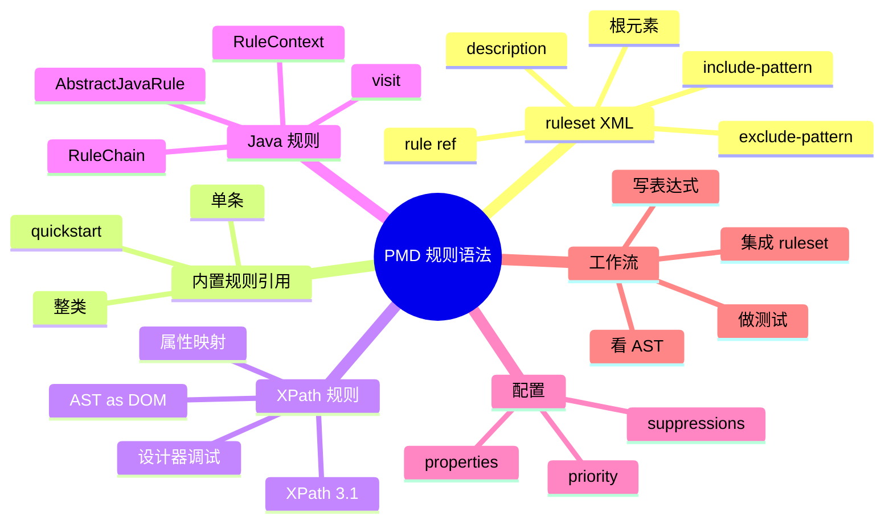

# PMD 常用规则语法全解：ruleset XML、XPath 规则、Java 自定义规则

## 记忆卡片摘要（快速复习版）

### 1. 大纲（压缩版）

- ruleset 是什么
- 内置规则如何引用
- 单条规则、整类规则、排除规则怎么写
- 文件 include / exclude 怎么写
- XPath 规则怎么写
- Java 规则怎么写
- 规则开发完整工作流

### 2. 思维导图（Mermaid）



### 3. 重要知识点（必须记住）

- PMD 的规则集是 XML 文件，官方明确建议从一开始就创建自己的 ruleset，而不是长期直接依赖通用集合。[来源1][来源2]
- 单条内置规则引用的典型形式是 `<rule ref="category/java/errorprone.xml/EmptyCatchBlock" />`。[来源1]
- 整类引用可以直接引用整个 category，再用 `<exclude name="..."/>` 去掉不想要的规则。[来源1]
- XPath 规则自 PMD 7 起使用 XPath 3.1，并把 AST 视作 XML-like DOM。[来源3]
- Java 规则通常继承 `AbstractJavaRule` 或 `AbstractJavaRulechainRule`，通过访问 AST 节点并用 `RuleContext` 报告违规。[来源4]

### 4. 难点 / 易混点

- `ruleset XML` 里的属性配置和 CLI `-P` 不是一回事。
- XPath 规则写的是“匹配 AST 节点”，不是匹配源码文本。
- 批量引用整类规则方便，但升级 PMD 时可能自动带入新增规则。[来源1]

### 5. QA 快速复习卡片

- Q: 初学应该先学 XPath 还是 Java 规则？
  A: 先学 XPath 更容易建立 AST 心智模型；复杂逻辑再转 Java 规则。[来源5][来源4]
- Q: 为什么官方建议自己建 ruleset？
  A: 因为项目差异很大，只有自定义 ruleset 才能稳定表达你的治理策略。[来源1][来源2]
- Q: 规则写好后怎么接入？
  A: 放进 ruleset；Java 规则还要编译成 jar 并加入 PMD 运行时 classpath。[来源4][来源6]

### 6. 快速复现步骤（最短路径）

1. 先写一个最小 ruleset 外壳。[来源1]
2. 加一条内置规则引用，跑通 PMD。[来源1][来源2]
3. 用 `designer` 或 `ast-dump` 观察 AST。[来源5][来源7]
4. 写一条 XPath 规则，再导出为 XML。[来源5]
5. 需要复杂逻辑时，再写 Java 规则。[来源4]

---

## 学习笔记正文（详细版）

## 0. 学习目标、读者画像与假设

- 技术：PMD 规则与 ruleset 语法
- 学习目标：让读者既会配内置规则，也会理解自定义 XPath / Java 规则的开发方式
- 读者水平：初学
- 版本范围：PMD 7 latest 文档

## 1. ruleset 是什么

官方 Making rulesets 文档的定义非常直接：ruleset 是一个 XML 配置文件，用来描述一次 PMD 运行应该执行哪些规则。[来源1]

把它讲白一点：

- PMD 程序本身像扫描引擎
- ruleset 像你的扫描计划书

没有 ruleset，PMD 不知道该看什么问题；ruleset 配得不好，PMD 结果也不会符合你的项目。

这就是为什么官方一方面提供 quickstart 这种现成集合，另一方面又强烈建议用户尽早创建自己的 ruleset。[来源1][来源2]

## 2. 最小 ruleset 外壳长什么样

官方模板如下思路：

```xml
<?xml version="1.0"?>
<ruleset name="Custom Rules"
    xmlns="http://pmd.sourceforge.net/ruleset/2.0.0"
    xmlns:xsi="http://www.w3.org/2001/XMLSchema-instance"
    xsi:schemaLocation="http://pmd.sourceforge.net/ruleset/2.0.0 https://pmd.sourceforge.io/ruleset_2_0_0.xsd">
    <description>My custom rules</description>
</ruleset>
```

你可以把这几个部分理解成：

- XML 声明：这是 XML 文件
- `ruleset` 根元素：整份配置文件的容器
- `name`：给这份规则集起名字
- `description`：给团队留说明
- `schemaLocation`：告诉工具这份 XML 应遵守哪个结构规范

初学时最重要的不是背 schema，而是知道：规则集并不是任意 XML，它有固定结构。

## 3. 内置规则如何引用

### 3.1 单条规则引用

官方示例：

```xml
<rule ref="category/java/errorprone.xml/EmptyCatchBlock" />
```

这个写法可以拆成两半看：

- `category/java/errorprone.xml`：规则类别文件
- `EmptyCatchBlock`：具体规则名[来源1]

这很像“目录 + 文件名”的组合。只不过这里的“目录”不是你的本地路径，而是 PMD 内置规则目录结构。

### 3.2 整类规则引用

官方也支持一次引用整个类别：

```xml
<rule ref="category/java/codestyle.xml">
    <exclude name="WhileLoopsMustUseBraces"/>
    <exclude name="IfElseStmtsMustUseBraces"/>
</rule>
```

这意味着你可以：

- 先把一整类装进来
- 再删掉你不想要的个别规则[来源1]

优点是快。
缺点是升级 PMD 时，这个 category 新增的规则会自动带进来。[来源1]

所以：

- 想快速起步：可用整类引用
- 想完全稳定：更建议逐条明确引用

## 4. 八大规则类别怎么理解

Making rulesets 文档说明，PMD 内置规则从 6.0.0 起统一归到八大类别：[来源1]

- Best Practices
- Code Style
- Design
- Documentation
- Error Prone
- Multithreading
- Performance
- Security

这八类可以用一句话记：

- Best Practices：常识性好习惯
- Code Style：风格统一
- Design：设计质量
- Documentation：文档注释相关
- Error Prone：易错写法
- Multithreading：并发问题
- Performance：性能坏味道
- Security：潜在安全风险

对非科班最有用的做法不是死记分类，而是学会按治理目标挑分类。例如：

- 想先降噪：先看 Best Practices、Error Prone
- 想做安全基线：补 Security
- 想做架构治理：再看 Design、Performance

## 5. 文件过滤语法怎么写

ruleset 不只决定“用哪些规则”，还可以决定“哪些文件不该被这份规则集管”。官方提供：

- `<exclude-pattern>`
- `<include-pattern>`[来源1]

它的逻辑是：

- 命中 exclude-pattern 的文件默认被排除
- 如果同时命中 include-pattern，则可以重新纳入

这在大型仓库里非常有价值。常见用途：

- 排除生成代码
- 排除第三方 vendor 目录
- 排除遗留模块
- 但保留其中少数必须继续监管的路径

## 6. 为什么官方强调自定义 ruleset

Installation 页面和 Best Practices 页面都在表达同一个思想：

- 不要长期依赖笼统的默认集合
- 不要一上来启用全部规则
- 要用你真正需要的规则，形成自己的 ruleset。[来源2][来源8]

原因很现实：

- 项目技术栈不同
- 风险偏好不同
- 老项目和新项目容忍度不同
- 团队对风格规则接受度不同

如果你不写自己的 ruleset，最终要么噪音太大，要么错过关键问题。

## 7. XPath 规则到底是什么

Your first rule 和 Writing XPath rules 两篇文档可以连起来看。[来源5][来源3]

核心思想是：

- PMD 先把源码变成 AST
- XPath 规则把这棵 AST 看成一棵 XML DOM
- 你写 XPath 表达式去选中“违规节点”

例如，官方示例中先匹配：

```xpath
//VariableId[@Name = "bill"]
```

后来再细化为类型也要满足：

```xpath
//VariableId[@Name = "bill" and ../../Type[@TypeImage = "short"]]
```

这说明 XPath 规则不是在源码里搜“bill”这个单词，而是在树上找“名字叫 bill 的变量声明节点，并且它对应的类型节点是 short”。[来源5]

## 8. 为什么说 XPath 规则适合入门

### 8.1 可视化强

配合 Rule Designer，你可以一边看 AST，一边写 XPath，一边看匹配结果。[来源5]

### 8.2 成本低

你不必写 Java 类、编译、打包，只需把 XPath 表达式导出成 XML 规则元素即可。[来源5]

### 8.3 很适合结构型规则

例如：

- 某类节点缺少某属性
- 某表达式出现在某上下文
- 某标签缺少转义或属性

但要注意，XPath 规则不是万能的。复杂语义、多步状态、跨节点推理往往更适合 Java 规则。

## 9. XPath 规则的重要语法点

Writing XPath rules 文档给了几个关键事实：[来源3]

### 9.1 PMD 7 使用 XPath 3.1

这点很重要。因为 PMD 7 前的默认版本不同，旧教程可能还是 XPath 1.0 / 2.0 语境。

### 9.2 AST 是 XML-like DOM

每个 AST 节点像一个元素。

### 9.3 部分 Java getter 暴露成 XPath 属性

例如某节点的 `SimpleName`、`Name` 等，可在 XPath 中用 `@Name` 之类访问。[来源3]

### 9.4 PMD 提供扩展函数

某些语言还有扩展函数用于访问语义信息。[来源3]

这意味着学习 XPath 规则，最关键的技能不是背 XPath 语法本身，而是学会“读 AST 节点名和属性”。

## 10. Rule Designer 的完整工作流

官方 Your first rule 文档给出了非常实用的开发流程：[来源5]

1. 写一个包含问题代码的示例片段
2. 查看 AST，找出应该报错的节点
3. 写 XPath 匹配这个节点
4. 用更多正例和反例迭代
5. 导出为 XML rule 元素并加入 ruleset

这套流程非常值得背下来，因为它其实也是“非科班开发规则”的最低摩擦路径。

## 11. Java 自定义规则怎么写

Writing a custom rule 文档说明，写 Java 规则通常要做四件事：[来源4]

1. 写一个实现 `Rule` 接口的 Java 类，实际常继承 `AbstractJavaRule`
2. 编译并链接 PMD API
3. 打包成 JAR
4. 把它放到 PMD 运行时 classpath，并在 ruleset 中声明

这意味着 Java 规则更像真正的软件开发，而不仅是配置。

## 12. Java 规则的核心编程模型

### 12.1 Visitor 模式

Java 规则通常通过 `visit` 方法访问不同节点类型。[来源4]

### 12.2 `super.visit(node, data)`

它让遍历继续向子节点递归。如果你不调用它，遍历会在当前子树停止。[来源4]

### 12.3 `RuleContext`

通过 `addViolation` 等方法上报违规。[来源4]

### 12.4 RuleChain

如果规则只关心某些节点类型，可改用 `AbstractJavaRulechainRule`，避免遍历整棵树。[来源4]

## 13. XPath 规则和 Java 规则怎么选

一个非常实用的判断表：

- 结构简单、模式明显、想快速试错：XPath
- 逻辑复杂、依赖语义、多条件组合、想长期维护：Java
- 团队缺少 Java 扩展能力但想快速固化规范：先 XPath
- 规则成为核心资产：再迁移为 Java

不是说 XPath 低级、Java 高级，而是它们适合不同问题。

## 14. 规则属性与消息

Java 规则文档说明，违规消息可以使用占位符，如 `{0}`；规则也可通过属性定制，消息里还能引用 `${propertyName}`。[来源4]

这意味着规则不是死板的。你可以做出：

- 不同阈值可配置
- 报错消息带当前阈值
- 不同项目使用同一规则实现，但参数不同

这是工程复用的关键。

## 15. 测试与落地为什么不能省

Your first rule 文档提醒：每次你拿不同代码片段试规则时，最好把它保存为测试用例。[来源5]

这是非常工程化的建议，因为规则开发最怕两件事：

- 误报
- 漏报

如果没有正例、反例和回归测试，规则越积越多后你自己也不敢升级。

## 16. 一套实用的规则开发闭环

建议按下面顺序做：

1. 先明确要抓什么问题
2. 写最小正例和反例
3. 用 designer / ast-dump 观察 AST
4. 先尝试 XPath
5. 复杂则改 Java 规则
6. 写测试
7. 挂进 ruleset
8. 在真实项目小范围试跑
9. 再进入 CI

这套顺序比“直接上生产仓扫全量”稳得多。

## 17. 常见坑

### 17.1 用整类规则引用导致升级后结果暴增

原因：新版本加入了新规则。[来源1]

### 17.2 XPath 对着源码写，而不是对着 AST 写

原因：没有先看树，导致表达式想当然。

### 17.3 Java 规则忘记处理遍历终止或状态清理

原因：不了解规则实例生命周期与 `start/end` 回调。[来源4]

### 17.4 把规则参数写到 CLI `-P`

原因：混淆渲染器属性与规则属性。

## 18. 延伸学习路径（官方优先）

- Making rulesets。[来源1]
- Installation and basic CLI usage。[来源2]
- Writing XPath rules。[来源3]
- Writing a custom rule。[来源4]
- Your first rule。[来源5]
- AST dump。[来源7]
- Defining rule properties / Testing your rules（官方扩展文档导航入口）。[来源6]

---

## 练习与复习闭环

## 1. 分层练习

### 基础练习

- 写出一个最小 ruleset 外壳。
- 写出一条内置 Java 规则引用。

### 应用练习

- 写一个批量引入某分类规则并排除两条规则的例子。
- 解释为什么 XPath 规则是在 AST 上匹配。

### 综合练习

- 从你自己的项目里挑一个团队规范，用 XPath 先尝试写出规则思路；若发现太复杂，再说明为什么应改写为 Java 规则。

## 2. 动手任务（带验收标准）

- 任务：用 designer 或 ast-dump 为一段简单 Java 代码找出 `VariableId` 节点，然后构造一个 XPath 表达式选中它。
- 验收标准：能清楚说出节点名、用到的属性和为什么表达式命中了目标。

## 3. 常见误区纠偏

- 误区：ruleset 只是“开关列表”。
  正解：它还是项目级策略文件，包含规则、排除和组织结构。
- 误区：XPath 规则匹配源码文本。
  正解：它匹配 AST DOM。[来源3]
- 误区：Java 规则一开始就比 XPath 更好。
  正解：取决于问题复杂度和团队维护成本。

## 4. 复习节奏建议

- Day 1：记住 ruleset 外壳与单条规则引用。
- Day 3：记住整类引用与排除规则。
- Day 7：记住 XPath 3.1 与 AST DOM 映射。
- Day 14：尝试自己设计一条小规则。

## 5. 自测题与参考答案（简版）

- 题目1：为什么官方建议自定义 ruleset？
  参考答案：因为项目差异很大，通用集合不能直接代表你的治理策略。[来源1][来源2]
- 题目2：为什么 XPath 规则适合入门？
  参考答案：因为可视化强、试错快、和 Rule Designer 配合好。[来源5]
- 题目3：什么时候应该从 XPath 转 Java 规则？
  参考答案：当规则需要复杂语义、状态、性能优化或长期维护时。

---

## 参考来源与版本说明

## 官方来源（优先）

1. Making rulesets: https://docs.pmd-code.org/latest/pmd_userdocs_making_rulesets.html
2. Installation and basic CLI usage: https://docs.pmd-code.org/latest/pmd_userdocs_installation.html
3. Writing XPath rules: https://docs.pmd-code.org/latest/pmd_userdocs_extending_writing_xpath_rules.html
4. Writing a custom rule: https://docs.pmd-code.org/latest/pmd_userdocs_extending_writing_java_rules.html
5. Your first rule: https://docs.pmd-code.org/latest/pmd_userdocs_extending_your_first_rule.html
6. Extending PMD 文档导航入口: https://docs.pmd-code.org/latest/
7. AST dump: https://docs.pmd-code.org/latest/pmd_userdocs_extending_ast_dump.html
8. Best Practices: https://docs.pmd-code.org/latest/pmd_userdocs_best_practices.html

## 第三方来源（按采信程度标注）

- 无。

## 关键结论引用映射

- [来源1] -> ruleset 模板、规则引用、分类、include/exclude、批量引入风险
- [来源2] -> quickstart 和自定义 ruleset 的上手入口
- [来源3] -> XPath 3.1、AST DOM、属性映射
- [来源4] -> Java 规则生命周期、visit、RuleContext、RuleChain
- [来源5] -> Rule Designer 与 XPath 规则导出流程
- [来源6] -> 扩展文档体系
- [来源7] -> AST 观察方法
- [来源8] -> 渐进规则治理原则

## 官方文档章节映射与重要例子保留检查

- Making rulesets -> 本文第 1、2、3、4、5、6 节
- Your first rule -> 本文第 7、8、10 节
- Writing XPath rules -> 本文第 7、9 节
- Writing a custom rule -> 本文第 11、12、14、15 节
- AST dump -> 本文第 10 节
- Best Practices -> 本文第 6、16 节
- 重要例子保留说明：保留了 `EmptyCatchBlock`、批量 category 引用、`VariableId` XPath 示例和 Java visit 模型

## 冲突点与裁决（如有）

- 无显著冲突。
