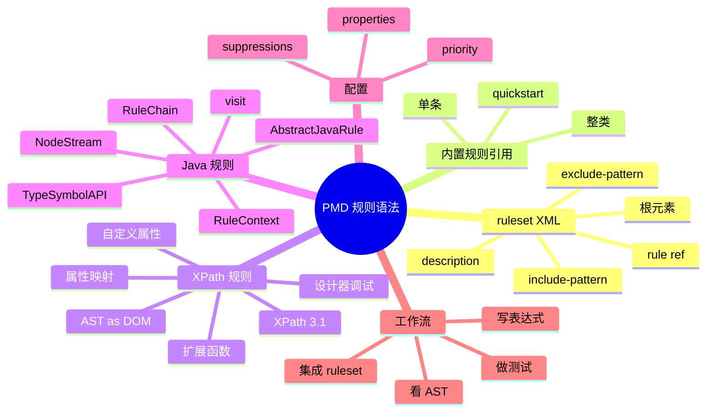

# PMD 常用规则语法全解：ruleset XML、XPath 规则、Java 自定义规则

## 记忆卡片摘要（快速复习版）

### 1. 大纲（压缩版）

- ruleset 是什么
- 内置规则如何引用
- 单条规则、整类规则、排除规则怎么写
- 文件 include / exclude 怎么写
- XPath 规则怎么写
- XPath rule XML、属性、扩展函数怎么写
- Java 规则怎么写
- Java RuleChain、NodeStream、类型/符号 API 怎么用
- 规则开发完整工作流

### 2. 思维导图（Mermaid）



### 3. 重要知识点（必须记住）

- PMD 的规则集是 XML 文件，官方明确建议从一开始就创建自己的 ruleset，而不是长期直接依赖通用集合。[来源1][来源2]
- 单条内置规则引用的典型形式是 `<rule ref="category/java/errorprone.xml/EmptyCatchBlock" />`。[来源1]
- 整类引用可以直接引用整个 category，再用 `<exclude name="..."/>` 去掉不想要的规则。[来源1]
- XPath 规则自 PMD 7 起使用 XPath 3.1，并把 AST 视作 XML-like DOM。[来源3]
- XPath 规则在 ruleset 中本质上是一条 `class="net.sourceforge.pmd.lang.rule.xpath.XPathRule"` 的规则，XPath 表达式放在名为 `xpath` 的 property 里。[来源5]
- Java 规则通常继承 `AbstractJavaRule` 或 `AbstractJavaRulechainRule`，通过访问 AST 节点并用 `RuleContext` 报告违规。[来源4]
- Java 规则如果需要语义判断，应该优先使用 Java 语言文档里的 symbol table、type resolution、metrics API，而不是自己靠字符串猜类型。[来源9]

### 4. 难点 / 易混点

- `ruleset XML` 里的属性配置和 CLI `-P` 不是一回事。
- XPath 规则写的是“匹配 AST 节点”，不是匹配源码文本。
- XPath 属性来自 AST 节点公开的 getter，属性值会转换成 XPath/XDM 类型，所以布尔、整数、字符串、集合比较要按 XPath 语义理解。[来源3]
- 批量引用整类规则方便，但升级 PMD 时可能自动带入新增规则。[来源1]

### 5. QA 快速复习卡片

- Q: 初学应该先学 XPath 还是 Java 规则？
  A: 先学 XPath 更容易建立 AST 心智模型；复杂逻辑再转 Java 规则。[来源5][来源4]
- Q: 为什么官方建议自己建 ruleset？
  A: 因为项目差异很大，只有自定义 ruleset 才能稳定表达你的治理策略。[来源1][来源2]
- Q: 规则写好后怎么接入？
  A: 放进 ruleset；Java 规则还要编译成 jar 并加入 PMD 运行时 classpath。[来源4][来源6]

### 6. 快速复现步骤（最短路径）

1. 先写一个最小 ruleset 外壳。[来源1]
2. 加一条内置规则引用，跑通 PMD。[来源1][来源2]
3. 用 `designer` 或 `ast-dump` 观察 AST。[来源5][来源7]
4. 写一条 XPath 规则，再导出为 XML；需要参数化时给 XPath rule 增加 typed property。[来源5][来源10]
5. 需要复杂逻辑时，再写 Java 规则，并用 RuleChain、NodeStream、类型/符号 API 降低误报和性能成本。[来源4][来源9]

---

## 学习笔记正文（详细版）

## 0. 学习目标、读者画像与假设

- 技术：PMD 规则与 ruleset 语法
- 学习目标：让读者既会配内置规则，也会理解自定义 XPath / Java 规则的开发方式
- 读者水平：初学
- 版本范围：PMD 7 latest 文档；本次补充对照官方 latest 页面，访问时导航显示 `7.24.0`，发布日期 `2026-04-24`

## 1. ruleset 是什么

官方 Making rulesets 文档的定义非常直接：ruleset 是一个 XML 配置文件，用来描述一次 PMD 运行应该执行哪些规则。[来源1]

把它讲白一点：

- PMD 程序本身像扫描引擎
- ruleset 像你的扫描计划书

没有 ruleset，PMD 不知道该看什么问题；ruleset 配得不好，PMD 结果也不会符合你的项目。

这就是为什么官方一方面提供 quickstart 这种现成集合，另一方面又强烈建议用户尽早创建自己的 ruleset。[来源1][来源2]

## 2. 最小 ruleset 外壳长什么样

官方模板如下思路：

```xml
<?xml version="1.0"?>
<ruleset name="Custom Rules"
    xmlns="http://pmd.sourceforge.net/ruleset/2.0.0"
    xmlns:xsi="http://www.w3.org/2001/XMLSchema-instance"
    xsi:schemaLocation="http://pmd.sourceforge.net/ruleset/2.0.0 https://pmd.sourceforge.io/ruleset_2_0_0.xsd">
    <description>My custom rules</description>
</ruleset>
```

你可以把这几个部分理解成：

- XML 声明：这是 XML 文件
- `ruleset` 根元素：整份配置文件的容器
- `name`：给这份规则集起名字
- `description`：给团队留说明
- `schemaLocation`：告诉工具这份 XML 应遵守哪个结构规范

初学时最重要的不是背 schema，而是知道：规则集并不是任意 XML，它有固定结构。

## 3. 内置规则如何引用

### 3.1 单条规则引用

官方示例：

```xml
<rule ref="category/java/errorprone.xml/EmptyCatchBlock" />
```

这个写法可以拆成两半看：

- `category/java/errorprone.xml`：规则类别文件
- `EmptyCatchBlock`：具体规则名[来源1]

这很像“目录 + 文件名”的组合。只不过这里的“目录”不是你的本地路径，而是 PMD 内置规则目录结构。

### 3.2 整类规则引用

官方也支持一次引用整个类别：

```xml
<rule ref="category/java/codestyle.xml">
    <exclude name="WhileLoopsMustUseBraces"/>
    <exclude name="IfElseStmtsMustUseBraces"/>
</rule>
```

这意味着你可以：

- 先把一整类装进来
- 再删掉你不想要的个别规则[来源1]

优点是快。
缺点是升级 PMD 时，这个 category 新增的规则会自动带进来。[来源1]

所以：

- 想快速起步：可用整类引用
- 想完全稳定：更建议逐条明确引用

## 4. 八大规则类别怎么理解

Making rulesets 文档说明，PMD 内置规则从 6.0.0 起统一归到八大类别：[来源1]

- Best Practices
- Code Style
- Design
- Documentation
- Error Prone
- Multithreading
- Performance
- Security

这八类可以用一句话记：

- Best Practices：常识性好习惯
- Code Style：风格统一
- Design：设计质量
- Documentation：文档注释相关
- Error Prone：易错写法
- Multithreading：并发问题
- Performance：性能坏味道
- Security：潜在安全风险

对非科班最有用的做法不是死记分类，而是学会按治理目标挑分类。例如：

- 想先降噪：先看 Best Practices、Error Prone
- 想做安全基线：补 Security
- 想做架构治理：再看 Design、Performance

## 5. 文件过滤语法怎么写

ruleset 不只决定“用哪些规则”，还可以决定“哪些文件不该被这份规则集管”。官方提供：

- `<exclude-pattern>`
- `<include-pattern>`[来源1]

它的逻辑是：

- 命中 exclude-pattern 的文件默认被排除
- 如果同时命中 include-pattern，则可以重新纳入

这在大型仓库里非常有价值。常见用途：

- 排除生成代码
- 排除第三方 vendor 目录
- 排除遗留模块
- 但保留其中少数必须继续监管的路径

## 6. 为什么官方强调自定义 ruleset

Installation 页面和 Best Practices 页面都在表达同一个思想：

- 不要长期依赖笼统的默认集合
- 不要一上来启用全部规则
- 要用你真正需要的规则，形成自己的 ruleset。[来源2][来源8]

原因很现实：

- 项目技术栈不同
- 风险偏好不同
- 老项目和新项目容忍度不同
- 团队对风格规则接受度不同

如果你不写自己的 ruleset，最终要么噪音太大，要么错过关键问题。

## 7. XPath 规则到底是什么

Your first rule 和 Writing XPath rules 两篇文档可以连起来看。[来源5][来源3]

核心思想是：

- PMD 先把源码变成 AST
- XPath 规则把这棵 AST 看成一棵 XML DOM
- 你写 XPath 表达式去选中“违规节点”

例如，官方示例中先匹配：

```xpath
//VariableId[@Name = "bill"]
```

后来再细化为类型也要满足：

```xpath
//VariableId[@Name = "bill" and ../../Type[@TypeImage = "short"]]
```

这说明 XPath 规则不是在源码里搜“bill”这个单词，而是在树上找“名字叫 bill 的变量声明节点，并且它对应的类型节点是 short”。[来源5]

## 8. 为什么说 XPath 规则适合入门

### 8.1 可视化强

配合 Rule Designer，你可以一边看 AST，一边写 XPath，一边看匹配结果。[来源5]

### 8.2 成本低

你不必写 Java 类、编译、打包，只需把 XPath 表达式导出成 XML 规则元素即可。[来源5]

### 8.3 很适合结构型规则

例如：

- 某类节点缺少某属性
- 某表达式出现在某上下文
- 某标签缺少转义或属性

但要注意，XPath 规则不是万能的。复杂语义、多步状态、跨节点推理往往更适合 Java 规则。

## 9. XPath 规则的重要语法点

Writing XPath rules 文档给了几个关键事实：[来源3]

### 9.1 PMD 7 使用 XPath 3.1

这点很重要。因为 PMD 7 前的默认版本不同，旧教程可能还是 XPath 1.0 / 2.0 语境。

### 9.2 AST 是 XML-like DOM

每个 AST 节点像一个元素。

### 9.3 部分 Java getter 暴露成 XPath 属性

例如某节点的 `SimpleName`、`Name` 等，可在 XPath 中用 `@Name` 之类访问。[来源3]

### 9.4 PMD 提供扩展函数

某些语言还有扩展函数用于访问语义信息。[来源3]

这意味着学习 XPath 规则，最关键的技能不是背 XPath 语法本身，而是学会“读 AST 节点名和属性”。

## 10. Rule Designer 的完整工作流

官方 Your first rule 文档给出了非常实用的开发流程：[来源5]

1. 写一个包含问题代码的示例片段
2. 查看 AST，找出应该报错的节点
3. 写 XPath 匹配这个节点
4. 用更多正例和反例迭代
5. 导出为 XML rule 元素并加入 ruleset

这套流程非常值得背下来，因为它其实也是“非科班开发规则”的最低摩擦路径。

## 11. XPath 规则 XML 应该怎么写

只会写 XPath 表达式还不够，真正接入 PMD 时，你需要把它包装成 ruleset 里的 `<rule>` 元素。官方 Your first rule 文档导出的结构大致如下：[来源5]

```xml
<rule name="DontCallBossShort"
      language="java"
      message="Boss wants to talk to you."
      class="net.sourceforge.pmd.lang.rule.xpath.XPathRule">
    <description>
        Finds local short variables named bill.
    </description>
    <priority>3</priority>
    <properties>
        <property name="xpath">
            <value>
<![CDATA[
//VariableId[@Name = "bill"][../../Type[@TypeImage = "short"]]
]]>
            </value>
        </property>
    </properties>
</rule>
```

这里每个字段都有实际意义：

- `name`：规则名，会出现在报告和规则引用中。
- `language="java"`：说明这条 XPath 规则应用到 Java AST。
- `message`：违规消息。Java 规则能用 `{0}` 这类占位符；XPath 规则通常先把消息写清楚，不要塞太多动态逻辑。
- `class="net.sourceforge.pmd.lang.rule.xpath.XPathRule"`：告诉 PMD 这是一条 XPath 规则。
- `<priority>`：规则优先级，`1` 最高，`5` 最低；CLI 的 `--minimum-priority` 会按它过滤结果。[来源11]
- `<property name="xpath">`：真正的 XPath 表达式。
- `CDATA`：避免 XPath 中的 `<`、`>`、`&` 被 XML 当成标记解析。

初学者最容易漏的是 `class` 和 `language`。没有 `class`，PMD 不知道这条自定义规则由 XPath 引擎执行；没有正确的 `language`，PMD 无法把表达式放到对应语言的 AST 上理解。

## 12. XPath 里的节点名、属性和值类型

Writing XPath rules 文档对 AST 到 XPath DOM 的映射有几条关键规则：[来源3]

- AST 节点在 XPath 里表现为元素。
- 元素的本地名来自节点的 `getXPathNodeName()`。
- 部分 Java getter 会暴露为 XML 属性，例如 Java `EnumDeclaration` 的 `@SimpleName` 来自对应 AST 类型上的 `getSimpleName()`。
- Java 值会转换成 XPath Data Model 值，常见映射包括 `int/long -> xs:integer`、`double/float -> xs:decimal`、`boolean -> xs:boolean`、`String/Character -> xs:string`、集合 -> XPath 序列。[来源3]

这会影响你写比较条件的方式。例如：

```xpath
//MethodDeclaration[@Static = true()]
```

比下面这种写法更符合 XPath 类型语义：

```xpath
//MethodDeclaration[@Static = "true"]
```

对集合属性也一样。XPath 里 `=` 对序列的语义是“序列中任意一个值相等即可”。所以如果某个函数或属性返回多个 modifier，可以写：

```xpath
//MethodDeclaration[pmd-java:modifiers() = "native"]
```

意思不是“整个 modifier 列表等于一个字符串”，而是“返回序列中包含 native”。这类细节会直接影响误报和漏报。

## 13. XPath 规则属性：把规则从写死变成可配置

XPath 规则也可以定义自己的属性。官方 Defining rule properties 文档要求：XPath rule 的自定义属性要放在 `<properties>` 下，并声明 `type`；XPath 表达式里用 `$propertyName` 读取。[来源10]

例如，把“最多语句数”做成参数：

```xml
<rule name="TooManyStatements"
      language="java"
      message="Method has too many statements."
      class="net.sourceforge.pmd.lang.rule.xpath.XPathRule">
    <description>Reports methods with too many block statements.</description>
    <priority>3</priority>
    <properties>
        <property name="maxStatements"
                  type="Integer"
                  value="10"
                  min="1"
                  max="40"
                  description="Maximum allowed statements."/>
        <property name="xpath">
            <value>
<![CDATA[
//MethodDeclaration[count(.//Statement) > $maxStatements]
]]>
            </value>
        </property>
    </properties>
</rule>
```

XPath 属性常见类型包括：

- `Integer`
- `Long`
- `Double`
- `Boolean`
- `String`
- `Character`
- `Regex`

数值属性需要 `min` 和 `max`。属性也可以是列表，形式如 `List[String]`、`List[Integer]`；多个值用逗号分隔，逗号本身可用反斜杠转义。[来源10]

例如，让一条规则报告多个禁止变量名：

```xml
<property name="reportedIdentifiers"
          type="List[String]"
          value="foo,bar"
          description="Names that should be reported."/>
<property name="xpath">
    <value>
<![CDATA[
//VariableId[@Name = $reportedIdentifiers]
]]>
    </value>
</property>
```

这里 `@Name = $reportedIdentifiers` 能工作，是因为 `$reportedIdentifiers` 是一个字符串序列，XPath 的比较会判断 `@Name` 是否等于序列中的任意一个值。

## 14. PMD XPath 扩展函数：什么时候不只靠 AST 形状

PMD 为 XPath 规则提供扩展函数。通用函数在 `pmd` 命名空间下，Java 专用函数在 `pmd-java` 命名空间下。[来源3]

通用函数主要用于位置信息：

- `pmd:fileName()`：当前文件名。
- `pmd:startLine()` / `pmd:endLine()`：节点起止行。
- `pmd:startColumn()` / `pmd:endColumn()`：节点起止列。

Java 常用函数更关键：

- `pmd-java:nodeIs("Expression")`：判断当前 AST 节点运行时类型是否是某 AST 类型或其子类型。
- `pmd-java:typeIs("java.lang.List")`：判断当前 `TypeNode` 的静态类型是否兼容给定类型。
- `pmd-java:typeIsExactly("java.lang.List")`：要求静态类型精确匹配。
- `pmd-java:metric("NCSS")`：读取当前节点上的 Java 度量值。
- `pmd-java:hasAnnotation("java.lang.Override")`：判断可注解节点是否有某注解。
- `pmd-java:modifiers()` / `pmd-java:explicitModifiers()`：读取有效或显式 modifier 序列。
- `pmd-java:matchesSig("java.lang.String#toString()")`：判断方法或构造调用签名。[来源3]

这些函数让 XPath 规则不只看“树长什么样”，还能看部分 Java 语义。例如：

```xpath
//FormalParameter[pmd-java:typeIs("java.lang.String[]")]
```

```xpath
//MethodDeclaration[pmd-java:hasAnnotation("java.lang.Override")]
```

```xpath
//MethodCall[pmd-java:matchesSig("java.lang.String#toString()")]
```

注意边界：这些函数对上下文节点有要求。比如 `typeIs` 要求当前节点是 `TypeNode`；`hasAnnotation` 要求节点可注解；`matchesSig` 要求节点是调用节点。如果上下文不对，结果通常不是你想象的“自动帮你找附近类型”，而是返回 false 或报错。写表达式前仍要先看 AST 和节点 API。

## 15. Java 自定义规则怎么写

Writing a custom rule 文档说明，写 Java 规则通常要做四件事：[来源4]

1. 写一个实现 `Rule` 接口的 Java 类，实际常继承 `AbstractJavaRule`
2. 编译并链接 PMD API
3. 打包成 JAR
4. 把它放到 PMD 运行时 classpath，并在 ruleset 中声明

这意味着 Java 规则更像真正的软件开发，而不仅是配置。

## 16. Java 规则的核心编程模型

### 16.1 Visitor 模式

Java 规则通常通过 `visit` 方法访问不同节点类型。[来源4]

一个最小 Java 规则大致是：

```java
import net.sourceforge.pmd.lang.java.ast.ASTVariableId;
import net.sourceforge.pmd.lang.java.rule.AbstractJavaRule;

public class DontCallBossShortRule extends AbstractJavaRule {
    @Override
    public Object visit(ASTVariableId node, Object data) {
        if ("bill".equals(node.getName())) {
            asCtx(data).addViolation(node);
        }
        return super.visit(node, data);
    }
}
```

真实规则里不要照抄这个判断，它只是说明结构：重写关心的 `visit` 方法，判断条件成立时用 `asCtx(data).addViolation(node)` 报告违规，然后让遍历继续。

### 16.2 `super.visit(node, data)`

它让遍历继续向子节点递归。如果你不调用它，遍历会在当前子树停止。[来源4]

这既是能力，也是风险。某些规则在当前节点已经能确定整棵子树无需检查，可以故意不调用 `super.visit`；但多数规则漏掉它会造成漏报。

### 16.3 `RuleContext`

通过 `addViolation` 等方法上报违规。[来源4]

常用形式有三类：[来源4]

- `addViolation(node)`：使用 ruleset XML 中声明的默认消息。
- `addViolation(node, arg1, arg2)`：给消息里的 `{0}`、`{1}` 等占位符传值，消息按 `java.text.MessageFormat` 处理。
- `addViolationWithMessage(node, "...")`：直接在代码里提供消息。

规则消息还可以引用属性值，形式是 `${propertyName}`。Java 语言还支持额外的 violation decorator，例如 `${methodName}` 可用于插入方法名；这类语言专属能力要看 Java language 文档。[来源4][来源9]

### 16.4 RuleChain

如果规则只关心某些节点类型，可改用 `AbstractJavaRulechainRule`，避免遍历整棵树。[来源4]

RuleChain 的关键约束是：你的 `visit` 方法不应该再调用 `super.visit`。因为 PMD 已经只把你声明关心的节点推给规则，RuleChain 规则不走普通递归遍历。[来源4]

典型形态：

```java
import net.sourceforge.pmd.lang.java.ast.ASTVariableId;
import net.sourceforge.pmd.lang.java.rule.AbstractJavaRulechainRule;

public class DontCallBossShortRule extends AbstractJavaRulechainRule {
    public DontCallBossShortRule() {
        super(ASTVariableId.class);
    }

    @Override
    public Object visit(ASTVariableId node, Object data) {
        if ("bill".equals(node.getName())) {
            asCtx(data).addViolation(node);
        }
        return null;
    }
}
```

选择 RuleChain 的判断标准：

- 只关心少数固定节点类型。
- 不依赖普通遍历顺序。
- 不需要在父子递归过程中维护复杂状态。
- 希望减少大仓库中的遍历成本。

如果规则需要“进入某节点时记录状态，离开时清理状态”，普通 visitor 往往更直观。

## 17. Java 规则里的 AST 导航：NodeStream 和专用 getter

Java 规则不应该大量手写“第几个子节点”的脆弱逻辑。PMD 的 `Node` 提供了 `children()`、`ancestors()`、`descendants()`、`descendantsOrSelf()` 等导航方法，并返回类似 Java Stream 的 `NodeStream`。[来源4]

例如你想从某节点向下找调用，可以写成：

```java
boolean hasToStringCall =
    node.descendants(ASTMethodCall.class)
        .filterMatching(ASTMethodCall::getMethodName, "toString")
        .nonEmpty();
```

如果 Java AST 节点本身提供了更具体的方法，优先用专用 getter。例如 `ASTIfStatement#getCondition()` 比“取第一个子节点再转型”更稳定。[来源4]

经验规则：

- 查同类后代：用 `descendants(SomeNode.class)`。
- 查父级上下文：用 `ancestors()` 或语言节点提供的上下文方法。
- 查固定语义结构：优先找节点 API 上有没有 `getCondition()`、`getName()`、`getTypeMirror()` 这类方法。
- 避免依赖 child index，除非官方 AST 文档或源码明确保证。

## 18. Java 规则属性：PropertyDescriptor 怎么写

Java 规则的属性不是写在 CLI `-P` 里，而是由规则类声明 `PropertyDescriptor`，再由 ruleset XML 覆盖默认值。[来源10][来源11]

官方推荐的基本步骤是：[来源10]

1. 用 `PropertyFactory` 创建特定类型的 property descriptor。
2. 在规则构造函数里调用 `definePropertyDescriptor(...)`。
3. 在 `visit` 或执行阶段用 `getProperty(...)` 读取，不要在构造函数里读取。

示例：

```java
import net.sourceforge.pmd.lang.java.ast.ASTVariableId;
import net.sourceforge.pmd.lang.java.rule.AbstractJavaRule;
import net.sourceforge.pmd.properties.PropertyDescriptor;
import net.sourceforge.pmd.properties.PropertyFactory;

import static net.sourceforge.pmd.properties.NumericConstraints.positive;

public class LongVariableNameRule extends AbstractJavaRule {
    private static final PropertyDescriptor<Integer> REPORT_LEVEL =
        PropertyFactory.intProperty("maxNameLength")
            .desc("Maximum allowed variable name length.")
            .defaultValue(30)
            .require(positive())
            .build();

    public LongVariableNameRule() {
        definePropertyDescriptor(REPORT_LEVEL);
    }

    @Override
    public Object visit(ASTVariableId node, Object data) {
        int maxNameLength = getProperty(REPORT_LEVEL);
        String name = node.getName();
        if (name != null && name.length() > maxNameLength) {
            asCtx(data).addViolation(node, name, maxNameLength);
        }
        return super.visit(node, data);
    }
}
```

对应 ruleset 覆盖：

```xml
<rule name="LongVariableName"
      language="java"
      message="Variable name {0} is longer than {1} characters."
      class="com.example.pmd.LongVariableNameRule">
    <description>Reports long variable names.</description>
    <priority>3</priority>
    <properties>
        <property name="maxNameLength" value="40"/>
    </properties>
</rule>
```

这里的核心不是示例里的统计方式，而是属性生命周期：descriptor 应该是 `static final`，在构造函数声明，执行时读取。这样 PMD 能在规则运行前识别属性并应用 XML 中的覆盖值。[来源10]

## 19. Java 类型解析、符号表和 metrics：复杂规则的关键 API

Java support 文档把 Java 语义分析分为符号解析、名称绑定、类型解析等阶段。[来源9] 写安全规则或框架规则时，这些 API 往往比字符串匹配可靠。

### 19.1 符号表

符号相关类在 `net.sourceforge.pmd.lang.java.symbols` 包下，根接口是 `JElementSymbol`。[来源9]

常见入口：

- 任意 Java 节点可通过 `getSymbolTable()` 取得当前作用域可见的变量、方法、类型。
- 声明节点如 `ASTVariableId` 实现 `SymbolDeclaratorNode`，可通过 `getSymbol()` 取得它声明的符号。
- 变量名引用可通过 `getReferencedSym()` 找到引用到的变量符号。
- `ASTVariableId#getLocalUsages()` 可查局部使用点。[来源9]

适合场景：

- 查“声明了但没有使用”。
- 区分同名字段、参数、局部变量。
- 判断某个引用到底指向哪个声明。

### 19.2 类型解析

类型相关类在 `net.sourceforge.pmd.lang.java.types` 包下，核心接口是 `JTypeMirror`，类型由全局 `TypeSystem` 表示。[来源9]

常见入口：

- 实现 `TypeNode` 的节点可调用 `getTypeMirror()`。
- `TypeTestUtil.isA(String.class, variableIdNode)` 可判断某变量是否是某类型。
- `ASTMethodCall#getTypeMirror()` 可取得方法调用返回类型。[来源9]

适合场景：

- 判断调用目标是否真的是某个库 API。
- 区分同名方法的不同重载。
- 判断某表达式是否是 `String`、`File`、`Cipher` 等安全敏感类型。

类型解析依赖 `--aux-classpath` 或 Java 语言属性 `auxClasspath`。依赖类路径缺失时，某些规则可能误报、漏报或变得保守。[来源9]

### 19.3 Metrics

Java metrics 应优先用 `JavaMetrics` 常量配合 `MetricsUtil`，而不是自己数行数或数节点。[来源9]

适合场景：

- 方法复杂度。
- 类体积。
- NCSS、CYCLO 等可量化设计问题。

XPath 规则中也可以通过 `pmd-java:metric("NCSS")` 读取部分度量；Java 规则中则用 metrics API 更可维护。[来源3][来源9]

## 20. Java 自定义规则如何接入 ruleset 和运行时

Java 规则编译成 JAR 后，要让 PMD 运行时能加载它。CLI 文档说明，自定义规则 JAR 可放进 PMD 的 `lib/`，也可通过 `CLASSPATH` 提供。[来源2]

ruleset 里写自定义 Java 规则时，`class` 指向完整类名：

```xml
<rule name="NoUnsafeApi"
      language="java"
      message="Avoid calling unsafe API."
      class="com.example.pmd.NoUnsafeApiRule">
    <description>Reports calls to an internal unsafe API.</description>
    <priority>2</priority>
</rule>
```

最常见排查顺序：

1. PMD 能否在 classpath 中找到 JAR。
2. `class` 是否是完整包名加类名。
3. 规则类是否 public，是否有可用无参构造。
4. 规则是否声明了正确的 `language`。
5. 属性名是否拼错；给不存在的属性赋值会报错。[来源11]

## 21. 规则测试语法：至少要有正例和反例

官方 Testing your rules 文档明确建议：好规则至少要有一个能触发违规的正例和一个不触发的反例；复杂规则和带属性的规则还要覆盖不同属性配置。[来源12]

PMD 自身测试框架通常使用 `pmd-test` 和 XML 测试数据。测试数据根元素是 `<test-data>`，每个 `<test-code>` 是一个用例，核心字段包括：

- `<description>`：测试说明，也会成为测试名。
- `<rule-property>`：给本用例覆盖规则属性。
- `<expected-problems>`：期望违规数量。
- `<code>`：被测代码，通常用 `CDATA` 包起来。

一个极简形态：

```xml
<test-data xmlns="http://pmd.sourceforge.net/rule-tests"
           xmlns:xsi="http://www.w3.org/2001/XMLSchema-instance"
           xsi:schemaLocation="http://pmd.sourceforge.net/rule-tests https://pmd.sourceforge.io/rule-tests_1_1_1.xsd">
    <test-code>
        <description>does not report normal variable</description>
        <expected-problems>0</expected-problems>
        <code><![CDATA[
public class Demo {
    void ok() {
        int value = 1;
    }
}
        ]]></code>
    </test-code>

    <test-code>
        <description>reports forbidden variable name</description>
        <expected-problems>1</expected-problems>
        <code><![CDATA[
public class Demo {
    void bad() {
        short bill;
    }
}
        ]]></code>
    </test-code>
</test-data>
```

如果你在 PMD 源码外维护自定义规则，官方文档也说明可以依赖 `net.sourceforge.pmd:pmd-test`，或者用 `SimpleAggregatorTst` 手工注册 ruleset 和规则名。[来源12]

## 22. XPath 规则和 Java 规则怎么选

一个非常实用的判断表：

- 结构简单、模式明显、想快速试错：XPath
- 逻辑复杂、依赖语义、多条件组合、想长期维护：Java
- 团队缺少 Java 扩展能力但想快速固化规范：先 XPath
- 规则成为核心资产：再迁移为 Java

不是说 XPath 低级、Java 高级，而是它们适合不同问题。

## 23. 规则属性与消息

Java 规则文档说明，违规消息可以使用占位符，如 `{0}`；规则也可通过属性定制，消息里还能引用 `${propertyName}`。[来源4][来源10]

这意味着规则不是死板的。你可以做出：

- 不同阈值可配置
- 报错消息带当前阈值
- 不同项目使用同一规则实现，但参数不同

这是工程复用的关键。

配置内置规则属性时，属性值必须放在 ruleset XML 的 `<properties>` 下：

```xml
<rule ref="category/java/design.xml/NPathComplexity">
    <properties>
        <property name="reportLevel" value="150"/>
    </properties>
</rule>
```

也可以写成元素内容：

```xml
<property name="reportLevel">
    <value>150</value>
</property>
```

多值属性通常用逗号分隔。属性名必须是该规则真实声明过的属性；给不存在的属性赋值会报错。[来源11]

## 24. 测试与落地为什么不能省

Your first rule 文档提醒：每次你拿不同代码片段试规则时，最好把它保存为测试用例；Testing your rules 文档进一步强调至少保留正例和反例。[来源5][来源12]

这是非常工程化的建议，因为规则开发最怕两件事：

- 误报
- 漏报

如果没有正例、反例和回归测试，规则越积越多后你自己也不敢升级。

## 25. 一套实用的规则开发闭环

建议按下面顺序做：

1. 先明确要抓什么问题
2. 写最小正例和反例
3. 用 designer / ast-dump 观察 AST
4. 先尝试 XPath
5. 复杂则改 Java 规则
6. 写测试
7. 挂进 ruleset
8. 在真实项目小范围试跑
9. 再进入 CI

这套顺序比“直接上生产仓扫全量”稳得多。

## 26. 常见坑

### 26.1 用整类规则引用导致升级后结果暴增

原因：新版本加入了新规则。[来源1]

### 26.2 XPath 对着源码写，而不是对着 AST 写

原因：没有先看树，导致表达式想当然。

### 26.3 XPath 属性类型按字符串想当然

原因：PMD 会把 Java getter 返回值转换成 XPath/XDM 类型。布尔值、数值、集合序列都应按 XPath 语义写比较，而不是全部当字符串比较。[来源3]

### 26.4 RuleChain 里继续调用 `super.visit`

原因：RuleChain 规则已经由 PMD 推送目标节点，不走普通递归遍历；在 RuleChain 的 `visit` 中调用 `super.visit` 会破坏这种模型。[来源4]

### 26.5 Java 规则忘记处理遍历终止或状态清理

原因：不了解规则实例生命周期与 `start/end` 回调。PMD 会为规则创建实例，`start` 每个文件调用一次，`apply` 处理 AST，`end` 在该规则处理完成时调用。[来源4]

### 26.6 类型相关 Java 规则没配 `--aux-classpath`

原因：Java 类型解析需要项目依赖和合适的 Java 运行时类信息。类路径不全会影响依赖类型判断，进而造成误报或漏报。[来源9]

### 26.7 把规则参数写到 CLI `-P`

原因：混淆渲染器属性与规则属性。

## 27. 延伸学习路径（官方优先）

- Making rulesets。[来源1]
- Installation and basic CLI usage。[来源2]
- Writing XPath rules。[来源3]
- Writing a custom rule。[来源4]
- Your first rule。[来源5]
- AST dump。[来源7]
- Java support。[来源9]
- Defining rule properties。[来源10]
- Configuring rules。[来源11]
- Testing your rules。[来源12]

---

## 练习与复习闭环

## 1. 分层练习

### 基础练习

- 写出一个最小 ruleset 外壳。
- 写出一条内置 Java 规则引用。

### 应用练习

- 写一个批量引入某分类规则并排除两条规则的例子。
- 解释为什么 XPath 规则是在 AST 上匹配。
- 写一条完整 XPath rule XML，要求包含 `language`、`class`、`priority`、`xpath` property。
- 给 XPath rule 增加一个 `List[String]` 属性，并在表达式里用 `$propertyName` 引用。

### 综合练习

- 从你自己的项目里挑一个团队规范，用 XPath 先尝试写出规则思路；若发现太复杂，再说明为什么应改写为 Java 规则。
- 为一条 Java 规则写出 `PropertyDescriptor`、ruleset 覆盖属性、正例/反例测试数据三部分草稿。

## 2. 动手任务（带验收标准）

- 任务：用 designer 或 ast-dump 为一段简单 Java 代码找出 `VariableId` 节点，然后构造一个 XPath 表达式选中它。
- 验收标准：能清楚说出节点名、用到的属性和为什么表达式命中了目标。
- 任务：把上面的 XPath 表达式包装成完整 `<rule>`，再说明每个 XML 字段的作用。
- 验收标准：能解释 `class="net.sourceforge.pmd.lang.rule.xpath.XPathRule"`、`language`、`priority`、`properties`、`CDATA` 的意义。
- 任务：写一个 Java RuleChain 规则骨架，只监听 `ASTVariableId`。
- 验收标准：能说明为什么 RuleChain 的 `visit` 中不调用 `super.visit`。

## 3. 常见误区纠偏

- 误区：ruleset 只是“开关列表”。
  正解：它还是项目级策略文件，包含规则、排除和组织结构。
- 误区：XPath 规则匹配源码文本。
  正解：它匹配 AST DOM。[来源3]
- 误区：XPath 属性值都当字符串比较。
  正解：PMD 会转换成 XPath/XDM 类型，布尔、数值和列表要按 XPath 语义比较。[来源3]
- 误区：Java 规则一开始就比 XPath 更好。
  正解：取决于问题复杂度和团队维护成本。
- 误区：Java 自定义规则只要能遍历 AST 就够了。
  正解：复杂 Java 规则应使用符号表、类型解析和 metrics API，必要时配置 `--aux-classpath`。[来源9]

## 4. 复习节奏建议

- Day 1：记住 ruleset 外壳与单条规则引用。
- Day 3：记住整类引用与排除规则。
- Day 7：记住 XPath 3.1、AST DOM 映射、XPath rule XML 结构。
- Day 14：尝试自己设计一条小规则，并补正例/反例测试。

## 5. 自测题与参考答案（简版）

- 题目1：为什么官方建议自定义 ruleset？
  参考答案：因为项目差异很大，通用集合不能直接代表你的治理策略。[来源1][来源2]
- 题目2：为什么 XPath 规则适合入门？
  参考答案：因为可视化强、试错快、和 Rule Designer 配合好。[来源5]
- 题目3：什么时候应该从 XPath 转 Java 规则？
  参考答案：当规则需要复杂语义、状态、性能优化或长期维护时。
- 题目4：XPath 规则如何读取自定义属性？
  参考答案：在 `<properties>` 中声明带 `type` 和 `description` 的 property，然后在 XPath 表达式里用 `$propertyName` 引用。[来源10]
- 题目5：Java 规则为什么不能总靠字符串判断类型？
  参考答案：Java 有重载、继承、泛型和外部依赖，可靠判断应使用 type resolution、symbol table 和合适的 `auxClasspath`。[来源9]

---

## 参考来源与版本说明

## 官方来源（优先）

1. Making rulesets: https://docs.pmd-code.org/latest/pmd_userdocs_making_rulesets.html
2. Installation and basic CLI usage: https://docs.pmd-code.org/latest/pmd_userdocs_installation.html
3. Writing XPath rules: https://docs.pmd-code.org/latest/pmd_userdocs_extending_writing_xpath_rules.html
4. Writing a custom rule: https://docs.pmd-code.org/latest/pmd_userdocs_extending_writing_java_rules.html
5. Your first rule: https://docs.pmd-code.org/latest/pmd_userdocs_extending_your_first_rule.html
6. Extending PMD 文档导航入口: https://docs.pmd-code.org/latest/
7. AST dump: https://docs.pmd-code.org/latest/pmd_userdocs_extending_ast_dump.html
8. Best Practices: https://docs.pmd-code.org/latest/pmd_userdocs_best_practices.html
9. Java support: https://docs.pmd-code.org/latest/pmd_languages_java.html
10. Defining rule properties: https://docs.pmd-code.org/latest/pmd_userdocs_extending_defining_properties.html
11. Configuring rules: https://docs.pmd-code.org/latest/pmd_userdocs_configuring_rules.html
12. Testing your rules: https://docs.pmd-code.org/latest/pmd_userdocs_extending_testing.html

## 第三方来源（按采信程度标注）

- 无。

## 关键结论引用映射

- [来源1] -> ruleset 模板、规则引用、分类、include/exclude、批量引入风险
- [来源2] -> quickstart 和自定义 ruleset 的上手入口
- [来源3] -> XPath 3.1、AST DOM、属性映射
- [来源4] -> Java 规则生命周期、visit、RuleContext、RuleChain
- [来源5] -> Rule Designer 与 XPath 规则导出流程
- [来源6] -> 扩展文档体系
- [来源7] -> AST 观察方法
- [来源8] -> 渐进规则治理原则
- [来源9] -> Java symbol table、type resolution、metrics、auxClasspath
- [来源10] -> Java/XPath 规则属性声明、XPath typed property、列表属性
- [来源11] -> ruleset 中覆盖消息、优先级、内置规则属性和值写法
- [来源12] -> 规则测试 XML、正例/反例、pmd-test

## 官方文档章节映射与重要例子保留检查

- Making rulesets -> 本文第 1、2、3、4、5、6 节
- Your first rule -> 本文第 7、8、10、11 节
- Writing XPath rules -> 本文第 7、9、12、14 节
- Writing a custom rule -> 本文第 15、16、17、20、23、26 节
- Defining rule properties -> 本文第 13、18、23 节
- Configuring rules -> 本文第 11、20、23 节
- Java support -> 本文第 14、19、26 节
- Testing your rules -> 本文第 21、24、25 节
- AST dump -> 本文第 10、25 节
- Best Practices -> 本文第 6、25 节
- 重要例子保留说明：保留了 `EmptyCatchBlock`、批量 category 引用、`VariableId` XPath 示例、XPath rule XML、typed property、Java visit、RuleChain、PropertyDescriptor、测试 XML 等关键例子。

## 本次补充的缺口说明

- 原文已有 XPath / Java 规则概念，但缺少可直接落地的 XPath rule XML 结构；已补充 `XPathRule`、`language`、`priority`、`xpath` property、`CDATA`。
- 原文提到 XPath 属性映射，但缺少值类型、列表属性和 `$propertyName`；已补充 XDM 类型、typed property、`List[String]` 示例。
- 原文提到 PMD 扩展函数，但未列出 Java 常用函数；已补充 `pmd` 与 `pmd-java` 命名空间下的常用函数和上下文限制。
- 原文提到 Java visitor 和 RuleChain，但缺少 RuleChain 禁止递归、NodeStream、属性声明、类型/符号解析、metrics、测试 XML；已逐节补齐。
- 官方 latest 页面当前显示 PMD `7.24.0`，发布日期 `2026-04-24`；本次补充按该版本核对。仓库其他文档仍保留原整理日期和版本说明，未整体重写。

## 冲突点与裁决（如有）

- 无显著冲突。
