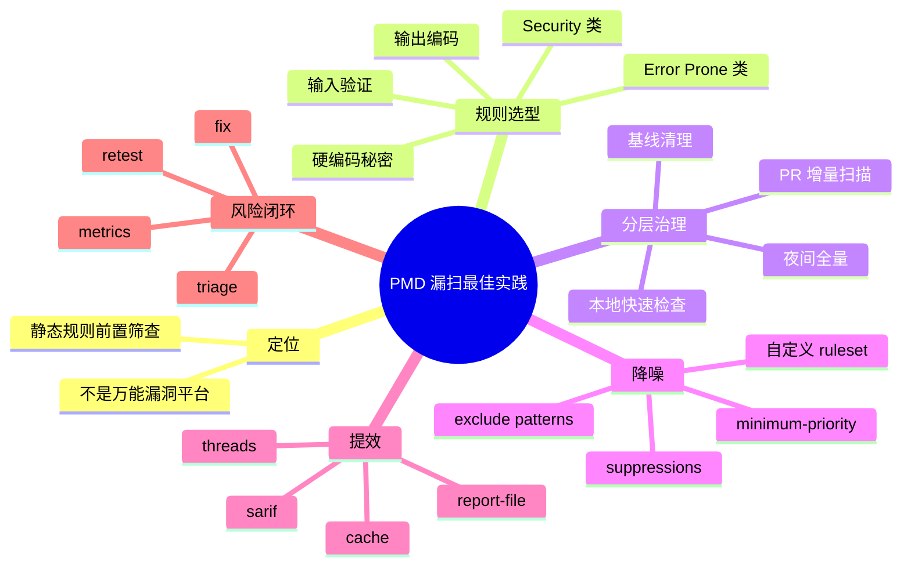

# 用 PMD 做典型漏洞扫描的工程最佳实践：规则选型、分层治理、降噪与流水线落地

## 记忆卡片摘要（快速复习版）

### 1. 大纲（压缩版）

- PMD 在漏洞扫描里应该扮演什么角色
- 哪些安全问题适合 PMD 先发现
- 为什么不能一上来全量开规则
- Java、Apex、JSP 的典型安全规则怎么用
- PR、CI、夜间全量、基线治理怎么组合
- 如何控制误报、漏报和例外

### 2. 思维导图（Mermaid）

### 3. 重要知识点（必须记住）

- 官方 Best Practices 明确反对“一次性启用全部规则”，因为那会产生大量无关违规，极大增加治理成本。[来源1]
- PMD 的安全扫描应以“自定义 ruleset + 高价值规则优先 + 分阶段落地”为核心，而不是把所有 Security 类规则全部打开后再慢慢删。
- Java Security 规则中，`HardCodedCryptoKey`、`InsecureCryptoIv` 等非常适合作为基础安全基线。[来源2]
- JSP Security 规则中的 `NoUnsanitizedJSPExpression` 很适合老式服务端页面项目做 XSS 早期筛查。[来源3]
- Apex Security 规则集覆盖面很强，包含 SOQL 注入、开放重定向、不安全端点、硬编码凭据等典型问题，非常适合 Salesforce 场景。[来源4]

### 4. 难点 / 易混点

- PMD 能查“部分安全问题”，不等于能代替完整 SAST / DAST / 人工审计。
- 很多真正高价值安全规则并不只在 Security 类里，Error Prone、Best Practices 也常能减少可利用缺陷。
- 降噪不是“关掉所有烦人的规则”，而是建立项目级风险模型。

### 5. QA 快速复习卡片

- Q: 漏洞扫描是不是只开 Security 类就够了？
  A: 不够。很多资源泄漏、空 catch、错误处理缺陷、未验证输入等问题也可能在其他类别里体现。
- Q: 为什么旧项目不适合直接全量门禁？
  A: 因为历史债务太多，直接阻断交付通常会失败，应该先基线化再渐进收紧。
- Q: PMD 最适合在哪个阶段发现安全问题？
  A: 本地开发、PR 检查和 CI 前置阶段，用来尽早发现结构化问题。

### 6. 快速复现步骤（最短路径）

1. 先按语言挑官方安全规则页。[来源2][来源3][来源4]
2. 建一份只含高价值安全规则的自定义 ruleset。[来源5]
3. 在 PR 上跑增量分析，在夜间任务上跑全量分析。[来源6][来源7]
4. 用 SARIF 或 XML 进入平台，做 triage 和趋势跟踪。[来源6]

---

## 学习笔记正文（详细版）

## 0. 学习目标、读者画像与假设

- 技术：用 PMD 做安全相关静态扫描的工程实践
- 学习目标：让读者知道 PMD 在漏洞扫描体系里该怎么用、用到什么程度最合适
- 读者水平：初学到中级
- 版本范围：latest 文档，访问日期 2026-03-19

## 1. 先摆正 PMD 在漏洞扫描中的位置

如果你把 PMD 当成“万能漏洞扫描平台”，很快会失望；如果你把它当成“开发流程中最早的一道结构化安全筛查”，它会非常有价值。

PMD 的强项是：

- 便宜地频繁运行
- 发现结构化、模式化、规则化的问题
- 尽早在本地和 PR 阶段给反馈
- 和质量治理体系合并落地

PMD 的弱项是：

- 不理解真实运行时数据
- 不一定能跨服务、跨框架追踪复杂污点传播
- 对需要深上下文或业务语义的漏洞无能为力

因此，成熟姿势不是“只用 PMD”，而是：

- PMD 做前置静态守门
- 更重型 SAST / 专项工具做深扫描
- DAST / IAST / 手工审计补运行时与业务逻辑层

## 2. 什么类型的漏洞最适合 PMD 先发现

### 2.1 硬编码机密与密码学误用

Java Security 规则页给出了典型例子：

- `HardCodedCryptoKey`
- `InsecureCryptoIv`[来源2]

这些问题有个共同点：结构明显，代码模式稳定，非常适合规则静态扫描。

### 2.2 输出编码 / XSS 风险

JSP Security 规则里的 `NoUnsanitizedJSPExpression` 就是典型例子：未经过转义/清洗的表达式直接输出到页面，可能导致 XSS。[来源3]

### 2.3 不安全重定向、HTTP 端点、权限检查缺失

Apex Security 规则里有：

- `ApexOpenRedirect`
- `ApexInsecureEndpoint`
- `ApexCRUDViolation`
- `ApexSOQLInjection`
- `ApexSuggestUsingNamedCred`
- `ApexXSSFromEscapeFalse`[来源4]

这些都说明 PMD 在某些生态中，安全规则并不只是“加密密钥”这么窄。

### 2.4 与安全直接相关的基础质量问题

不要只盯 Security 类。很多看似质量问题，最终也会演化为安全问题，例如：

- 错误处理不当
- 资源关闭不正确
- 过度宽松异常吞掉
- 可疑逻辑分支

所以漏洞扫描实践里，常会同时启用 Security + Error Prone + 一部分 Best Practices。

## 3. 为什么不建议“一次性开全部安全规则”

官方 Best Practices 虽然讲的是整体规则治理，但对安全扫描尤其适用：跑全部规则会得到巨量报告，其中很多对你当前项目并不重要。[来源1]

安全扫描里这会带来三类灾难：

- 开发者迅速疲劳，不再看报告
- 安全团队陷入海量低价值 triage
- 平台门禁被迫放松，最终形同虚设

所以正确做法是：

- 先选一小批高价值、高可解释、易修复的规则
- 在团队建立信任后，再逐步扩展

## 4. 安全 ruleset 的分层设计方法

建议至少分成四层。

### 4.1 基础安全基线层

特点：

- 误报低
- 修复成本可控
- 安全价值明确

典型候选：

- 硬编码密钥
- 硬编码 IV
- 不安全 HTTP 端点
- 未转义页面输出

### 4.2 质量增强层

特点：

- 不一定直接写着 Security
- 但会显著降低缺陷和可利用面

典型候选：

- 空 catch
- 资源泄漏
- 容易出错的控制流
- 明显的 API 误用

### 4.3 定制规范层

把你们自己的安全规范固化为规则，例如：

- 禁止公司内部黑名单 API
- 禁止直接拼接某类查询
- 强制使用内部安全封装

这层往往最能体现 PMD 的长期价值，因为它把组织知识写进了规则。

### 4.4 历史债务豁免层

现实里旧系统一定有存量问题。与其让门禁第一天就爆炸，不如把历史存量基线化，只对新增和修改代码严格执行。

## 5. 典型语言的安全扫描策略

## 5.1 Java 项目

Java 是 PMD 的主战场之一。[来源8]

推荐策略：

- 先启用 Java Security 中明确、可解释的规则
- 搭配 Error Prone 和资源处理类规则
- Java 项目尽量配置 `--aux-classpath`，让类型相关规则更靠谱。[来源6]

优先示例：

- `HardCodedCryptoKey`
- `InsecureCryptoIv`
- 以及 quickstart 中与明显错误相关的规则[来源2][来源8]

## 5.2 JSP / 老式服务端页面项目

这类系统常年潜伏的风险之一就是输出未编码和模板页结构问题。JSP Security 中 `NoUnsanitizedJSPExpression` 很适合做低门槛、价值高的第一批规则。[来源3]

如果你的老系统仍有大量 JSP，这条规则往往比追求复杂污点分析更快产生效果。

## 5.3 Apex / Visualforce 项目

Apex 是 PMD 的另一个传统主场，安全规则很丰富。[来源4][来源8]

特别值得关注：

- `ApexSOQLInjection`
- `ApexOpenRedirect`
- `ApexInsecureEndpoint`
- `ApexSuggestUsingNamedCred`
- `ApexXSSFromEscapeFalse`
- `ApexCRUDViolation`[来源4]

Visualforce 侧也有如 `VfCsrf`、`VfHtmlStyleTagXss` 等规则，适合页面层风险治理。[来源9]

## 6. 规则落地的四阶段模型

### 6.1 本地快速检查

目的不是绝对全面，而是让开发者尽早看到高价值问题。

建议：

- 规则少而精
- 输出用 `text`
- 不一定失败阻断

### 6.2 PR 增量扫描

这是最有价值的阶段。结合 `--cache`、`--file-list` 或变更文件列表，只看新增或修改文件，能把成本和噪音控制在最低。[来源6][来源7]

建议：

- 只拦截高优先级安全问题
- 历史遗留问题不在 PR 阶段重新点燃

### 6.3 夜间全量扫描

目的：

- 观察全仓趋势
- 发现 PR 范围外的存量问题
- 验证 ruleset 升级后的全局影响

### 6.4 基线治理与专题修复

把夜间全量结果按规则聚类，形成专项修复任务，例如：

- 一周清理全部硬编码密钥
- 一周治理 JSP 未转义输出
- 一周清理开放重定向

## 7. 如何控制误报

误报不可怕，无法治理的误报才可怕。

建议按这个顺序降噪：

1. 不要开太多规则
2. 用自定义 ruleset 明确选规则
3. 用 `--minimum-priority` 先聚焦高价值违规
4. 用路径排除排掉生成代码、第三方代码
5. 对极少数合理例外使用 suppress，而不是大面积关规则[来源5][来源6]

这背后的原则是：先从策略层降噪，再到局部豁免；不要一开始就靠注释到处 `NOPMD`。

## 8. 如何避免漏报

只谈误报而不谈漏报，也是不成熟的。

减少漏报的关键做法：

- Java 项目配好 `--aux-classpath`
- 根据语言版本配置 `--use-version`
- 对重点模块做全量扫描而不是只扫 diff
- 用 `ast-dump` / `designer` 验证自定义规则是否真的命中目标结构
- 每次升级 PMD 后复查规则表现

尤其是安全规则，自定义规则一定要留测试样例。

## 9. 报告格式与安全平台集成

CLI Reference 提供多种报告格式，并说明渲染器可配置。[来源6]

工程上常见策略：

- 本地：`text`
- CI / 平台：`xml` 或 `sarif`
- 归档：写 `--report-file`

选择 SARIF 的价值在于，它更适合进入统一静态分析平台、代码托管平台安全视图或后续自动归并。

## 10. 为什么缓存对安全扫描也重要

很多人以为安全扫描就必须每次全量跑。其实官方 Incremental Analysis 文档明确说，增量分析的最终报告与全量分析一致。[来源7]

这意味着：

- 日常 PR 可以大胆使用缓存提速
- 夜间任务做周期性全量复核即可
- 你可以把“及时反馈”和“全局准确性”同时兼顾

## 11. 安全扫描中的 suppress 应该怎么管

建议建立三条纪律：

- suppress 必须写理由
- suppress 必须尽量局部，而不是整文件
- 定期复查 suppress，防止历史豁免永久化

技术上，PMD 支持注释标记抑制，也支持在规则层和路径层做排除。[来源5][来源6] 但从治理角度看，凡是“绕过规则”的行为都应留痕。

## 12. 一个成熟团队的 PMD 安全治理看板应该看什么

不只看“总违规数”，更应看：

- 新增违规数
- 已修复违规数
- 每条规则误报率
- 重点规则覆盖模块数
- 历史基线剩余量
- 平均修复时长

因为总数往往会被老项目历史债务淹没，而新增趋势才真正决定门禁是否有效。

## 13. 典型落地模板

### 13.1 新项目

- 从第一天起就启用精简安全 ruleset
- PR 阶段直接门禁
- 不允许新增高优先级安全违规

### 13.2 老项目

- 先全量跑一次，建立基线
- 把存量问题冻结
- 新增和修改代码严格执行
- 按专题逐步消化老问题

### 13.3 平台团队

- 维护统一 ruleset 基线
- 允许业务线按需叠加扩展规则
- 保持核心高价值规则不可删除

## 14. 常见失败模式

### 14.1 一上来全量开规则并强门禁

结果：开发者全面反感，门禁很快被放水。

### 14.2 把所有安全问题都指望 PMD

结果：复杂漏洞漏报严重，团队产生错误安全感。

### 14.3 规则太多但没人维护

结果：误报堆积，升级不敢做，最终停用。

### 14.4 没有基线策略

结果：旧项目根本无法接入，只能永远处于“准备接入”状态。

## 15. 非科班最该记住的原则

如果你只记一句话，就记这个：

PMD 做安全扫描时，最重要的不是“扫得多”，而是“扫得早、扫得稳、扫得让团队愿意持续使用”。

真正好的安全治理不是一次性把所有问题炸出来，而是让新增风险越来越难混进主干。

## 16. 延伸学习路径（官方优先）

- Best Practices。[来源1]
- Making rulesets。[来源5]
- CLI Reference。[来源6]
- Incremental analysis。[来源7]
- Java / Apex / JSP / Visualforce 安全规则页。[来源2][来源3][来源4][来源9]

---

## 练习与复习闭环

## 1. 分层练习

### 基础练习

- 解释为什么不能把 PMD 当万能漏洞平台。
- 解释为什么安全扫描不应一上来启用全部规则。

### 应用练习

- 为一个 Java 老项目写一套“基线 + PR 门禁”方案。
- 为一个 Apex 项目挑出 5 条优先启用的安全规则，并说明原因。

### 综合练习

- 设计一套 PMD 安全扫描治理流程，要求包含：规则分层、误报处理、缓存策略、报告格式、夜间全量任务。

## 2. 动手任务（带验收标准）

- 任务：根据你自己的项目语言，手工整理一份“高价值安全规则第一批名单”。
- 验收标准：每条规则都能说明它为什么高价值、它会抓什么、修复成本大概如何。

## 3. 常见误区纠偏

- 误区：安全扫描就应该越多规则越好。
  正解：规则太多会让团队失去信任，应先抓高价值、低噪音规则。
- 误区：只开 Security 类就够了。
  正解：很多安全相关缺陷分布在其他类别。
- 误区：老项目接不进门禁就说明工具没价值。
  正解：应先基线化，再治理新增问题。

## 4. 复习节奏建议

- Day 1：记住 PMD 在安全体系中的定位。
- Day 3：记住“高价值安全规则优先”原则。
- Day 7：记住“本地 + PR + 夜间全量 + 基线”的四阶段模型。
- Day 14：结合实际项目输出一版 ruleset 初稿。

## 5. 自测题与参考答案（简版）

- 题目1：为什么 `HardCodedCryptoKey` 适合作为第一批规则？
  参考答案：风险明确、模式稳定、解释性强、修复路径清晰。[来源2]
- 题目2：为什么 PR 阶段更适合做严格门禁？
  参考答案：因为范围小、反馈快、便于只拦截新增问题。
- 题目3：为什么缓存对安全扫描并不冲突？
  参考答案：官方说明增量分析结果与全量一致，只是提速。[来源7]

---

## 参考来源与版本说明

## 官方来源（优先）

1. Best Practices: https://docs.pmd-code.org/latest/pmd_userdocs_best_practices.html
2. Java Security rules: https://docs.pmd-code.org/latest/pmd_rules_java_security.html
3. JSP Security rules: https://docs.pmd-code.org/latest/pmd_rules_jsp_security.html
4. Apex Security rules: https://docs.pmd-code.org/latest/pmd_rules_apex_security.html
5. Making rulesets: https://docs.pmd-code.org/latest/pmd_userdocs_making_rulesets.html
6. PMD CLI reference: https://docs.pmd-code.org/latest/pmd_userdocs_cli_reference.html
7. Incremental analysis: https://docs.pmd-code.org/latest/pmd_userdocs_incremental_analysis.html
8. PMD GitHub README: https://github.com/pmd/pmd
9. Visualforce Security rules: https://docs.pmd-code.org/snapshot/pmd_rules_visualforce_security.html

## 第三方来源（按采信程度标注）

- 无。

## 关键结论引用映射

- [来源1] -> 渐进启用规则、避免大而无当的报告
- [来源2] -> Java 安全规则示例与定位
- [来源3] -> JSP 安全规则示例与定位
- [来源4] -> Apex 安全规则覆盖面与典型漏洞类型
- [来源5] -> 自定义 ruleset 和路径过滤
- [来源6] -> 报告格式、失败策略、线程、类路径、文件输入
- [来源7] -> 缓存与增量分析等价性
- [来源8] -> Java/Apex 主战场定位
- [来源9] -> Visualforce 页面层安全规则

## 官方文档章节映射与重要例子保留检查

- Best Practices -> 本文第 3、4 节
- Java Security -> 本文第 2、5 节
- JSP Security -> 本文第 2、5 节
- Apex Security -> 本文第 2、5 节
- Visualforce Security -> 本文第 5 节
- Making rulesets -> 本文第 4、7、11 节
- CLI Reference / Incremental Analysis -> 本文第 6、8、9、10 节
- 重要例子保留说明：保留了 `HardCodedCryptoKey`、`InsecureCryptoIv`、`NoUnsanitizedJSPExpression`、`ApexSOQLInjection` 等典型示例所代表的问题类型

## 冲突点与裁决（如有）

- 冲突点：Visualforce 使用的搜索结果是 snapshot 页面，而 latest 导航片段未直接展开对应规则详情。
- 裁决依据：Visualforce 规则名称与 PMD 规则体系一致，且用于补充“页面层安全规则存在性”这一结论，不作为唯一主结论依据。
- 采用结论：Apex / Java / JSP 安全规则是本文主依据，Visualforce 作为补充说明。
