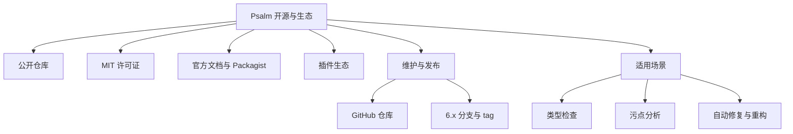

# 记忆卡片摘要（快速复习版）

## 1. 大纲（压缩版）
- Psalm 是什么
- 它是不是开源软件，怎么判断
- 它的官方仓库、许可证、维护方式、发布方式
- 它在 PHP 静态分析生态里的位置
- 它适合做什么，不适合做什么
- 初学者理解 Psalm 的最短上手路径

## 2. 思维导图（Mermaid）

## 3. 重要知识点（必须记住）
- Psalm 是开源软件。最硬的证据不是“有人这么说”，而是它有公开 GitHub 仓库、MIT 许可证文件、公开文档站和公开的 Composer 包。[来源1][来源2][来源3]
- 本地仓库 `/home/nyn/Desktop/Projects/SAST/sast_tools/psalm` 是 `https://github.com/vimeo/psalm` 的一个 checkout，当前分支是 `6.x`，本地 `git describe` 结果是 `6.16.1-1-g03037f74c`，说明它离 `6.16.1` tag 只差 1 个提交。
- Psalm 不只是“报类型错”的工具，还内置污点分析、Language Server、自动修复和重构能力。[来源3][来源4][来源5]
- “规则仓库”不是单独一个目录，而是由 issue 类、issue 文档、配置模式、污点定义、插件接口和示例插件共同组成的规则生态。

## 4. 难点 / 易混点
- “开源”不等于“永久免费服务”。Psalm 核心代码开源，但维护者仍可提供商业支持合同，这两者不冲突。[来源3]
- “官方文档说最新版本需要 PHP >= 8.2”和“当前 checkout 的 composer.json 允许 8.1.31+”看起来矛盾。裁决时应以具体版本分支里的 `composer.json` 为准，因为那是这个 checkout 的真实依赖约束；安装文档更像面向“当前官方推荐安装方式”的泛化说明。[来源2][来源6]
- “生态”不只指插件数量，还包括发布渠道、IDE 集成、SARIF 输出、CI 集成、污点分析能力和社区维护状态。

## 5. QA 快速复习卡片
- Q: 怎么最快判断 Psalm 是不是开源？
  A: 看公开仓库、许可证文件、包管理器公开发布和文档站，四个证据同时成立基本就能下结论。
- Q: Psalm 是谁维护的？
  A: README 指出最初由 Matthew Brown 构建，目前活跃维护者是 Daniil Gentili。[来源3]
- Q: Psalm 只会查类型吗？
  A: 不是，它还能做逻辑检查、属性初始化检查、污点分析、自动修复、自动重构和语言服务器支持。[来源4]
- Q: 为什么要区分“本地 checkout 版本”和“官网最新稳定版”？
  A: 因为你分析源码、跑命令、写配置时，真正生效的是当前 checkout，而不是抽象意义上的“最新版本”。

## 6. 快速复现步骤（最短路径）
1. 打开仓库根目录的 `README.md`、`LICENSE`、`composer.json`。
2. 运行 `git remote -v`、`git describe --tags --always`、`git log -1` 确认来源和版本。
3. 打开 `docs/README.md` 和 `psalm.dev/docs`，确认官方文档入口。
4. 打开 `docs/security_analysis/index.md` 与 `docs/running_psalm/plugins/using_plugins.md`，确认它不是单一能力工具。

---

# 学习笔记正文（详细版）

## 0. 学习目标、读者画像与假设
- 技术：`Psalm`
- 本文目标：把“Psalm 是否开源”这个问题讲透，并顺带讲明它的官方入口、发布渠道、生态结构和适用边界。
- 读者水平：默认你会一点命令行，但不假设你受过科班训练。
- 时间预算：按深入版组织，适合 2 到 4 小时精读。
- 版本范围：以本地仓库 `/home/nyn/Desktop/Projects/SAST/sast_tools/psalm` 当前 checkout 为主，同时参考官方文档站。
- 本地观察基线：`6.x` 分支，`git describe` 为 `6.16.1-1-g03037f74c`，最新本地提交日期为 `2026-03-26`。
- 运行环境限制：当前环境未安装项目依赖，未直接执行 `vendor/bin/psalm`。本文中的 Mermaid 图已通过 `npx @mermaid-js/mermaid-cli` 配合 Chromium `--no-sandbox` 方式完成编译验证。

## 1. Psalm 到底是什么

先用最直白的话讲：Psalm 是一个 PHP 静态分析工具。所谓“静态分析”，就是**不真的把你的业务跑起来**，而是直接看源代码，推断代码可能出错的地方。你可以把它理解成“比 IDE 更严格、更系统、能批量扫整个仓库的代码检查器”。[来源4]

它最早是为 PHP 的类型问题、逻辑问题、未使用代码、属性初始化问题而设计的，但后来逐渐长成了一个更完整的工程工具箱：既能做类型分析，也能做污点分析，还能做自动修复、简单重构、语言服务器接入和插件扩展。[来源3][来源4][来源5]

这点很重要，因为很多人第一次听到 Psalm，只把它想成“PHPStan 的另一个版本”或者“给 PHP 加类型提示的工具”。这会把它看小。Psalm 的核心仍然是静态分析，但它提供的输出形式和扩展点，已经让它具备了一定的 SAST 工具属性。

## 2. Psalm 是不是开源软件

答案先给出来：**是，Psalm 是开源软件。**

但真正有价值的不是这个答案，而是你应该学会怎样自己判断一个项目是不是开源。判断不要只靠博客或二手文章，应该看四类一手证据。

### 2.1 证据一：有公开可访问的官方代码仓库

本地仓库的 `git remote -v` 指向 `https://github.com/vimeo/psalm`。这说明它的上游仓库是公开的 GitHub 项目，而不是闭源二进制镜像或私有发行物。[来源1]

对非科班读者可以这样理解：  
如果一个项目只有官网介绍，没有源码仓库，你很难说它“开源”。  
如果一个项目有公开仓库，但没有许可证，也不能轻易说它“真正开源”。  
Psalm 两者都有。

### 2.2 证据二：仓库里有许可证文件

本地 `LICENSE` 文件明确写的是 `MIT License`，并授予使用、复制、修改、合并、发布、分发、再许可和销售副本的权限，只要求保留版权与许可证声明。[来源2]

MIT 是非常宽松的开源许可证。用大白话讲：
- 你可以拿来用
- 你可以商用
- 你可以改
- 你可以分发
- 你甚至可以把它整合进商业流程
- 但作者不对你的使用后果兜底

这也是为什么很多企业愿意把 Psalm 纳入 CI 或开发流程。不是因为“它免费”，而是因为它的许可证足够清晰、风险边界足够明确。

### 2.3 证据三：有公开包管理器发布

`composer.json` 的包名是 `vimeo/psalm`，README 也明确指向 Packagist 和官方文档站。[来源3][来源6]

这说明 Psalm 并不是“源码放出来给你自己凑合编译”的半开放项目，而是走了 PHP 生态的标准分发路径：  
源码在 GitHub，安装通过 Composer，文档在官方站点，扩展通过插件包传播。

### 2.4 证据四：文档与生态公开可见

Psalm 官方文档公开托管在 `https://psalm.dev/docs`，而且 README 明确说网站文档是由仓库里的 `docs/` 目录生成的。[来源3][来源4]

这件事很关键。它意味着：
- 你看到的文档不是“另一个神秘私有知识库”
- 仓库文档和官网文档有清晰对应关系
- 你完全可以通过本地源码仓库反向理解官方文档

综合这四点，Psalm 不仅“开源”，而且是一个**公开仓库 + 开源许可证 + 公开发行 + 公开文档**都具备的成熟开源项目。

## 3. Psalm 的官方入口有哪些

如果你以后要研究一个安全工具，最容易迷路的地方是“入口太多”。Psalm 至少有下面几类官方入口：

### 3.1 代码入口
- GitHub 仓库：`https://github.com/vimeo/psalm`
- 本地 checkout：`/home/nyn/Desktop/Projects/SAST/sast_tools/psalm`

### 3.2 文档入口
- 文档首页：`https://psalm.dev/docs`
- 仓库内文档索引：`docs/README.md`

### 3.3 安装入口
- Composer 包：`vimeo/psalm`
- Phar 形式：文档中提供 GitHub release 下载方式
- Docker 镜像：安装文档推荐 `ghcr.io/danog/psalm:latest` 形式运行。[来源6]

### 3.4 扩展入口
- 插件文档：`docs/running_psalm/plugins/using_plugins.md`
- 插件模板：`weirdan/psalm-plugin-skeleton`
- 插件发现页：`https://psalm.dev/plugins`
- Packagist 类型筛选：`type=psalm-plugin`。[来源5][来源7]

### 3.5 社区与支持入口
README 中提到官方 Telegram 新闻频道、社区频道，以及维护者提供的商业支持合同。[来源3]

很多初学者看到“有商业支持合同”会误以为“这不是开源了”。这是误解。  
正确理解是：**代码开源，不妨碍维护者通过咨询、集成支持、定制开发来获得收入。**

## 4. 这个项目由谁维护，怎么发布

README 写得很明确：项目由 Matthew Brown 构建，目前活跃维护者是 Daniil Gentili，历史上还有其他维护者参与。[来源3]

本地仓库显示当前分支是 `6.x`，`composer.json` 里还保留了 `7.x-dev`、`6.x-dev` 等 branch alias，这说明 Psalm 采用的是比较典型的“稳定分支 + 开发分支”管理方式。[来源8]

这对学习者意味着什么？

### 4.1 你要区分“项目主线”和“你手里的 checkout”

你手头这个仓库并不是一个抽象的“Psalm 最新所有状态”，而是一个具体 checkout。  
它的行为、支持的 PHP 版本、帮助文档、命令参数，都应该优先以这个 checkout 为准。

### 4.2 文档可能比源码更泛化

本地 `docs/running_psalm/installation.md` 写“latest version requires PHP >= 8.2”，但本地 `composer.json` 又允许 `~8.1.31`。这就是典型的“文档面向当前官方推荐路径，而源码分支仍兼容更宽版本”的情况。[来源6][来源8]

裁决依据：
- 如果你要判断**这个仓库 checkout 能不能装**，看 `composer.json`
- 如果你要判断**官网目前推荐什么版本路径**，看安装文档

这是源码学习里非常重要的基本功：**优先使用更具体、更接近执行层的证据。**

## 5. Psalm 在 PHP 静态分析生态中的位置

Psalm 的生态位置，可以简单理解成“一个类型系统能力很强，同时兼顾工程落地和安全分析的 PHP 静态分析平台”。

### 5.1 它的核心竞争力
- 对 `mixed` 类型的跟踪很重视
- 对条件逻辑和上下文推断很深入
- 对属性初始化、模板类型、断言、纯函数、不可变性等概念支持很强
- 内置污点分析，不是纯粹的类型检查器
- 提供插件事件接口，适合做领域规则扩展

这些能力在官方文档首页就有总结。[来源4]

### 5.2 它不是“单一规则表驱动工具”

很多传统安全扫描工具给人的感觉是“拉一份规则库，对代码做匹配”。Psalm 不是这种单薄模型。  
它有类型系统、控制流推断、数据流跟踪、污点传播、缓存、差异分析、报告系统、IDE 集成、代码修复和插件机制。  
所以它更接近“分析平台”，而不是“只有规则库的扫描器”。

### 5.3 对安全工程的价值

如果你把 Psalm 只当成“代码风格检查器”，会严重低估它。  
它在安全工程里的真正价值包括：
- 为污点分析提供类型与调用上下文
- 给大型遗留仓库建立 baseline
- 通过 SARIF 把结果接入平台
- 通过插件表达业务特有 source/sink
- 用 `literal-string`、注解、issueHandler 管住高风险路径

## 6. 适合做什么，不适合做什么

### 6.1 适合
- PHP 项目的类型和逻辑问题排查
- 中大型仓库的渐进式静态分析治理
- 需要把安全扫描嵌进开发流程的团队
- 需要自定义业务规则的团队
- 需要 CI 报告、IDE 诊断、污点路径追踪的场景

### 6.2 不适合
- 你想扫描非 PHP 语言为主的仓库
- 你想要“零配置、零误报、秒出最终安全结论”的黑盒工具
- 你完全不愿意维护 docblock、配置或 baseline
- 你只想做运行时动态行为检测

简化理解：Psalm 擅长“看代码结构与数据流”，不擅长“替你跑业务系统做动态渗透”。

## 7. 非科班读者该如何理解 Psalm 的生态

可以用一个非常朴素的类比：

- `GitHub 仓库`：像超市总仓库，所有货都在这里
- `LICENSE`：像使用说明和许可合同，告诉你能不能拿、怎么拿
- `Composer 包`：像标准物流渠道，方便你把货拉到项目里
- `文档站`：像说明书和教程区
- `插件`：像可插拔配件
- `Issue 类型`：像故障类别字典
- `Analyzer`：像实际工作的检查员

这个类比并不严格，但足以帮助入门者先建立整体图景。回到真实机制时，你再把它替换成更准确的术语：仓库、许可证、分发、文档、插件 API、Issue 类、Analyzer、数据流和污点传播。

## 8. 常见误区与排查路径

### 误区一：仓库公开就一定开源
不对。没有许可证，很多情况下你依旧没有合法使用和分发权。

### 误区二：有 MIT 许可证就等于没有使用风险
也不对。MIT 给你权利，但也写清楚作者不承担担保责任。

### 误区三：文档写“最新版本”就一定适用于我当前 checkout
不对。分支、tag、commit、文档发布时间都可能不同。

### 误区四：Psalm 有插件系统，所以内核规则不重要
不对。插件是扩展层，内核类型系统和分析流程才是地基。

### 推荐排查顺序
1. 先看 `LICENSE`
2. 再看 `README` 和 `composer.json`
3. 再看 `git remote`、branch、tag、最近提交
4. 最后再看官网文档与插件市场

## 9. 延伸学习路径（官方优先）
- 第一步：读 `docs/README.md`，建立官方目录感。[来源4]
- 第二步：读 `docs/running_psalm/installation.md`、`command_line_usage.md`，知道怎么跑。[来源6][来源9]
- 第三步：读 `docs/contributing/how_psalm_works.md`，理解扫描与分析两阶段。[来源10]
- 第四步：读 `docs/security_analysis/index.md`，理解它为什么不只是类型工具。[来源11]
- 第五步：读插件文档和示例插件，理解规则如何扩展。[来源5][来源12]

---

# 练习与复习闭环

## 1. 分层练习

### 基础练习
- 解释“公开仓库”和“开源许可证”的区别。
- 解释为什么 `composer.json` 在判断当前 checkout 的支持版本时比安装文档更权威。
- 找出 Psalm 的三个官方入口并说出它们各自作用。

### 应用练习
- 用你自己的话写出 5 条证据，证明 Psalm 是开源项目。
- 打开本地仓库，说出当前 branch、最近提交日期和上游 remote。
- 说明插件生态、Issue 生态、文档生态分别是什么。

### 综合练习
- 假设你要向团队做一次 10 分钟分享，题目是“为什么 Psalm 值得纳入 PHP 安全工程流程”，写出提纲并包含许可证、发布方式、功能边界和扩展性四部分。

## 2. 动手任务（带验收标准）
- 任务：在本地仓库里完成一次“项目身份证明”检查。
- 步骤：
  1. 查看 `README.md`
  2. 查看 `LICENSE`
  3. 查看 `composer.json`
  4. 运行 `git remote -v`
  5. 运行 `git describe --tags --always`
- 验收标准：
  - 能说出许可证类型
  - 能说出官方上游地址
  - 能说出本地 checkout 所处分支/tag 状态
  - 能说出至少 3 个官方能力入口

## 3. 常见误区纠偏
- 误区：开源项目就没有商业成分。  
  正解：开源代码和商业支持完全可以同时存在。
- 误区：只要官网能打开就够了，不需要看源码。  
  正解：学习工具机制时，源码仓库才是最接近真相的材料。
- 误区：文档和源码冲突时，任选一个相信就好。  
  正解：要比较版本、分支、发布日期和“谁更接近真实执行层”。

## 4. 复习节奏建议
- Day 1：记住四类开源证据和 Psalm 的五个官方入口。
- Day 3：复述“为什么 Psalm 是分析平台，而不只是规则库”。
- Day 7：重新核对一次本地 checkout 的 branch、tag、remote、license。
- Day 14：把 Psalm 的生态结构讲给另一个没接触过 PHP 静态分析的人听。

## 5. 自测题与参考答案（简版）
- 题目1：Psalm 是不是开源？你不能只回答“是”，请给出证据链。  
  参考答案：是。证据链包括公开 GitHub 仓库、MIT 许可证、公开 Composer 包、公开官方文档站。
- 题目2：为什么本地 checkout 和官网“最新”文档可能不一致？  
  参考答案：因为分支、tag、提交时间和文档面向的版本不同，当前 checkout 的实际依赖应优先看当前分支源码。
- 题目3：插件生态为什么也是“开源生态”的一部分？  
  参考答案：因为它决定了社区如何围绕官方内核继续扩展、复用和分享规则能力。

---

# 参考来源与版本说明

## 官方来源（优先）
1. [GitHub 仓库 vimeo/psalm](https://github.com/vimeo/psalm) - 官方源码入口 - 访问日期：2026-03-28
2. [LICENSE](https://github.com/vimeo/psalm/blob/master/LICENSE) - MIT 许可证 - 访问日期：2026-03-28
3. [README](https://github.com/vimeo/psalm/blob/master/README.md) - 项目定位、维护者、文档入口 - 访问日期：2026-03-28
4. [Documentation Home](https://psalm.dev/docs) - 官方文档首页 - 访问日期：2026-03-28
5. [Using Plugins](https://psalm.dev/docs/running_psalm/plugins/using_plugins/) - 官方插件使用文档 - 访问日期：2026-03-28
6. [Installation](https://psalm.dev/docs/running_psalm/installation/) - 安装文档 - 访问日期：2026-03-28
7. [Psalm Plugins](https://psalm.dev/plugins) - 官方插件目录 - 访问日期：2026-03-28
8. [composer.json](https://github.com/vimeo/psalm/blob/master/composer.json) - 包元信息、branch alias、依赖与 CLI 列表 - 访问日期：2026-03-28
9. [Command line usage](https://psalm.dev/docs/running_psalm/command_line_usage/) - CLI 入口说明 - 访问日期：2026-03-28
10. [How Psalm works](https://github.com/vimeo/psalm/blob/master/docs/contributing/how_psalm_works.md) - 工作原理 - 访问日期：2026-03-28
11. [Security analysis in Psalm](https://psalm.dev/docs/security_analysis/) - 污点分析概览 - 访问日期：2026-03-28
12. [Authoring Plugins](https://psalm.dev/docs/running_psalm/plugins/authoring_plugins/) - 插件扩展入口 - 访问日期：2026-03-28

## 第三方来源（按采信程度标注）
- 无。本文刻意只采用官方仓库和官方文档。

## 关键结论引用映射
- [来源1][来源2][来源3] -> Psalm 是公开源码并具备明确开源许可证的项目
- [来源3][来源4] -> Psalm 官方把它定义为静态分析工具，并列出核心能力
- [来源5][来源7][来源12] -> Psalm 有官方承认的插件生态与扩展机制
- [来源6][来源8] -> 关于 PHP 版本支持需要结合安装文档和当前分支 `composer.json` 联合判断
- [来源10][来源11] -> Psalm 不只是普通类型检查器，也覆盖分析机制和安全分析

## 官方文档章节映射与重要例子保留检查
- `README / docs/README` -> 本文第 1、3、5 节
- `running_psalm/installation` -> 本文第 3、4 节
- `running_psalm/plugins/using_plugins` -> 本文第 3、5 节
- `contributing/how_psalm_works` -> 本文第 5、9 节
- `security_analysis/index` -> 本文第 1、5 节
- 保留的重要例子：
  - 官方首页关于 `mixed`、逻辑检查、属性初始化、污点分析的能力列举已在第 1、5 节转写并解释
  - 安装文档中 Composer / Docker / Phar 三种入口已在第 3 节保留

## 冲突点与裁决
- 冲突点：安装文档称“latest version requires PHP >= 8.2”，但当前 checkout 的 `composer.json` 允许 `~8.1.31`。
- 来源A：安装文档，面向官方当前推荐安装说明。[来源6]
- 来源B：当前分支 `composer.json`，面向具体 checkout 的真实约束。[来源8]
- 差异原因判断：文档描述的是官方当前推荐“最新版本”路径，而本地 checkout 是 `6.x` 分支上的具体提交。
- 本文采用结论：讨论当前本地仓库时，以 `composer.json` 为准；讨论官网当前推荐安装方式时，以安装文档为准。

## 版本与访问说明
- 本地源码基线：`6.x` 分支，`6.16.1-1-g03037f74c`
- 最近本地提交：`2026-03-26`
- 文档访问日期：`2026-03-28`
