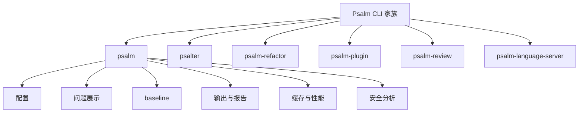

# 记忆卡片摘要（快速复习版）

## 1. 大纲（压缩版）
- Psalm 的 CLI 家族有哪些
- 主命令 `psalm` 怎么用
- 各参数按功能怎么分组
- `psalter`、`psalm-refactor`、`psalm-plugin`、`psalm-review`、`psalm-language-server` 各干什么
- 参数组合的常见套路
- 初学者最常踩的坑

## 2. 思维导图（Mermaid）


## 3. 重要知识点（必须记住）
- Psalm 不止一个命令。`composer.json` 里声明了 `psalm`、`psalm-language-server`、`psalm-plugin`、`psalm-refactor`、`psalm-review`、`psalter` 六个可执行入口。[来源1]
- 主命令 `psalm` 的完整帮助文本并不只在网页里，源码 `src/Psalm/Internal/Cli/Psalm.php` 自己拼出了完整 help 文本，所以想做参数详解时最好直接看源码帮助定义。[来源2]
- `--taint-analysis` 会进入污点分析模式，而且官方文档明确说它与普通分析分开跑；想拿到更完整结果，应先正常跑 Psalm 并修正常规错误，再单独跑 taint。[来源2][来源3]
- `--set-baseline`、`--use-baseline`、`--update-baseline` 是大仓库渐进治理的核心参数；不会 baseline，等于不会在遗留项目里落地 Psalm。[来源2][来源4]

## 4. 难点 / 易混点
- `--threads` 和 `--scan-threads` 不是一回事。前者影响扫描和分析，后者优先控制扫描线程数。[来源2]
- `--show-info` 和 `--report-show-info` 也不是一回事。前者影响终端显示，后者影响生成报告是否包含 info 级别项。[来源2]
- `psalter` 是自动修复工具，不是普通扫描器。它会改代码，除非你加 `--dry-run`。[来源5]
- `psalm-refactor` 是“结构性重构”，不只是 rename 文本替换；它依赖 Psalm 能正确识别符号与引用。[来源6]
- `psalm-review` 不是扫描器，而是报告浏览器，用来按条在 IDE 里打开问题。[来源7]

## 5. QA 快速复习卡片
- Q: 最常用的 Psalm 命令是什么？
  A: `./vendor/bin/psalm`，它跑主分析流程。
- Q: 遗留项目第一步该用什么参数？
  A: 常见是 `--set-baseline`，先把已有问题冻结起来，再持续治理新问题。
- Q: 想跑污点分析要加什么？
  A: `--taint-analysis`，但最好先跑普通分析并修掉基础错误。
- Q: 想自动修复缺失类型该用哪个命令？
  A: `psalter` 或 `psalm --alter`。
- Q: 想启用插件用哪个命令？
  A: `psalm-plugin enable <package-or-class>`。

## 6. 快速复现步骤（最短路径）
1. 用 Composer 安装后运行 `./vendor/bin/psalm --init` 生成配置。
2. 运行 `./vendor/bin/psalm --no-cache` 做第一次全量扫描。
3. 运行 `./vendor/bin/psalm --set-baseline` 冻结遗留问题。
4. 需要安全分析时，再单独运行 `./vendor/bin/psalm --taint-analysis --report=results.sarif`。

---

# 学习笔记正文（详细版）

## 0. 学习目标、读者画像与假设
- 技术：`Psalm CLI`
- 学习目标：把 Psalm 全家桶命令和参数讲到能直接上手，特别是主命令 `psalm` 的参数分类与实战用法。
- 读者水平：默认是第一次系统接触 Psalm 命令行的工程师。
- 版本范围：以本地仓库当前 checkout 的 CLI 源码为准。
- 重要限制：当前环境没有该仓库的完整 vendor 依赖，所以本文没有直接运行 `psalm --help`；参数说明来自官方源码中的 help 文本和官方文档，而不是背记。
- Mermaid 验证：本文中的 Mermaid 图已通过 `npx @mermaid-js/mermaid-cli` 配合 Chromium `--no-sandbox` 方式完成编译验证。

## 1. Psalm CLI 家族总览

很多教程只写 `vendor/bin/psalm`，这会让初学者误以为 Psalm 只有一个命令。实际上 `composer.json` 里声明了 6 个 bin。[来源1]

### 1.1 六个官方 CLI 入口
- `psalm`：主分析入口
- `psalm-language-server`：语言服务器
- `psalm-plugin`：插件启用、禁用、查看
- `psalm-refactor`：结构化重构
- `psalm-review`：交互式浏览 JSON 报告
- `psalter`：自动修复代码

如果把 Psalm 比作一个工具箱：
- `psalm` 是主钳子
- `psalter` 是自动修补器
- `psalm-refactor` 是结构改造器
- `psalm-plugin` 是配件管理器
- `psalm-review` 是报告浏览器
- `psalm-language-server` 是 IDE 后台服务

## 2. 主命令 `psalm` 的基本用法

源码 help 文本给出的标准形式是：

```bash
psalm [options] [file...]
```

也就是说：
- 你可以什么文件都不写，让它按 `psalm.xml` 的 `<projectFiles>` 扫整个项目
- 你也可以直接传 `file1.php file2.php` 只扫指定文件

官方文档补充了退出码含义：[来源9]
- `0`：运行成功且没有问题
- `1`：运行过程本身出错
- `2`：运行成功，但发现了问题
- 其他值：通常表示内部错误

这对 CI 很重要。很多人只看 stdout，不看 exit code，结果流水线控制逻辑全写错。

## 3. `psalm` 参数详解

下面按照源码 help 的分组来讲。每个参数我都尽量讲清四件事：是什么、为什么要用、典型场景、容易踩什么坑。

## 3.1 Basic configuration：基础配置类参数

### `-c, --config=psalm.xml`
- 作用：指定配置文件路径。
- 什么时候用：项目里配置不叫 `psalm.xml`，或者你想切换到另一套分析配置。
- 典型场景：同一仓库里区分普通分析配置和安全分析配置。
- 容易踩坑：路径相对谁解析，取决于配置中的 `resolveFromConfigFile` 和当前工作目录。

### `--use-ini-defaults`
- 作用：使用 PHP 默认 ini 行为，而不是 Psalm 自己调整的内存/错误显示策略。
- 什么时候用：你想严格沿用当前 PHP 进程默认配置。
- 风险：容易因为默认内存太小导致大仓库分析失败。

### `--memory-limit=LIMIT`
- 作用：手动指定内存上限。
- 常见写法：`--memory-limit=2G`
- 场景：大型仓库、CI 容器、污点分析。
- 注意：不能和 `--use-ini-defaults` 一起用。[来源2]

### `--disable-extension=[extension]`
- 作用：在 Psalm 运行时临时禁用某些 PHP 扩展。
- 场景：排查某扩展与 Psalm 运行冲突，或希望在更可控的环境里分析。

### `--force-jit`
- 作用：强制启用 JIT 加速，启不起来就直接退出。
- 场景：你明确知道当前环境适合 JIT，并想强制拿性能。
- 坑：不是所有 PHP 环境都能平滑启用 JIT，失败时会直接结束。

### `--threads=INT`
- 作用：并行扫描和分析。
- 场景：多核机器、大仓库。
- 坑：不是越大越好，I/O、内存、容器核数和 CI 限制都要考虑。

### `--scan-threads=INT`
- 作用：只控制扫描阶段线程数，而且优先级高于 `--threads`。[来源2]
- 场景：想精细控制“解析/扫描”和“分析”的资源使用。
- 常见误解：很多人以为它只是 `--threads` 的别名，不是。

### `--no-diff`
- 作用：关闭 diff 模式，不管文件是否变化都全量检查。
- 场景：CI 冷启动、缓存失效、怀疑 diff 漏掉依赖影响。
- 背景：文档说明 Psalm 4 起 diff 默认开启，可用 `--no-diff` 关闭。[来源9]

### `--php-version=PHP_VERSION`
- 作用：显式按某个 PHP 版本语义分析代码。
- 场景：你的运行环境和开发机 PHP 版本不同；或要确保生成/修复代码兼容目标版本。

### `--error-level=ERROR_LEVEL`
- 作用：设置严格级别，1 最严格，8 最宽松。[来源10]
- 场景：新项目可以从低数字开始；遗留项目常从较宽松等级或 baseline 起步。

## 3.2 Surfacing issues：问题呈现类参数

### `--show-info[=BOOLEAN]`
- 作用：是否在终端显示 info 级别项。
- 场景：你想连非错误项也一起看。
- 注意：默认是 false。[来源2]

### `--show-snippet[=true]`
- 作用：是否显示报错对应的代码片段。
- 场景：本地调试时很有用；CI 长日志可能想关掉。

### `--find-dead-code[=auto]`
### `--find-unused-code[=auto]`
- 作用：查找未使用代码。
- 选项：`auto` 或 `always`。
- 场景：代码治理、瘦身、清理遗留 API。
- 注意：未使用代码检测会提高分析成本，也可能引出更多历史噪音。

### `--find-unused-psalm-suppress`
- 作用：找出没实际起作用的 `@psalm-suppress`。
- 场景：防止 suppression 膨胀和陈旧垃圾积累。

### `--find-references-to=[class|method|property]`
- 作用：搜索对给定全限定类/方法/属性的引用。
- 场景：重构前摸清影响面。
- 注意：method 形式要写成 `ClassName::methodName`。[来源2]

### `--no-suggestions`
- 作用：隐藏建议项，让输出更“只谈事实，不给建议”。
- 场景：日志最小化、CI 精简输出。

### `--taint-analysis`
- 作用：进入污点分析模式。
- 核心理解：它不是“在普通分析结果上顺便附加一点安全检查”，而是切换到专门的 taint 分析模式。[来源3]
- 官方建议：先正常运行 Psalm 并修掉错误，再跑 taint，以得到更完整的结果。[来源3]

### `--dump-taint-graph=OUTPUT_PATH`
- 作用：把污点图导出成 DOT。
- 场景：排查为什么某条污点路径没被发现，或者为什么误报出现。
- 注意：依赖 `--taint-analysis`。[来源2][来源3]

## 3.3 Issue baselines：baseline 相关参数

### `--set-baseline[=PATH]`
- 作用：把当前错误快照写入 baseline 文件。
- 默认文件：`psalm-baseline.xml`
- 典型用途：遗留项目引入 Psalm 时“先冻结旧债，再禁止新增”。
- 额外说明：可配合 `--include-php-versions` 记录扩展版本信息。[来源2]

### `--use-baseline=PATH`
- 作用：运行时加载指定 baseline。
- 场景：不同扫描模式用不同 baseline，比如普通分析和 taint 分析分开。

### `--ignore-baseline`
- 作用：临时忽略 baseline。
- 场景：想知道“真实全量问题现在还有多少”。

### `--update-baseline`
- 作用：只把已经修好的问题从 baseline 中删掉，不新增新问题。
- 场景：持续治理过程中的日常维护。

## 3.4 Plugins：插件类参数

### `--plugin=PATH`
- 作用：直接执行插件文件，替代在配置里声明插件。
- 场景：临时实验某个 file-based 插件。
- 注意：适合试验，不一定适合长期团队协作。

## 3.5 Output：终端输出类参数

### `-m, --monochrome`
- 作用：关闭彩色输出。
- 场景：CI 日志、日志采集系统、无 ANSI 支持终端。

### `--output-format=console`
- 作用：选择输出格式。
- 场景：不同消费者需要不同格式，终端、人类、机器、平台都可能不同。
- 补充：具体支持格式由 `Report` 常量和映射决定，help 文本会动态列出。[来源2]

### `--no-progress`
- 作用：关闭进度条。
- 场景：CI 或日志很怕动态刷新。

### `--long-progress`
- 作用：使用更适合 CI 的进度显示。
- 场景：需要保留过程感知，但又不想要交互式短进度条。

### `--stats`
- 作用：显示类型推断统计。
- 场景：衡量类型覆盖率、治理成效。

## 3.6 Reports：报告文件类参数

### `--report=PATH`
- 作用：把结果写到文件，格式由扩展名决定。
- 场景：CI、SARIF、机器消费、后续 review。
- 安全分析典型组合：`--taint-analysis --report=results.sarif`。[来源3]

### `--report-show-info[=BOOLEAN]`
- 作用：控制报告文件里是否包含 info 项。
- 注意：和终端 `--show-info` 不一样，它只影响报告内容。

## 3.7 Caching：缓存与性能类参数

### `--consolidate-cache`
- 作用：把项目缓存合并成单文件，便于 CI 保存和恢复。
- 场景：整仓全量扫描频繁、CI 缓存可持久化。

### `--clear-cache`
- 作用：清当前项目缓存。
- 适用：怀疑缓存污染或分析结果怪异。

### `--clear-global-cache`
- 作用：清所有项目的全局缓存。
- 适用：更重的缓存清理，不建议日常滥用。

### `--no-cache`
- 作用：完全禁用缓存。
- 场景：第一次排错、追求结果确定性、CI 冷启动验证。

### `--no-reflection-cache`
- 作用：不使用未变化类/文件的缓存表示。
- 官方说明特别指出：如果你想让 `afterClassLikeVisit` 插件钩子每次都运行，这个参数很有用。[来源2]

### `--no-reference-cache`
- 作用：不使用未变化方法的引用缓存。

### `--no-file-cache`
- 作用：不为后续 diff 保存每个文件缓存，减少磁盘占用和 I/O。
- 代价：后续 diff 模式收益可能变弱。

## 3.8 Miscellaneous：杂项参数

### `-h, --help`
- 作用：显示帮助。

### `-v, --version`
- 作用：显示版本。

### `-i, --init [source_dir=src] [level=3]`
- 作用：初始化配置。
- 解释：会生成配置文件并为项目估一个合适的起始 level。
- 对新手非常关键：这是把“不会配”变成“先跑起来”的桥梁。

### `--debug`
### `--debug-by-line`
### `--debug-emitted-issues`
- 作用：输出调试信息；最后一个还会在 issue 发射时打印 backtrace。[来源2]
- 场景：研究内部行为、排查异常误报、开发插件。

### `-r, --root`
- 作用：全局安装 Psalm 时显式指定项目根目录。
- 场景：不是在项目根目录执行，或使用全局 phar/全局命令。

### `--generate-json-map=PATH`
- 作用：生成节点引用和类型的 JSON 映射。
- 场景：做二次处理或构建自定义工具。

### `--generate-stubs=PATH`
- 作用：为项目生成 stub 文件。
- 场景：给第三方库补类型信息、做插件定制。

### `--shepherd[=endpoint]`
- 作用：把分析统计发到 Shepherd 或自定义端点。
- 场景：公共项目类型覆盖率跟踪。[来源9]

### `--alter`
- 作用：切换到 Psalter 模式。
- 理解：相当于从主入口跳到自动修复工具。

### `--review`
- 作用：切换到 psalm-review 模式。

### `--language-server`
- 作用：切换到语言服务器模式。

## 4. 兄弟命令详解

## 4.1 `psalter`

`psalter [options] [file...]` 是自动修复工具。[来源11]

核心参数：
- `--dry-run`：只看 diff，不真改
- `--safe-types`：只用相对更可信的类型信息修复
- `--issues=Issue1,Issue2`：只修指定问题
- `--issues=all`：尽可能修全部支持的问题
- `--list-supported-issues`：列出它会修哪些 issue
- `--find-unused-code`：把未使用代码也纳入候选
- `--allow-backwards-incompatible-changes=BOOL`：是否允许可能破坏外部兼容性的改动
- `--add-newline-between-docblock-annotations=BOOL`：控制 docblock 格式
- `--codeowner=[codeowner]`：只改某 code owner 负责的代码

最重要的认知：
- 它会写代码
- 所以第一次永远建议 `--dry-run`
- 版本兼容性要配合 `--php-version`

## 4.2 `psalm-refactor`

`psalm-refactor [options] [symbol1] into [symbol2]` 用于移动和重命名类、方法等符号。[来源6][来源12]

核心参数：
- `--move "Ns\Foo::bar" --into "Ns\Baz"`
- `--rename "Ns\Foo" --to "Ns2\Bar"`
- `--threads=auto`
- `-c/--config`
- `-r/--root`

它不是 grep + sed。它依赖 Psalm 的符号解析能力，所以比文本替换安全得多，但前提是项目能被 Psalm 正确理解。

## 4.3 `psalm-plugin`

这是一个 Symfony Console 应用，默认子命令是 `show`。[来源13][来源14][来源15]

可用子命令：
- `psalm-plugin show [-c path/to/psalm.xml]`
- `psalm-plugin enable <pluginName> [-c path/to/psalm.xml]`
- `psalm-plugin disable <pluginName> [-c path/to/psalm.xml]`

`pluginName` 可以是：
- composer 包名
- 插件入口类名

典型流程：
1. `composer require --dev vendor/plugin-package`
2. `vendor/bin/psalm-plugin enable vendor/plugin-package`
3. `vendor/bin/psalm-plugin show`

## 4.4 `psalm-review`

用途不是扫描，而是**按条浏览 JSON 报告**。[来源7][来源9]

用法：
```bash
psalm-review report.json code|phpstorm|code-server [ inv|rev|[~-]IssueType1 ] ...
```

你可以：
- 指定 IDE
- 倒序浏览 `rev` / `inv`
- 只看某些 issue
- 排除某些 issue（前缀 `~` 或 `-`）

适合什么时候用？
- 你不想在大段 JSON 里肉眼翻
- 你要一条条定位问题现场
- 你要人工 review 某类告警

## 4.5 `psalm-language-server`

这是给 IDE 和编辑器用的后台服务。[来源16]

关键参数：
- `--map-folder=SERVER:CLIENT`
- `--tcp=url`
- `--tcp-server`
- `--disable-on-change[=line-number-threshold]`
- `--enable-code-actions`
- `--enable-provide-diagnostics`
- `--enable-autocomplete`
- `--enable-provide-hover`
- `--enable-provide-signature-help`
- `--enable-provide-definition`
- `--show-diagnostic-warnings`
- `--on-change-debounce-ms`
- `--on-open-debounce-ms`
- `--disable-xdebug`
- `--in-memory`
- `--verbose`

最重要的场景是容器映射。  
如果编辑器看到的是宿主机路径，而语言服务器跑在容器里，你就必须用 `--map-folder` 把两边路径视图对齐。

## 5. 新手最常用的参数组合

### 5.1 第一次初始化
```bash
./vendor/bin/psalm --init
```

### 5.2 第一次全量扫描
```bash
./vendor/bin/psalm --no-cache --show-info=true
```

### 5.3 遗留仓库冻结旧问题
```bash
./vendor/bin/psalm --set-baseline
```

### 5.4 日常 CI
```bash
./vendor/bin/psalm --threads=8 --no-progress --report=results.sarif
```

### 5.5 安全扫描
```bash
./vendor/bin/psalm --taint-analysis --report=taint.sarif
```

### 5.6 预演自动修复
```bash
./vendor/bin/psalter --issues=MissingReturnType,MissingParamType --dry-run
```

## 6. 常见错误与排查路径

### 错误一：把 `--show-info` 当成报告参数
排查：看你想控制的是终端输出还是报告文件。

### 错误二：污点分析直接上，不先修基础错误
后果：结果不完整，误报漏报都可能更难解释。[来源3]

### 错误三：在大仓库里直接让 `psalter` 真改
后果：一次改太多，review 失控。
正确做法：先 `--dry-run`，分 issue 类型、分目录、分 code owner 逐步推进。

### 错误四：明明依赖缓存，却每次都 `--no-cache`
后果：CI 慢得离谱。
正确做法：本地排错时可关缓存，稳定流水线应利用缓存。

### 错误五：把 `psalm-review` 当扫描器
正确理解：它只消费已有 JSON 报告。

## 7. 版本差异 / 兼容性说明

- `--diff` 默认开启的说明来自官方文档，至少在 Psalm 4 起如此。[来源9]
- `psalm-language-server` 的参数比一般 CLI 更多，主要因为要适配 IDE 和容器环境。
- `composer.json` 中 bin 列表是当前 checkout 的一手真相；如果某篇旧教程没提某个命令，优先以当前源码为准。[来源1]

## 8. 延伸学习路径（官方优先）
- 先读 `docs/running_psalm/command_line_usage.md`，知道主命令与 exit status。[来源9]
- 再读 `src/Psalm/Internal/Cli/Psalm.php` help 文本，掌握完整参数。[来源2]
- 再读 `docs/manipulating_code/fixing.md` 和 `refactoring.md`，掌握写回代码类工具。[来源5][来源6]
- 最后读 `src/Psalm/Internal/Cli/LanguageServer.php` 和插件管理命令源码，理解 IDE 与插件 CLI 的真实行为。[来源13][来源16]

---

# 练习与复习闭环

## 1. 分层练习

### 基础练习
- 解释 `--set-baseline`、`--use-baseline`、`--update-baseline` 的区别。
- 解释 `--show-info` 和 `--report-show-info` 的区别。
- 解释 `--threads` 与 `--scan-threads` 的区别。

### 应用练习
- 给一个历史项目写出“第一次引入 Psalm”的 5 条命令顺序。
- 给一个安全扫描流水线写出普通分析和 taint 分析的命令组合。
- 给一个想自动补类型的项目写出 `psalter` 的安全预演命令。

### 综合练习
- 设计一份团队规范，要求说明：
  - 本地开发用哪些参数
  - CI 用哪些参数
  - 何时允许 `psalter` 真改代码
  - 何时必须带 `--report=results.sarif`

## 2. 动手任务（带验收标准）
- 任务：在一个示例 PHP 项目里设计 Psalm 命令清单。
- 验收标准：
  - 有初始化命令
  - 有普通分析命令
  - 有 baseline 命令
  - 有 taint 分析命令
  - 有自动修复 dry-run 命令
  - 每条命令说明了参数选择原因

## 3. 常见误区纠偏
- 误区：Psalm 只有 `psalm` 一个命令。  
  正解：它至少有 6 个官方 bin。
- 误区：`psalter` 只是报告器。  
  正解：它会改代码。
- 误区：污点分析就是普通分析多加一个开关。  
  正解：它是分开的分析模式。

## 4. 复习节奏建议
- Day 1：背会主命令六大参数分组。
- Day 3：手写 baseline 三连参数的区别。
- Day 7：能脱稿说明 6 个 bin 各自职责。
- Day 14：给团队同事演示一次“从初始化到 taint 扫描”的完整命令链。

## 5. 自测题与参考答案（简版）
- 题目1：为什么 `psalter` 第一次最好带 `--dry-run`？  
  参考答案：因为它会改代码，先看 diff 能控制风险。
- 题目2：为什么 taint 分析前最好先跑普通分析？  
  参考答案：官方明确建议这样做，以拿到更完整和更可信的污点结果。
- 题目3：`psalm-review` 的输入是什么？  
  参考答案：Psalm 生成的 JSON 报告，而不是源代码本身。

---

# 参考来源与版本说明

## 官方来源（优先）
1. [composer.json](https://github.com/vimeo/psalm/blob/master/composer.json) - bin 列表与包元信息 - 访问日期：2026-03-28
2. [src/Psalm/Internal/Cli/Psalm.php](https://github.com/vimeo/psalm/blob/master/src/Psalm/Internal/Cli/Psalm.php) - 主命令完整 help 文本 - 访问日期：2026-03-28
3. [Security analysis in Psalm](https://psalm.dev/docs/security_analysis/) - `--taint-analysis` 及使用建议 - 访问日期：2026-03-28
4. [Dealing with code issues](https://psalm.dev/docs/running_psalm/dealing_with_code_issues/) - baseline 与 issue 处理 - 访问日期：2026-03-28
5. [Fixing code with Psalter](https://psalm.dev/docs/manipulating_code/fixing/) - `psalter` 用法 - 访问日期：2026-03-28
6. [Refactoring code](https://psalm.dev/docs/manipulating_code/refactoring/) - `psalm-refactor` 用法 - 访问日期：2026-03-28
7. [src/Psalm/Internal/Cli/Review.php](https://github.com/vimeo/psalm/blob/master/src/Psalm/Internal/Cli/Review.php) - `psalm-review` 帮助与行为 - 访问日期：2026-03-28
8. [Error levels](https://psalm.dev/docs/running_psalm/error_levels/) - 严格级别 - 访问日期：2026-03-28
9. [Command line usage](https://psalm.dev/docs/running_psalm/command_line_usage/) - 主 CLI 文档与 exit status - 访问日期：2026-03-28
10. [Installation](https://psalm.dev/docs/running_psalm/installation/) - 初始化与安装入口 - 访问日期：2026-03-28
11. [src/Psalm/Internal/Cli/Psalter.php](https://github.com/vimeo/psalm/blob/master/src/Psalm/Internal/Cli/Psalter.php) - `psalter` 参数帮助 - 访问日期：2026-03-28
12. [src/Psalm/Internal/Cli/Refactor.php](https://github.com/vimeo/psalm/blob/master/src/Psalm/Internal/Cli/Refactor.php) - `psalm-refactor` 参数帮助 - 访问日期：2026-03-28
13. [src/Psalm/Internal/Cli/Plugin.php](https://github.com/vimeo/psalm/blob/master/src/Psalm/Internal/Cli/Plugin.php) - `psalm-plugin` 入口 - 访问日期：2026-03-28
14. [EnableCommand](https://github.com/vimeo/psalm/blob/master/src/Psalm/Internal/PluginManager/Command/EnableCommand.php) - 插件启用参数 - 访问日期：2026-03-28
15. [ShowCommand](https://github.com/vimeo/psalm/blob/master/src/Psalm/Internal/PluginManager/Command/ShowCommand.php) - 插件列出参数 - 访问日期：2026-03-28
16. [src/Psalm/Internal/Cli/LanguageServer.php](https://github.com/vimeo/psalm/blob/master/src/Psalm/Internal/Cli/LanguageServer.php) - `psalm-language-server` 参数帮助 - 访问日期：2026-03-28

## 第三方来源（按采信程度标注）
- 无。本文只使用官方源码和官方文档。

## 关键结论引用映射
- [来源1] -> Psalm CLI 家族共有 6 个官方 bin
- [来源2][来源9] -> `psalm` 主命令参数分组、exit status 与输出行为
- [来源3][来源4] -> taint 分析与 baseline 的实践要点
- [来源5][来源11] -> `psalter` 是自动修复工具，需谨慎使用
- [来源6][来源12] -> `psalm-refactor` 是结构化重构而非文本替换
- [来源7][来源13][来源14][来源15][来源16] -> 其余兄弟命令的职责与参数来源

## 官方文档章节映射与重要例子保留检查
- `running_psalm/command_line_usage` -> 本文第 2、3 节
- `running_psalm/dealing_with_code_issues` -> 本文第 3.3、5、6 节
- `security_analysis/index` -> 本文第 3.2、5 节
- `manipulating_code/fixing` -> 本文第 4.1、5 节
- `manipulating_code/refactoring` -> 本文第 4.2、5 节
- `running_psalm/installation` -> 本文第 5 节
- 保留的重要例子：
  - `./vendor/bin/psalm file1.php [file2.php...]`
  - `--threads` 与 `--diff` 的提速组合思想
  - `psalm-review report.json code|phpstorm|code-server`
  - `psalm --report=results.sarif`

## 冲突点与裁决（如有）
- 冲突点：网页命令文档较简略，源码 help 更完整。
- 裁决依据：参数定义以源码 help 文本为准，网页文档用于补充语义和场景解释。
- 采用结论：本文参数清单优先采纳源码，行为说明参考官方文档。

## 版本与访问说明
- 参数基线：本地 checkout `6.16.1-1-g03037f74c`
- 访问日期：`2026-03-28`
