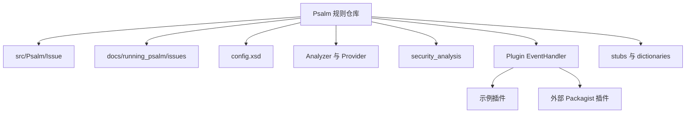

# 记忆卡片摘要（快速复习版）

## 1. 大纲（压缩版）
- 什么叫 Psalm 的“规则仓库”
- 内置规则放在哪些目录
- 问题类型、规则文档、配置模式、分析器之间怎么连起来
- 污点规则和普通 issue 规则有什么不同
- 插件、stub、callmap、示例插件各起什么作用
- 如果要自定义规则，应该从哪一层入手

## 2. 思维导图（Mermaid）

## 3. 重要知识点（必须记住）
- Psalm 没有一个单独叫“rules/”的目录。它的规则知识分散在 Issue 类、Issue 文档、配置模式、分析器源码、污点定义、插件接口、stub 与 callmap 中。[来源1][来源2][来源3]
- 当前 checkout 中 `src/Psalm/Issue` 里有 324 个 issue 类文件，而 `docs/running_psalm/issues` 里有 313 个 issue 文档文件，说明“规则实现”和“规则文档”是相关但不完全一一镜像的资产集合。
- 如果你要新增一个内置 issue，官方贡献文档明确要求同时改 Issue 类、`config.xsd`、问题文档、error level 文档和 issue 索引。[来源4]
- 污点规则不是靠普通 `Issue` 类单独实现的，它还依赖 `TaintKind`、source/sink 注解、数据流图和 taint 插件接口。[来源5][来源6][来源7]

## 4. 难点 / 易混点
- “Issue 类型”不是“分析逻辑”。Issue 类更像告警类型定义，真正什么时候触发，通常在 Analyzer、Provider 或插件里决定。
- “规则仓库”也不是只有 XML 配置。XML 更多是控制与裁决层，真正的分析逻辑在 PHP 源码里。
- `stubs` 不是规则本体，但它们会显著改变 Psalm 对第三方库和内建扩展的理解，因此实战里相当于“知识库的一部分”。

## 5. QA 快速复习卡片
- Q: Psalm 的规则都放在一个目录里吗？
  A: 不是，至少分散在 Issue 类、Issue 文档、Analyzer、security_analysis、Plugin EventHandler、stub/callmap 等多层。
- Q: 想新增一个官方内置 issue，最少要改哪几处？
  A: Issue 类、`config.xsd`、issue 文档、error level 文档、issue 索引，以及真正发射该 issue 的分析逻辑。
- Q: 业务自定义规则应该总是去改 Psalm 内核吗？
  A: 不应该。大多数团队先用插件、stub、注解和配置就够了。

## 6. 快速复现步骤（最短路径）
1. 查看 `src/Psalm/Issue/`
2. 查看 `docs/running_psalm/issues/`
3. 查看 `docs/contributing/adding_issues.md`
4. 查看 `src/Psalm/Plugin/EventHandler/`
5. 查看 `docs/security_analysis/` 与 `src/Psalm/Type/TaintKind.php`
6. 查看 `examples/plugins/`

---

# 学习笔记正文（详细版）

## 0. 学习目标、读者画像与假设
- 技术：`Psalm 规则仓库与扩展点`
- 学习目标：回答“Psalm 的规则到底存在哪里、如何组织、如何扩展”。
- 读者水平：默认理解“规则”这个词，但不预设你懂编译器、AST 或静态分析器内部结构。
- 版本基线：本地 checkout `6.16.1-1-g03037f74c`
- Mermaid 验证：本文中的 Mermaid 图已通过 `npx @mermaid-js/mermaid-cli` 配合 Chromium `--no-sandbox` 方式完成编译验证。

## 1. 先纠正一个误区：Psalm 没有单独的“规则仓库目录”

如果你以前接触过一些以 YAML、JSON、XML 规则为主的扫描器，可能会本能地去找 `rules/`、`checks/`、`signatures/` 之类的目录。  
在 Psalm 里，**“规则仓库”是一个逻辑概念，不是物理单目录概念。**

为什么？因为 Psalm 的规则并不是单靠“模式匹配”成立的。  
它很多结论依赖：
- 类型系统
- 上下文
- 控制流
- 数据流
- 调用关系
- docblock 注解
- 外部库 stub
- 插件钩子

所以在 Psalm 里，“规则”至少分成 6 层：

1. **告警类型层**：有哪些问题类别  
2. **分析逻辑层**：什么情况下触发这些问题  
3. **配置裁决层**：这些问题在项目里按 error/info/suppress 怎么处理  
4. **知识补充层**：stub、callmap、property map 告诉 Psalm 外部代码/内建函数的类型知识  
5. **安全扩展层**：污点 source、sink、escape、flow  
6. **插件扩展层**：允许你自己挂接新规则或替换内建推断

## 2. 规则资产分布图

下面按目录看。

## 2.1 `src/Psalm/Issue/`：问题类型定义仓库

这是最像“规则字典”的地方。  
当前 checkout 中这里有 324 个 PHP 文件，每个文件通常对应一种 issue 类，比如：
- `InvalidArgument`
- `MissingReturnType`
- `PossiblyNullReference`
- `UnusedBaselineEntry`
- `PluginIssue`

它们本质上定义的是：
- 问题名称
- 继承的 issue 基类类型
- 默认错误级别常量
- shortcode 等元信息

你可以把它理解成“病名库”，而不是“医生怎么诊断病”的全过程。

### 为什么这层重要
- 配置 suppression 时要用 issue 名
- 报告里显示的是 issue 名
- 文档页按 issue 名组织
- 插件也可以发出 issue

## 2.2 `docs/running_psalm/issues/`：规则说明书仓库

这里是对应的文档资产。当前 checkout 中有 313 个 issue 文档文件。  
这些文档通常包含：
- 问题定义
- 为什么会报
- 一个最小代码例子
- 如何修复或规避

这层对初学者极其重要，因为很多源码 issue 类本身很短，真正能看懂“为什么报”和“如何修”的是文档页。

### 为什么数量会和 `src/Psalm/Issue/` 不完全一样
这是一个很好的源码观察点。  
可能原因包括：
- 某些内部 issue 没独立文档
- 文档生成或索引更新滞后
- 某些 issue 类是抽象基类或特殊用途

所以不要假设“每个 issue 类都一定有一篇一模一样的独立文档”。

## 2.3 `config.xsd`：规则裁决与配置模式

`config.xsd` 不是“检测规则本体”，但它决定了你能怎样在 `psalm.xml` 里声明这些规则。  
例如它定义了：
- `<projectFiles>`
- `<taintAnalysis>`
- `<plugins>`
- `<issueHandlers>`
- `<enableExtensions>`
- `errorBaseline`

这说明 Psalm 的规则治理不是写死在代码里的，你可以通过 XML 把 issue 的处理等级、忽略范围、目录边界、插件、污点忽略文件等配置出来。[来源3]

### 对初学者的直白理解
- `Issue 类` 是“错误类别名册”
- `config.xsd / psalm.xml` 是“你们团队如何处置这些错误的制度文件”

## 2.4 `src/Psalm/Internal/Analyzer/`：真正发射问题的核心分析器

这层是“规则在什么时候成立”的关键。  
目录里可以看到：
- `ProjectAnalyzer`
- `FileAnalyzer`
- `FunctionAnalyzer`
- `FunctionLikeAnalyzer`
- `StatementsAnalyzer`
- `ClassAnalyzer`
- `InterfaceAnalyzer`
- `TypeAnalyzer`
- `AlgebraAnalyzer`

这里才是规则真正落地的地方。  
比如某个方法调用参数类型不匹配，Issue 名可能是 `InvalidArgument`，但真正何时发这个 issue，需要分析器读 AST、拿上下文、比对 Union Type、考虑分支和断言之后才能决定。

所以你学习 Psalm 规则时一定要牢记：
**Issue 是结果名，Analyzer 是判断过程。**

## 2.5 `docs/security_analysis/` + `src/Psalm/Type/TaintKind.php`：安全规则层

这部分是 Psalm 区别于“纯类型检查器”的关键之一。

### `docs/security_analysis/`
官方安全分析文档目录里有：
- `index.md`
- `annotations.md`
- `custom_taint_sources.md`
- `custom_taint_sinks.md`
- `taint_flow.md`
- `avoiding_false_positives.md`
- `avoiding_false_negatives.md`

这说明 Psalm 的安全分析并不是零散功能，而是一整套体系。

### `src/Psalm/Type/TaintKind.php`
这里定义了官方内置污点类型，例如：
- `sql`
- `ldap`
- `html`
- `has_quotes`
- `shell`
- `callable`
- `unserialize`
- `include`
- `eval`
- `ssrf`
- `file`
- `cookie`
- `header`
- `xpath`
- `sleep`
- `extract`
- `user_secret`
- `system_secret`

这就像安全规则里的“污染类别枚举”。  
不是所有 source 都一样，也不是所有 sink 都一样。不同污点类型决定了不同传播和命中逻辑。[来源5]

### `TaintKindGroup`
这里把多个输入污染类别组成 `ALL_INPUT` 这样的组，方便插件或规则统一处理。[来源6]

## 2.6 `src/Psalm/Plugin/EventHandler/`：扩展规则接口层

这是 Psalm 规则生态最工程化的一层。  
目录里可以看到几十个接口，例如：
- `AfterExpressionAnalysisInterface`
- `AfterMethodCallAnalysisInterface`
- `BeforeAddIssueInterface`
- `FunctionReturnTypeProviderInterface`
- `MethodExistenceProviderInterface`
- `PropertyTypeProviderInterface`
- `AddTaintsInterface`
- `RemoveTaintsInterface`

这意味着你不一定非要改 Psalm 内核，很多需求可以通过插件插进去。

### 对业务团队特别实用的三类扩展
- **类型补充**：告诉 Psalm 某个框架方法真实返回什么
- **存在性补充**：告诉 Psalm 某些动态方法/属性其实存在
- **安全扩展**：给你的 ORM、模板引擎、HTTP 封装补 source/sink/escape

## 2.7 `examples/plugins/`：可学习的规则样例库

示例插件包括：
- `StringChecker.php`
- `PreventFloatAssignmentChecker.php`
- `FunctionCasingChecker.php`
- `SafeArrayKeyChecker.php`
- `InternalChecker.php`
- `TaintActiveRecords.php`
- `ClassUnqualifier.php`

这些例子非常有价值，因为它们把“抽象插件接口”变成了“可复制的写法模板”。

举两个典型：

### `StringChecker`
它实现 `AfterExpressionAnalysisInterface`，在表达式分析后检查字符串字面量中是否错误使用了类名/方法名字符串，并在需要时发出 `InvalidClass` 或 `UndefinedMethod`。[来源8]

### `TaintActiveRecords`
它实现 `AddTaintsInterface`，把特定命名空间下的模型属性读取标记为 taint source。[来源9]

这两个例子刚好说明：
- 一个插件可以发普通 issue
- 另一个插件可以参与 taint 图构建

## 2.8 `stubs/`、`dictionaries/`：知识库层

很多人第一次看 Psalm 仓库，会忽略这两个目录，以为它们不是规则层。其实在实战里它们非常重要。

### `stubs/`
里面有 PHP 版本 stub 和扩展 stub，例如：
- `Php80.phpstub`
- `Php84.phpstub`
- `extensions/pdo.phpstub`
- `extensions/mysqli.phpstub`

这些文件不是“我写了某条规则”，而是“我告诉 Psalm 某个函数/类/扩展应该被怎样理解”。  
如果这些知识缺失，再好的规则也会因为“看不懂 API”而出错。

### `dictionaries/`
这里有 `CallMap_*`、`ManualPropertyMap` 等资产。  
它们本质上也是类型知识和 API 签名知识的仓库，是很多规则判断能否成立的前提。

## 3. 一个新内置规则是怎么加入 Psalm 的

官方文档 `docs/contributing/adding_issues.md` 给出了非常清晰的路线。[来源4]

### 3.1 步骤不是只加一个类

官方要求你至少做这些事：
1. 生成新的 shortcode
2. 在 `Psalm\Issue` 下创建 issue 类
3. 在 `config.xsd` 里增加对应项
4. 在 `docs/running_psalm/issues` 里加文档页
5. 在 `error_levels.md` 和 `issues.md` 里加链接
6. 运行文档测试
7. 在真正的分析逻辑里发出这个 issue

这说明 Psalm 的规则治理是成体系的。  
不是“拍脑袋写个 if，然后 echo 一个错误名字”。

### 3.2 为什么这么麻烦

因为一条规则要真正可用，至少要同时满足：
- 工具知道它叫什么
- 用户知道它是什么意思
- 配置系统知道怎么引用它
- 测试系统知道如何验证它
- 分析器知道何时触发它

这就是成熟工具和脚本式扫描器的差别。

## 4. 如果你想自定义规则，应该优先走哪条路

这取决于需求类型。

### 4.1 只是项目级裁决
例如你只是想：
- 把某类问题降为 info
- 某目录 suppress
- 某方法或属性例外处理

那优先用 `psalm.xml` 的 `<issueHandlers>`。  
这不是新增规则，是“裁决现有规则”。

### 4.2 第三方库类型不准
优先用：
- stub
- Provider 类插件
- `@psalm-*` 注解

### 4.3 你想表达业务特定安全规则
优先用：
- taint 注解
- `AddTaintsInterface`
- `RemoveTaintsInterface`
- 自定义 source/sink/flow

### 4.4 你想定义一种全新问题类型
这时才考虑：
- 新 `Issue` 类
- 新 Analyzer 逻辑
- 新文档与配置模式

对多数业务团队来说，**插件比改内核更合适**。

## 5. 非科班视角下如何理解“规则仓库”

你可以把 Psalm 想成一家医院：
- `Issue 类` 是病名本
- `Analyzer` 是各科医生
- `config.xsd + psalm.xml` 是医院规章制度
- `docs/issues` 是病种说明书
- `stubs/callmap` 是医学词典和药典
- `Plugin EventHandler` 是外聘专家接口
- `security_analysis` 是感染科和流行病追踪系统

这个类比不是严格定义，但非常适合建立整体感。  
当你以后真的去读源码时，再把类比替换成准确术语：Issue、Analyzer、Provider、XSD、Stub、TaintKind、Plugin Hook。

## 6. 常见错误与排查路径

### 错误一：只看 `Issue` 类，忽略 Analyzer
后果：你知道问题名，却不知道为什么会报。

### 错误二：想做业务扩展，直接改 Psalm 内核
后果：维护成本高，升级痛苦。
先问自己：插件、stub、注解够不够？

### 错误三：把 security_analysis 看成“附属文档”
后果：会忽略 taint 类型、flow 注解、误报/漏报治理。

### 错误四：以为 `docs/issues` 就是完整规则真相
后果：你会缺少“规则如何实现”的层次感。

## 7. 延伸学习路径（官方优先）
- 先读 `docs/running_psalm/issues.md`，感受问题类型全景。[来源2]
- 再读 `docs/contributing/adding_issues.md`，理解内置规则如何被接入。[来源4]
- 再读 `docs/running_psalm/plugins/authoring_plugins.md`，理解扩展点。[来源10]
- 再看 `examples/plugins/`，把抽象接口落到实例。[来源8][来源9]
- 最后再回到 `src/Psalm/Internal/Analyzer/` 与安全分析文档，理解规则真正执行路径。[来源1][来源7]

---

# 练习与复习闭环

## 1. 分层练习

### 基础练习
- 解释为什么 Psalm 的规则仓库不是单目录。
- 解释 `Issue` 类和 `Analyzer` 的区别。
- 解释 stub 与规则的关系。

### 应用练习
- 指出 5 个与规则相关的目录，并说出它们各自责任。
- 设计一个“我想让某个 ORM 字段读取自动带 taint”的实现方案。
- 说明新增内置 issue 至少要改哪些文件。

### 综合练习
- 假设你们团队要给自研模板引擎接入 Psalm 安全规则，请分别说明：
  - 哪些内容放插件
  - 哪些内容放注解
  - 哪些内容放配置
  - 哪些情况下才考虑改内核

## 2. 动手任务（带验收标准）
- 任务：画出你自己理解的 Psalm 规则层级图。
- 验收标准：
  - 至少包含 Issue、Analyzer、config、stub、plugin、taint 六层
  - 能说明层与层之间的关系
  - 能举出每层至少一个实际目录

## 3. 常见误区纠偏
- 误区：`docs/issues` 就是规则仓库。  
  正解：它只是规则说明书的一部分。
- 误区：插件只能加小功能，不能表达真正规则。  
  正解：很多业务规则完全可以通过插件落地。
- 误区：安全规则与普通规则完全无关。  
  正解：taint 分析仍然依赖类型知识、数据流和插件机制。

## 4. 复习节奏建议
- Day 1：记住 6 层规则资产结构。
- Day 3：复述“新增一个 issue 要改哪几处”。
- Day 7：把 `TaintKind`、示例插件、Issue 类三者关系讲清楚。
- Day 14：自己找一个框架，思考它的 Psalm 规则扩展该放哪一层。

## 5. 自测题与参考答案（简版）
- 题目1：为什么说 `config.xsd` 也属于“规则仓库”的一部分？  
  参考答案：因为它规定了项目如何声明、裁决和组织这些规则。
- 题目2：为什么 `stubs/` 也重要？  
  参考答案：因为它们影响 Psalm 如何理解外部 API，进而影响规则是否成立。
- 题目3：给业务项目扩展规则时，为什么优先考虑插件？  
  参考答案：因为插件耦合更低、升级成本更小、官方也明确提供了完整钩子接口。

---

# 参考来源与版本说明

## 官方来源（优先）
1. [Analyzer 目录](https://github.com/vimeo/psalm/tree/master/src/Psalm/Internal/Analyzer) - 分析器实现 - 访问日期：2026-03-28
2. [Issue types index](https://psalm.dev/docs/running_psalm/issues/) - Issue 文档索引 - 访问日期：2026-03-28
3. [config.xsd](https://github.com/vimeo/psalm/blob/master/config.xsd) - 配置模式定义 - 访问日期：2026-03-28
4. [Adding a new issue type](https://github.com/vimeo/psalm/blob/master/docs/contributing/adding_issues.md) - 新增 issue 官方流程 - 访问日期：2026-03-28
5. [TaintKind.php](https://github.com/vimeo/psalm/blob/master/src/Psalm/Type/TaintKind.php) - 内置 taint 类型 - 访问日期：2026-03-28
6. [TaintKindGroup.php](https://github.com/vimeo/psalm/blob/master/src/Psalm/Type/TaintKindGroup.php) - taint 分组 - 访问日期：2026-03-28
7. [Security analysis docs](https://psalm.dev/docs/security_analysis/) - 污点规则体系 - 访问日期：2026-03-28
8. [StringChecker example plugin](https://github.com/vimeo/psalm/blob/master/examples/plugins/StringChecker.php) - 普通 issue 插件例子 - 访问日期：2026-03-28
9. [TaintActiveRecords example plugin](https://github.com/vimeo/psalm/blob/master/examples/plugins/TaintActiveRecords.php) - taint 插件例子 - 访问日期：2026-03-28
10. [Authoring Plugins](https://psalm.dev/docs/running_psalm/plugins/authoring_plugins/) - 扩展机制说明 - 访问日期：2026-03-28
11. [Using Plugins](https://psalm.dev/docs/running_psalm/plugins/using_plugins/) - 插件生态入口 - 访问日期：2026-03-28

## 第三方来源（按采信程度标注）
- 无。本文只采用官方源码与文档。

## 关键结论引用映射
- [来源1][来源2][来源3] -> Psalm 的规则资产分散在多个目录和层次
- [来源4] -> 新增内置 issue 的标准流程
- [来源5][来源6][来源7] -> taint 规则不是简单 issue 表，而是完整安全分析体系
- [来源8][来源9][来源10][来源11] -> 插件是正式的规则扩展方式

## 官方文档章节映射与重要例子保留检查
- `running_psalm/issues` -> 本文第 2.1、2.2 节
- `contributing/adding_issues` -> 本文第 3 节
- `running_psalm/plugins/authoring_plugins` -> 本文第 2.6、4 节
- `security_analysis/*` -> 本文第 2.5、4 节
- 保留的重要例子：
  - 新增 issue 的标准七步流程
  - `StringChecker` 作为普通 issue 插件示例
  - `TaintActiveRecords` 作为 taint 扩展示例

## 冲突点与裁决（如有）
- 无明确冲突。本文唯一需要提醒的是“规则文档数量”和“Issue 类数量”并不完全相等，这属于仓库资产结构观察结果，不是事实冲突。

## 版本与访问说明
- 本地观察时间：`2026-03-28`
- Issue 类文件统计：`324`
- issue 文档文件统计：`313`
