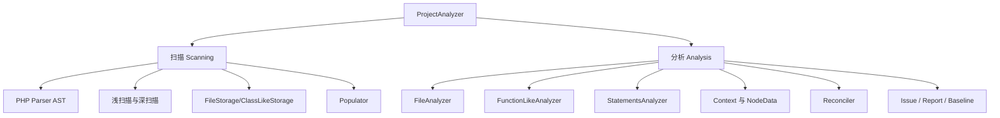

# 记忆卡片摘要（快速复习版）

## 1. 大纲（压缩版）
- Psalm 分析从哪里开始
- 扫描阶段做什么
- 分析阶段做什么
- Context、NodeData、Reconciler 各是什么
- 污点分析如何嵌入整体流程
- 缓存、diff、baseline、报告在工作流中分别处于哪一环

## 2. 思维导图（Mermaid）


## 3. 重要知识点（必须记住）
- Psalm 的总入口是 `ProjectAnalyzer`，它负责两件大事：扫描和分析。[来源1]
- 扫描阶段不是为了“直接报错”，而是先把项目的函数签名、类信息、依赖关系、继承关系等基础知识建好，让后续分析能高效且可并行地进行。[来源1]
- 分析阶段会维护一个 `Context`，它记录当前作用域里变量和属性已知的类型信息。每进一个 if/loop/ternary 分支，Context 都可能被克隆、修改、合并。[来源1]
- `NodeDataProvider` 会为 AST 节点存储类型；`Reconciler` 负责在断言和条件出现后，把已有类型进一步收窄或修正。[来源1]
- 污点分析依赖数据流思想，但官方明确说它与普通分析分开运行；普通分析是基础，污点分析是安全专项模式。[来源2]

## 4. 难点 / 易混点
- “扫描”和“分析”不是一回事。扫描更像建索引和知识库，分析才是逐语句判断。
- “深扫描”不是“深度优先遍历所有代码”。它是 Psalm 为后续真正分析准备依赖信息时，对必要文件进行更深入依赖提取的一种策略。
- “静态分析”不等于“纯字符串匹配”。Psalm 是基于 AST、类型系统、上下文、断言、数据流和缓存协同工作的。

## 5. QA 快速复习卡片
- Q: Psalm 为什么不能一边读文件一边随手报错就完了？
  A: 因为很多判断依赖全局符号、签名、继承和上下文，不先建知识库会既慢又不准。
- Q: Context 是什么？
  A: 是当前分析位置对变量/属性类型和状态的“认知快照”。
- Q: Reconciler 是干什么的？
  A: 把“if ($a !== null)”这类条件转换成更精确的类型结论。
- Q: 污点分析为什么建议单独跑？
  A: 因为它是专门模式，官方明确建议先跑常规分析并修掉问题，再跑 taint 以获得更完整结果。

## 6. 快速复现步骤（最短路径）
1. 打开 `docs/contributing/how_psalm_works.md`
2. 顺着文档记住 `ProjectAnalyzer -> Scanner -> Populator -> FileAnalyzer -> FunctionLikeAnalyzer -> StatementsAnalyzer`
3. 再打开 `docs/security_analysis/index.md`
4. 把普通分析流程和 taint 专项流程分开理解

---

# 学习笔记正文（详细版）

## 0. 学习目标、读者画像与假设
- 技术：`Psalm 的静态分析原理与工作流`
- 学习目标：让没学过编译原理的人，也能顺着 Psalm 官方材料理解“它为什么能从代码里推断出问题”。
- 读者水平：零基础到初学。
- 版本范围：使用官方贡献文档与安全分析文档，对应本地 6.x checkout。
- Mermaid 验证：本文中的 Mermaid 图已通过 `npx @mermaid-js/mermaid-cli` 配合 Chromium `--no-sandbox` 方式完成编译验证。

## 1. 先用一句人话概括 Psalm 的工作方式

Psalm 的核心思路不是“搜关键字”，而是：

1. 先把 PHP 代码解析成结构化语法树  
2. 再建立项目级知识库  
3. 然后带着上下文逐段推断类型、控制流和数据流  
4. 最后在发现矛盾、风险或违规时发出 issue

如果你非要一个生活化类比，可以把它想成：
- 第一步先把一本乱七八糟的账本整理成表格
- 第二步建立索引，知道每个账户是谁、在哪里
- 第三步顺着每条资金流看有没有前后矛盾或危险流向
- 第四步把异常项记成报告

## 2. 总入口：`ProjectAnalyzer`

官方文档直接点名：所有分析的入口是 `ProjectAnalyzer`。[来源1]

它负责两件大事：
- **Scanning**
- **Analysis**

这两个词必须分开记，因为它们对应 Psalm 内部完全不同的阶段。

## 3. 第一阶段：Scanning 扫描

## 3.1 扫描阶段到底在做什么

扫描阶段的目标不是“马上判断业务代码对不对”，而是先搞清楚：
- 这个项目有哪些文件
- 有哪些类、接口、trait、函数、常量
- 这些符号彼此如何继承、引用、依赖
- 哪些签名和返回类型已经已知

没有这一步，后面很多判断都做不稳。  
例如你在 `src/A.php` 里调用了某个 vendor 类的方法，如果连 vendor 类签名都没先建起来，Psalm 根本没法判断参数对不对、返回值是什么。

## 3.2 AST：代码先变成语法树

官方文档说明，Psalm 先借助 `nikic/php-parser` 把 PHP 文件转换成 AST，也就是抽象语法树。[来源1]

非科班理解：
- 源码文本像自然语言句子
- AST 像句法分析后的语法结构图
- 有了 AST，工具才能知道“这里是 if、这里是函数调用、这里是类声明”，而不是只看到一堆字符

所以静态分析的第一层地基就是 AST。

## 3.3 深扫描和浅扫描

这是 Psalm 很实用也很工程化的设计。

官方文档说，Psalm 使用自定义的 `ReflectorVisitor` 扫描文件时有两种模式：[来源1]

### 浅扫描（shallow scan）
- 主要提取函数签名、返回类型、常量、继承等“轮廓信息”
- 对很多 vendor 文件足够了

### 深扫描（deep scan）
- 会深入函数语句体内部，收集更深的依赖信息
- 通常只对那些之后真正要分析的文件做

为什么这样设计？

因为全量深扫一整个大型依赖树很贵。  
Psalm 的思路是：  
对你真正要查的项目代码，挖深一点；  
对多数只需要“知道它长什么样”的依赖，先浅一点。

这是一种典型的工程取舍：**够用的信息先拿到，昂贵工作只对必要目标做。**

## 3.4 扫描阶段产物：Storage 和符号表

文档指出，扫描后 Psalm 会创建多种 storage 对象：[来源1]
- `FileStorage`
- `ClassLikeStorage`
- `FunctionLikeStorage`

这些可以理解成“结构化档案”。  
例如：
- 某文件里定义了什么
- 某类有哪些方法、父类、接口、属性
- 某函数有哪些参数和返回类型

之后 `Populator` 再负责把继承、实现关系等信息补齐，让整个项目知识图谱完整起来。[来源1]

## 3.5 扫描阶段为什么对性能重要

扫描阶段做得好，后面分析阶段就能：
- 更少重复工作
- 更容易并行
- 更好利用缓存
- 让 diff 模式知道哪些文件受变化影响

所以不要把“扫描”理解成无聊预处理。  
在 Psalm 这种工具里，扫描是性能和正确性的共同地基。

## 4. 第二阶段：Analysis 分析

扫描完成后，Psalm 才真正开始“逐代码逻辑判断”。

## 4.1 `FileAnalyzer`：从文件级往下拆

官方文档说，分析文件的入口是 `FileAnalyzer`。[来源1]

它会在文件里找顶层构件：
- class
- trait
- interface
- function
- namespace 中的这些成员

然后把具体分析工作继续委派给更细粒度的 Analyzer。

你可以把它理解成总调度员：
- 先识别文件里有哪些大块头
- 再把每块交给对应专家

## 4.2 `FunctionLikeAnalyzer`：逐函数/方法分析的关键

官方文档特意深入讲了 `FunctionLikeAnalyzer`。  
原因很简单：函数/方法内部的逐句推断，是 Psalm 最核心也最容易理解的一层。[来源1]

它大致做这些事：
1. 取出扫描阶段准备好的 `FunctionLikeStorage`
2. 依据参数和已有签名初始化 `Context`
3. 创建 `StatementsAnalyzer`
4. 逐语句分析 AST 节点
5. 收集 return 类型并与声明类型比较

## 4.3 `Context`：Psalm 对当前作用域的“认知快照”

这是最值得初学者抓住的核心概念。

`Context` 保存的是：
- 当前变量在作用域里的类型
- 某些属性当前可知的状态
- 分支条件下成立的断言
- 其他会影响后续判断的上下文信息

比如：
```php
$a = rand(0, 1) ? "x" : null;
if ($a !== null) {
    echo strlen($a);
}
```

在 `if` 外面，Psalm 对 `$a` 的认识是 `string|null`。  
进到 `if ($a !== null)` 之后，经过类型收窄，Context 里 `$a` 会变成 `string`。  
这就是静态分析里“条件改变后续认知”的典型例子。

## 4.4 `StatementsAnalyzer`：逐语句把逻辑推下去

文档里提到 `StatementsAnalyzer` 会继续把工作交给一堆更细的分析器，比如：
- `IfAnalyzer`
- `ForeachAnalyzer`
- `ExpressionAnalyzer`

这说明 Psalm 的判断不是一锅端，而是按语言结构拆成很多专门模块处理。  
这也是为什么它既复杂又强大：  
每种 PHP 语法结构都可能改变类型、控制流和数据流。

## 4.5 分支、循环与 Context 克隆

官方文档特别强调：遇到 if、loop、ternary 等分支点，Context 会被克隆，然后分支结束后再做合并。[来源1]

为什么要这样？

因为：
- 在 `if ($x)` 分支里成立的条件
- 不一定在 `else` 分支里成立
- 也不一定在 if 结束后还能原样成立

这有点像“平行宇宙”：
- 一个宇宙里 `$x` 非空
- 另一个宇宙里 `$x` 为空
- 走出 if 后，要把两个宇宙的结论重新合并成更保守但正确的认识

## 4.6 `NodeDataProvider`：给每个 AST 节点记类型

文档指出，`NodeDataProvider` 会为每个 `PhpParser` 节点存一份类型信息。[来源1]

这非常关键，因为 Psalm 不是只关心变量声明。  
它还关心表达式：
- 这个函数调用返回什么
- 这个数组访问结果是什么
- 这个拼接表达式变成了什么
- 这个条件表达式最终是 bool 还是更窄的字面值 bool

## 4.7 `Reconciler`：类型收窄与断言融合器

官方文档最后特别提到了 `Reconciler`。[来源1]

它负责把“已有类型”和“新出现的断言/条件”合成更精确的结论。  
例如：
- 已知 `$a` 是 `string|null`
- 条件说 `$a` 不是 null
- 那么更新后就是 `string`

这一步叫类型协调、类型收窄或类型对账都可以。  
没有它，Psalm 就没法真正“理解 if 条件改变了什么”。

## 5. 污点分析如何嵌入整体机制

Psalm 官方安全分析文档说得很直接：它会尝试从用户可控输入追踪到危险输出位置，看数据怎样在赋值、函数调用、数组/属性访问中流动。[来源2]

### 5.1 Source、Sink、Flow
- source：污染源，例如 `$_GET`
- sink：危险落点，例如 SQL 执行、HTML 输出、命令执行
- flow：中间传播路径

### 5.2 为什么 Psalm 能做这个

因为前面普通分析阶段积累的很多能力，本来就为 taint 做了基础设施：
- AST
- 调用关系
- 类型信息
- 上下文
- 数据流图

所以 taint 分析不是凭空冒出来的特殊外挂，而是建立在 Psalm 原本分析平台能力之上的安全专项模式。

### 5.3 为什么官方建议单独跑

官方文档明确说：
- 开启 taint 时，不会执行其他分析
- 为确保结果更全面，应该先正常跑 Psalm 并修掉错误，再跑 taint。[来源2]

这背后的逻辑很朴素：
- 基础语义都没理顺时，taint 图也容易不完整
- 普通类型错误会影响数据流推断质量

## 6. 整体工作流：从命令到报告

把 Psalm 真正在工程里跑一次，完整流程通常是：

1. 读配置 `psalm.xml`
2. 定位项目文件、忽略文件、插件、baseline
3. 读缓存和 diff 信息
4. 扫描文件并构建 storage / 符号信息
5. 填充继承、函数、方法和文件档案
6. 对需要分析的文件逐语句分析
7. 发出 issue
8. 根据 config 和 baseline 做裁决
9. 输出 console / JSON / SARIF 等报告
10. 更新缓存，供下次 diff 和增量分析使用

如果是 taint 模式：
- 前面仍要建立必要知识
- 但后面转入专门污点传播和 sink 命中流程

## 7. 为什么 Psalm 会复杂

官方还有一篇文档专门讲“什么让 Psalm 的开发变复杂”。[来源3]

其中包括：
- 循环难推理
- 类型合并边界很多
- 逻辑断言复杂
- 泛型和模板类型复杂
- 未使用代码检测依赖数据流
- 缓存失效很难
- 语言服务器要处理半成品代码
- 自动修复要尽量做最小 diff

这其实反过来解释了：  
为什么 Psalm 不是几十个正则表达式就能替代的工具。  
因为它解决的问题，本质上就复杂。

## 8. 非科班友好的最终总结

你可以把 Psalm 看成一个很认真、记忆力很强的代码审计员：

- 它先把所有文件和关系登记造册
- 再读每个函数在干什么
- 遇到分支就分情况思考
- 遇到条件就更新自己的判断
- 遇到返回值和声明矛盾就记下来
- 遇到用户输入流向危险操作就标红

这就是 Psalm 的原理主线。  
真正复杂的地方不在“概念难懂”，而在“细节极多、边界极多、工程取舍极多”。

## 9. 常见错误与排查路径

### 错误一：把 AST 理解成“源码字符串稍微整理一下”
正解：AST 是结构化语法树，是后续所有推断的基础。

### 错误二：看不懂为什么 Psalm 需要扫描阶段
正解：因为很多分析依赖全局符号、签名、继承、依赖图和缓存。

### 错误三：以为 Context 就是变量表
正解：它不仅是变量类型表，还是当前控制流条件下的认知快照。

### 错误四：觉得 taint 分析和普通分析互不相干
正解：taint 建立在普通分析的很多底层能力之上，只是运行模式分开。

## 10. 延伸学习路径（官方优先）
- 首读 `how_psalm_works.md`。[来源1]
- 再读 `what_makes_psalm_complicated.md`，理解复杂性来源。[来源3]
- 再读 `security_analysis/index.md` 和 `taint_flow.md`。[来源2][来源4]
- 然后去看 `ProjectAnalyzer`、`FileAnalyzer`、`FunctionLikeAnalyzer`、`StatementsAnalyzer` 这些源码入口。

---

# 练习与复习闭环

## 1. 分层练习

### 基础练习
- 用自己的话解释扫描和分析的区别。
- 解释 `Context` 的作用。
- 解释为什么 if 分支会导致 Context 克隆。

### 应用练习
- 画出 `ProjectAnalyzer -> Scanner -> Populator -> FileAnalyzer -> FunctionLikeAnalyzer -> StatementsAnalyzer` 流程图。
- 选一个简单 PHP 例子，手动说明某变量如何从 `string|null` 在 if 内收窄到 `string`。
- 说明 taint 分析为什么建议单独跑。

### 综合练习
- 假设你在做一个教学分享，请用“医院/审计员/账本”类比之一，把 Psalm 原理讲给完全不懂 AST 的同事听，并在最后纠正类比和真实机制的差别。

## 2. 动手任务（带验收标准）
- 任务：写一份不超过 300 字的 Psalm 工作流说明。
- 验收标准：
  - 包含扫描与分析两阶段
  - 提到 AST
  - 提到 Context
  - 提到 issue 输出
  - 提到 taint 分析与普通分析的关系

## 3. 常见误区纠偏
- 误区：Psalm 静态分析就是字符串匹配。  
  正解：它是 AST + 类型系统 + 上下文 + 数据流。
- 误区：只要知道 issue 名就懂原理了。  
  正解：issue 名只是结果，原理在扫描、上下文、收窄和分析器协作里。
- 误区：污点分析可以跳过普通分析直接拿最准结果。  
  正解：官方建议相反。

## 4. 复习节奏建议
- Day 1：背会扫描/分析两阶段。
- Day 3：背会 Context、NodeDataProvider、Reconciler 三个关键词。
- Day 7：能口头讲清 taint 为什么依赖普通分析底座。
- Day 14：尝试顺着源码入口读一次 `ProjectAnalyzer` 到 `StatementsAnalyzer` 的调用链。

## 5. 自测题与参考答案（简版）
- 题目1：扫描阶段为什么不能省？  
  参考答案：因为分析依赖事先收集的签名、依赖、继承和文件档案。
- 题目2：`Reconciler` 解决什么问题？  
  参考答案：解决条件断言出现后，如何把已有类型更新为更精确类型的问题。
- 题目3：为什么说 Psalm 的 taint 分析不是外挂？  
  参考答案：因为它建立在 AST、类型、调用关系和数据流底座之上，只是以独立模式运行。

---

# 参考来源与版本说明

## 官方来源（优先）
1. [How Psalm works](https://github.com/vimeo/psalm/blob/master/docs/contributing/how_psalm_works.md) - 扫描与分析主流程 - 访问日期：2026-03-28
2. [Security analysis in Psalm](https://psalm.dev/docs/security_analysis/) - 污点分析原理与运行建议 - 访问日期：2026-03-28
3. [What makes Psalm complicated](https://github.com/vimeo/psalm/blob/master/docs/contributing/what_makes_psalm_complicated.md) - 复杂性来源 - 访问日期：2026-03-28
4. [Taint Flow](https://psalm.dev/docs/security_analysis/taint_flow/) - flow 注解与 taint 路径表达 - 访问日期：2026-03-28
5. [src/Psalm/Internal/Analyzer/ProjectAnalyzer.php](https://github.com/vimeo/psalm/blob/master/src/Psalm/Internal/Analyzer/ProjectAnalyzer.php) - 主入口源码 - 访问日期：2026-03-28
6. [src/Psalm/Internal/Analyzer/FileAnalyzer.php](https://github.com/vimeo/psalm/blob/master/src/Psalm/Internal/Analyzer/FileAnalyzer.php) - 文件级分析器 - 访问日期：2026-03-28
7. [src/Psalm/Internal/Analyzer/FunctionLikeAnalyzer.php](https://github.com/vimeo/psalm/blob/master/src/Psalm/Internal/Analyzer/FunctionLikeAnalyzer.php) - 函数/方法分析核心 - 访问日期：2026-03-28
8. [src/Psalm/Type/Reconciler.php](https://github.com/vimeo/psalm/blob/master/src/Psalm/Type/Reconciler.php) - 类型协调器 - 访问日期：2026-03-28

## 第三方来源（按采信程度标注）
- 无。只使用官方文档和官方源码。

## 关键结论引用映射
- [来源1] -> 扫描与分析两阶段、Context、NodeDataProvider、Reconciler 的官方说明
- [来源2][来源4] -> 污点分析与 taint flow 的官方说明
- [来源3] -> Psalm 复杂性的来源
- [来源5][来源6][来源7][来源8] -> 与官方文字对应的核心源码入口

## 官方文档章节映射与重要例子保留检查
- `contributing/how_psalm_works` -> 本文第 2 到第 6 节
- `contributing/what_makes_psalm_complicated` -> 本文第 7 节
- `security_analysis/index` -> 本文第 5、6 节
- `security_analysis/taint_flow` -> 本文第 5 节
- 保留的重要例子：
  - 深扫描 vs 浅扫描
  - `Context` 的作用
  - `Reconciler` 对 `$a => string|null` 到 `$a => string` 的更新
  - `@psalm-flow` 对 taint shortcut 的表达思想

## 冲突点与裁决（如有）
- 无明显冲突。本文做的主要是教学重排：先用非科班视角解释，再回到官方术语。

## 版本与访问说明
- 本地源码观察基线：`6.16.1-1-g03037f74c`
- 文档访问日期：`2026-03-28`
