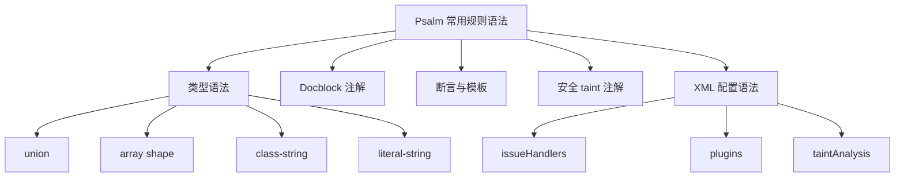

# 记忆卡片摘要（快速复习版）

## 1. 大纲（压缩版）
- Psalm 常用规则语法分哪几类
- 类型语法怎么写
- Docblock 注解怎么写
- 断言、模板、suppress、taint 注解怎么写
- XML 配置里的规则语法怎么写
- 新手常见误写有哪些

## 2. 思维导图（Mermaid）


## 3. 重要知识点（必须记住）
- Psalm 的“规则语法”至少包括四层：类型语法、Docblock 注解语法、taint 注解语法、`psalm.xml` 配置语法。[来源1][来源2][来源3][来源4]
- `@psalm-` 前缀注解存在的一个重要原因，是让 Psalm 支持比传统 phpDocumentor 更丰富的类型，而不把 IDE 搞糊涂。[来源1]
- 很多误报和漏报，不是 Psalm 不行，而是规则语法没写准，例如数组形状、模板参数、assert 注解、source/sink/escape 注解没表达清楚。
- 对遗留项目而言，配置语法中的 `<issueHandlers>`、baseline、`<ignoreFiles>` 和 taint 配置，和代码里的 docblock 语法同样重要。

## 4. 难点 / 易混点
- `@var`、`@psalm-var`、PHP 原生类型声明，不是一回事。
- `@psalm-suppress` 是裁决语法，不是类型语法。
- `@psalm-taint-source` 和 `@psalm-flow` 都跟安全分析有关，但前者定义来源，后者定义传播捷径。
- XML 里的 `<issueHandlers>` 是项目级规则裁决，不会改变类型系统本身。

## 5. QA 快速复习卡片
- Q: Psalm 最基础的类型语法有哪些？
  A: union、intersection、array shape、class-string、literal-string、模板与 utility types。
- Q: 什么时候用 `@psalm-param` 而不是 `@param`？
  A: 当你要写传统 PHPDoc 不易表达、但 Psalm 支持的高级类型时。
- Q: 什么时候该写 `@psalm-assert`？
  A: 当某个函数会改变调用方对变量类型的认知，但仅靠返回值签名表达不出来时。
- Q: XML 里最常用的规则裁决节点是什么？
  A: `<issueHandlers>`。

## 6. 快速复现步骤（最短路径）
1. 打开 `docs/annotating_code/typing_in_psalm.md`
2. 打开 `docs/annotating_code/supported_annotations.md`
3. 打开 `docs/security_analysis/annotations.md`
4. 打开 `docs/running_psalm/dealing_with_code_issues.md`
5. 打开 `docs/running_psalm/configuration.md`

---

# 学习笔记正文（详细版）

## 0. 学习目标、读者画像与假设
- 技术：`Psalm 常用规则语法`
- 学习目标：把你在 Psalm 日常配置、写注解、做安全扫描时最常碰到的语法体系讲清楚。
- 读者水平：能看懂 PHP 注释和 XML，但不要求熟悉高级类型系统。
- 版本范围：以官方注解文档、类型语法文档、安全分析注解文档和配置文档为准。
- Mermaid 验证：本文中的 Mermaid 图已通过 `npx @mermaid-js/mermaid-cli` 配合 Chromium `--no-sandbox` 方式完成编译验证。

## 1. 为什么要单独学“规则语法”

很多人学 Psalm 时只记命令，不记语法。结果就是：
- 会跑，但结果不准
- 会看 issue，但不会告诉 Psalm 更多真相
- 会 suppress，却不会表达更精确的类型

静态分析工具的一个核心事实是：  
**工具能力 = 分析器能力 + 你给它提供的信息质量。**

Psalm 很强，但如果你不给它准确类型、断言、source/sink、配置边界，它也只能按最保守的方式猜。

## 2. 第一层语法：类型语法

官方文档说得很清楚，Psalm 的 docblock 类型由三大类组成：
- atomic types
- union types
- intersection types。[来源2]

对非科班读者，可以简单理解为：
- 原子类型：一个最基础的类型单位
- 联合类型：可能是 A 或 B
- 交叉类型：必须同时满足 A 和 B

## 2.1 Union type：联合类型

写法：
```php
/** @return string|int */
```

意思：返回值可能是字符串，也可能是整数。

这是你最常用的一类高级类型。  
常见例子：
- `string|null`
- `User|false`
- `'a'|'b'`

### 为什么它重要
因为 PHP 真实世界里“可能为空”“可能失败”太常见了。  
如果你把联合类型写丢了，Psalm 不是误报，就是漏报。

## 2.2 Intersection type：交叉类型

写法类似：
```php
/** @param Iterator&Countable $it */
```

意思：参数既要是 `Iterator`，又要是 `Countable`。

这类语法没有 union 那么常见，但在框架接口组合、装饰器和复杂容器类型里很有用。

## 2.3 Array shape：数组形状

这是 Psalm 特别实用的地方。

写法：
```php
/** @return array{id:int, name:string} */
```

意思：
- 返回的是数组
- 而且键是固定结构
- `id` 对应 int
- `name` 对应 string

为什么它比 `array<string,mixed>` 强很多？
因为它不只是说“这是个数组”，还说“这个数组长什么样”。

### 可选键
```php
/** @return array{id:int, name?:string} */
```

意思：`name` 这个键可能有，也可能没有。

## 2.4 class-string / literal-string / value-of / key-of

这些是 Psalm 很典型的“工程语法”。

### `class-string<Foo>`
表示“一个字符串，但它必须是某个类名，而且这个类是 Foo 或其子类”。

### `literal-string`
表示“字面量字符串”，通常用于限制危险上下文，避免用户输入混进来。

### `key-of<...>` / `value-of<...>`
表示“某个数组或常量映射的键/值”。

这些语法看起来高级，但本质上都是在做一件事：  
**把原本很含糊的 string/int，缩成更可信、更具体的集合。**

## 2.5 模板与泛型语法

Psalm 支持 `@template` 等模板注解。[来源1][来源5]

例如：
```php
/**
 * @template T
 * @param T $x
 * @return T
 */
function identity($x) {
    return $x;
}
```

它的意义是：返回值和传入值是同一种类型。  
如果不写模板，Psalm 很多集合类、容器类、工厂类的精度都会差很多。

## 3. 第二层语法：Docblock 注解

## 3.1 标准 PHPDoc 注解

官方支持：
- `@var`
- `@return`
- `@param`
- `@property`
- `@property-read`
- `@property-write`
- `@method`
- `@deprecated`
- `@internal`
- `@mixin` 等。[来源1]

对初学者来说，最常用的仍然是前三个。

## 3.2 为什么有 `@psalm-param`、`@psalm-return`、`@psalm-var`

官方解释是：当你要使用传统 phpDocumentor 不支持、但 Psalm 支持的高级类型时，可以用 `@psalm-` 前缀，避免 IDE 混淆。[来源1]

典型场景：
```php
/**
 * @param array $data
 * @psalm-param array{id:int,name:string} $data
 */
```

这类“双轨写法”很适合团队过渡期：
- IDE 先看普通类型
- Psalm 再看更精细类型

## 3.3 `@psalm-ignore-var`

这个注解对很多团队很实用。[来源1]

场景是：
- 你想保留 IDE 友好的 `@var`
- 但又不想让 Psalm 被这个粗糙 `@var` 误导

于是你可以让 IDE 看 `@var`，让 Psalm 忽略它，继续相信自身推断。

## 3.4 `@mixin`

如果一个类通过 `__call`、`__get` 代理另一个类的方法和属性，可以用 `@mixin` 告诉 Psalm。[来源1]

这在魔术方法、Facade 风格封装、代理对象里很常见。

## 4. 第三层语法：断言与裁决注解

## 4.1 `@psalm-suppress`

这是最常见也最容易被滥用的注解。

写法：
```php
/** @psalm-suppress InvalidReturnType */
```

作用：告诉 Psalm 这里某个问题不要报。

### 正确理解
- 它是裁决语法
- 不是修复语法
- 不是类型语法

### 什么时候可以用
- 你非常明确这是误报
- 临时过渡
- 框架黑魔法短期无法更准确表达

### 什么时候不该先用
- 你只是懒得补类型
- 其实可以用更精确的 `@psalm-param` / `@template` / `@psalm-assert` 表达

## 4.2 `@psalm-assert` / `@psalm-assert-if-true` / `@psalm-assert-if-false`

这类注解告诉 Psalm：某个函数调用会改变你对变量类型的认识。

例如一个校验函数：
```php
/**
 * @psalm-assert non-empty-string $s
 */
function ensureNonEmptyString(string $s): void {}
```

调用后，Psalm 就知道 `$s` 不是空字符串了。

这类语法解决的是“普通返回值签名表达不出控制流效果”的问题。

## 4.3 `@psalm-param-out`

用于 by-reference 参数场景，表示函数执行后，引用参数的类型会被改造成另一种类型。[来源1]

这在“初始化输出参数”的旧式 PHP 代码里很常见。

## 4.4 `@psalm-seal-properties` / `@psalm-seal-methods`

这两个注解是对魔术属性和魔术方法的约束。[来源1]

意思大致是：
- 你可以有 `__get` / `__set` / `__call`
- 但我希望你只允许访问 docblock 里声明过的那些成员

对动态框架代码，这是一种非常有用的“收口”手段。

## 5. 第四层语法：安全 taint 注解

官方安全注解文档列出了这些关键语法：[来源3]

## 5.1 `@psalm-taint-source <taint-type>`

用来声明污染源。

例子：
```php
/**
 * @psalm-taint-source input
 */
function getQueryParam(string $name): string {}
```

意思：这个函数的返回值，应被当作用户输入污染源。

## 5.2 `@psalm-taint-sink <taint-type> <param-name>`

用来声明危险落点。

例子：
```php
/**
 * @psalm-taint-sink sql $sql
 */
function exec(string $sql): void {}
```

意思：如果 tainted SQL 流到 `$sql` 参数，就报问题。

## 5.3 `@psalm-taint-escape <taint-type>`

表示某操作会清洗某类污染。[来源6]

例如：
```php
/**
 * @psalm-taint-escape html
 */
```

它的本质是：告诉 Psalm 这里发生了安全上下文相关的净化。

## 5.4 `@psalm-taint-unescape <taint-type>`

表示原本清洗过的值又被“反解码/反净化”，重新变得危险。[来源7]

这个注解很重要，因为很多真实漏洞就是“先转义，后反转义”造成的。

## 5.5 `@psalm-taint-specialize`

用于更精确地区分不同调用上下文下的 taint 行为。[来源6]

直白理解：  
告诉 Psalm 不要把所有调用一锅端，而要按每次调用的输入单独判断。

## 5.6 `@psalm-flow`

这是很多人容易忽略但很强的语法。[来源8]

它能表达：
- 某函数其实代理了另一个 sink
- 某些输入参数会反映到返回值
- 某条 taint 路径可以走快捷语义

对复杂框架或层层封装的业务代码非常有用。

## 6. 第五层语法：`psalm.xml` 配置语法

## 6.1 `<projectFiles>`

决定分析范围。

最小例子：
```xml
<projectFiles>
    <directory name="src" />
</projectFiles>
```

这层语法非常重要，因为范围一旦圈错：
- 误报会增多
- 性能会变差
- taint 路径会被测试代码污染

## 6.2 `<ignoreFiles>`

用于从项目范围中排除特定目录或文件。[来源4]

适合：
- fixtures
- 生成代码
- 第三方不值得治理的历史目录

不适合：
- 为了“图省事”把真正的核心坏代码整个排掉

## 6.3 `<issueHandlers>`

这是项目级规则裁决核心。[来源9]

你可以：
- 整类 suppress
- 按目录 suppress
- 按文件 suppress
- 按 referencedMethod / referencedClass / referencedProperty 等更细粒度 suppress
- 处理 `PluginIssue`

示例：
```xml
<issueHandlers>
    <MissingPropertyType errorLevel="suppress" />
</issueHandlers>
```

## 6.4 baseline 语法

可通过命令设置，也可在配置根节点上写：
```xml
<psalm errorBaseline="./path/to/your-baseline.xml">
```

这是遗留项目治理时必学语法。

## 6.5 `<plugins>`

用于启用 file-based 插件或 composer-based 插件类。

示例：
```xml
<plugins>
    <plugin filename="examples/plugins/FunctionCasingChecker.php"/>
    <pluginClass class="Psalm\PhpUnitPlugin\Plugin"/>
</plugins>
```

## 6.6 `<taintAnalysis>`

用于 taint 相关配置，比如忽略某些不想进入污点路径的目录。[来源6]

示例思想：
```xml
<taintAnalysis>
    <ignoreFiles>
        <directory name="tests"/>
    </ignoreFiles>
</taintAnalysis>
```

## 7. 新手最值得先掌握的 12 条语法

如果你不想一口气学完整套语法，先记这 12 条：
- `string|null`
- `array{id:int,name:string}`
- `class-string<Foo>`
- `literal-string`
- `@psalm-param`
- `@psalm-return`
- `@psalm-suppress`
- `@psalm-assert`
- `@template`
- `@psalm-taint-source`
- `@psalm-taint-sink`
- `<issueHandlers>`

只靠这 12 条，你就已经能覆盖大量日常使用场景。

## 8. 常见错误与排查路径

### 错误一：用粗糙 `@var array` 代替数组形状
后果：Psalm 失去结构信息，误报漏报都会增加。

### 错误二：明明应该表达模板关系，却写成 `mixed`
后果：推断精度大幅下降。

### 错误三：误把 `@psalm-suppress` 当长期解决方案
后果：规则债务越积越多。

### 错误四：taint 只标 source，不标 sink / escape / flow
后果：结果既不完整，也难治理。

### 错误五：XML 里靠全局 suppress 图省事
后果：项目真实风险被埋掉。

## 9. 延伸学习路径（官方优先）
- `typing_in_psalm.md`：先建立类型语法总览。[来源2]
- `supported_annotations.md`：掌握常用注解。[来源1]
- `templated_annotations.md`：进一步学模板。[来源5]
- `security_analysis/annotations.md` 与相关章节：掌握 taint 注解。[来源3][来源6][来源7][来源8]
- `configuration.md` 与 `dealing_with_code_issues.md`：掌握项目级裁决语法。[来源4][来源9]

---

# 练习与复习闭环

## 1. 分层练习

### 基础练习
- 分别写出 union、array shape、class-string 的例子。
- 写出一个 `@psalm-suppress` 例子，并说明为什么它不是最佳长期方案。
- 写出一个 `<issueHandlers>` 示例。

### 应用练习
- 为一个返回用户数组的函数写出精确数组形状。
- 为一个校验函数写 `@psalm-assert`。
- 为一个 SQL 执行包装器写 `@psalm-taint-sink`。

### 综合练习
- 设计一段包含：
  - `@template`
  - `@psalm-param`
  - `@psalm-return`
  - `@psalm-assert`
  - `@psalm-taint-source`
  - `<issueHandlers>`
  的最小示例，并说明每一层语法分别解决什么问题。

## 2. 动手任务（带验收标准）
- 任务：把一个使用大量 `mixed` 和 `array` 的旧 PHP 文件，改造成对 Psalm 更友好的版本。
- 验收标准：
  - 至少新增 3 个精确类型
  - 至少新增 1 个数组形状
  - 至少新增 1 个断言或模板
  - 没有一上来就用 suppress 掩盖问题

## 3. 常见误区纠偏
- 误区：语法只是装饰，跑命令才是重点。  
  正解：语法决定 Psalm 能不能真正理解你的代码。
- 误区：安全扫描只靠 `--taint-analysis` 开关。  
  正解：source/sink/escape/flow 注解同样关键。
- 误区：所有高级类型都该直接塞进普通 `@param`。  
  正解：必要时应用 `@psalm-param` 等前缀语法。

## 4. 复习节奏建议
- Day 1：背会 12 条常用语法。
- Day 3：手写一个数组形状 + 模板 + assert 组合例子。
- Day 7：手写一个 taint source/sink/escape 组合例子。
- Day 14：复查团队项目里是否有可以从 suppress 改成精确类型表达的地方。

## 5. 自测题与参考答案（简版）
- 题目1：为什么 `array{id:int,name:string}` 比 `array<string,mixed>` 更好？  
  参考答案：因为它保留了结构和键级别类型信息。
- 题目2：`@psalm-assert` 解决什么问题？  
  参考答案：解决某些函数调用会改变调用方类型认知，但普通返回值表达不出来的问题。
- 题目3：为什么 taint 语法不只 source/sink 两个？  
  参考答案：因为真实传播还涉及净化、反净化和 flow shortcut。

---

# 参考来源与版本说明

## 官方来源（优先）
1. [Supported docblock annotations](https://psalm.dev/docs/annotating_code/supported_annotations/) - 注解总览 - 访问日期：2026-03-28
2. [Typing in Psalm](https://psalm.dev/docs/annotating_code/typing_in_psalm/) - 类型语法总览 - 访问日期：2026-03-28
3. [Security analysis annotations](https://psalm.dev/docs/security_analysis/annotations/) - taint 注解总览 - 访问日期：2026-03-28
4. [Configuration](https://psalm.dev/docs/running_psalm/configuration/) - `psalm.xml` 配置语法 - 访问日期：2026-03-28
5. [Template annotations](https://psalm.dev/docs/annotating_code/templated_annotations/) - 模板语法 - 访问日期：2026-03-28
6. [Avoiding false-positives](https://psalm.dev/docs/security_analysis/avoiding_false_positives/) - `@psalm-taint-escape` 与 specialize - 访问日期：2026-03-28
7. [Avoiding false-negatives](https://psalm.dev/docs/security_analysis/avoiding_false_negatives/) - `@psalm-taint-unescape` - 访问日期：2026-03-28
8. [Taint Flow](https://psalm.dev/docs/security_analysis/taint_flow/) - `@psalm-flow` - 访问日期：2026-03-28
9. [Dealing with code issues](https://psalm.dev/docs/running_psalm/dealing_with_code_issues/) - `<issueHandlers>` 与 suppress 策略 - 访问日期：2026-03-28

## 第三方来源（按采信程度标注）
- 无。本文只使用官方文档。

## 关键结论引用映射
- [来源1][来源2] -> 类型语法与常见注解体系
- [来源3][来源6][来源7][来源8] -> taint 注解语法体系
- [来源4][来源9] -> XML 配置语法与项目级规则裁决
- [来源5] -> 模板语法的独立重要性

## 官方文档章节映射与重要例子保留检查
- `annotating_code/typing_in_psalm` -> 本文第 2 节
- `annotating_code/supported_annotations` -> 本文第 3、4 节
- `annotating_code/templated_annotations` -> 本文第 2.5 节
- `security_analysis/annotations` -> 本文第 5 节
- `security_analysis/avoiding_false_positives` -> 本文第 5.3、5.5、6.6 节
- `security_analysis/avoiding_false_negatives` -> 本文第 5.4 节
- `security_analysis/taint_flow` -> 本文第 5.6 节
- `running_psalm/configuration` + `dealing_with_code_issues` -> 本文第 6 节
- 保留的重要例子：
  - `@param-out`
  - `@psalm-ignore-var`
  - `@mixin`
  - `@psalm-taint-escape`
  - `@psalm-flow`
  - `<issueHandlers>` 精细 suppress 示例

## 冲突点与裁决（如有）
- 无。本文做的是教学重排，把散落在不同文档中的语法并到一条学习路径里。

## 版本与访问说明
- 文档访问日期：`2026-03-28`
