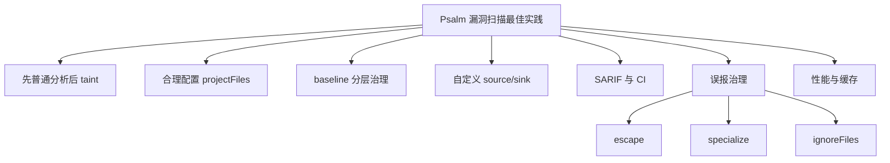

# 记忆卡片摘要（快速复习版）

## 1. 大纲（压缩版）
- 为什么 Psalm 能做漏洞扫描
- 普通分析与 taint 分析如何分工
- 新项目与遗留项目的最佳落地顺序
- baseline、SARIF、CI、插件、stub、source/sink 如何组合
- 怎样减少误报与漏报
- 团队级工程实践清单

## 2. 思维导图（Mermaid）

## 3. 重要知识点（必须记住）
- Psalm 的安全扫描核心是 taint analysis，它追踪用户可控输入到危险落点的流向。[来源1]
- 官方明确建议：要获得更完整结果，应先正常跑 Psalm、修正常规错误，再单独跑 `--taint-analysis`。[来源1]
- taint 分析适合重点看 SQL 注入、XSS、命令执行、文件包含、SSRF、LDAP、header/cookie 等路径风险，因为内置 taint 类型已经覆盖这些类别。[来源1][来源2]
- 在工程实践上，baseline、独立 taint baseline、SARIF 输出、CI 缓存、插件扩展 source/sink、`literal-string` 约束、上下文安全转义，是把 Psalm 从“能扫”变成“可持续用”的关键。

## 4. 难点 / 易混点
- “能做安全分析”不等于“默认就把你们业务框架的 source/sink 都懂了”。很多项目要补 taint 注解或插件。
- “减少误报”不等于“一路 suppress”。更好的做法往往是补 escape、specialize、stub 或更精确类型。
- “先上 taint”通常不是最佳顺序。很多团队失败，就是一开始就把安全专项和基础类型债务混在一起。

## 5. QA 快速复习卡片
- Q: 在遗留项目里引入 Psalm 安全扫描，第一步应该干什么？
  A: 先跑普通分析，建立 baseline，修关键基础问题，再单独跑 taint。
- Q: 为什么要单独准备 taint baseline？
  A: 因为 taint 是独立模式，问题类型和治理节奏通常与普通分析不同。
- Q: 怎么降低误报？
  A: 精确建模 source/sink/escape/flow，使用 `@psalm-taint-specialize`、`literal-string`、ignoreFiles，而不是无脑 suppress。
- Q: 怎么让结果进平台？
  A: 输出 SARIF，再接 GitHub code scanning 或其他兼容平台。

## 6. 快速复现步骤（最短路径）
1. `./vendor/bin/psalm --init`
2. `./vendor/bin/psalm --no-cache`
3. `./vendor/bin/psalm --set-baseline`
4. 修关键基础错误
5. `./vendor/bin/psalm --taint-analysis --report=taint.sarif`
6. 根据项目情况补 source/sink/escape/flow

---

# 学习笔记正文（详细版）

## 0. 学习目标、读者画像与假设
- 技术：`Psalm 在典型漏洞扫描工程中的最佳实践`
- 学习目标：回答“如何把 Psalm 真正用于安全扫描工程，而不是只跑一次 demo”。
- 读者水平：默认了解基本命令行和 CI 概念，不要求熟悉 SAST。
- 版本范围：以官方安全分析文档、命令文档、配置文档和插件文档为准。
- Mermaid 验证：本文中的 Mermaid 图已通过 `npx @mermaid-js/mermaid-cli` 配合 Chromium `--no-sandbox` 方式完成编译验证。

## 1. 先把定位说清楚：Psalm 不是黑盒漏洞扫描器

Psalm 更像是“有安全分析能力的静态分析平台”。  
这意味着：
- 它很强，但需要配置和建模
- 它适合进入开发流程
- 它擅长结合类型、上下文和数据流做静态推断
- 它不是一键取代动态测试、渗透测试或运行时防护

理解这点很重要。  
如果你把它当成“零配置黑盒审计器”，落地时会失望。  
如果你把它当成“可持续接入工程流程的白盒分析底座”，它就会很有价值。

## 2. Psalm 安全扫描的核心能力是什么

官方安全分析文档给出的核心描述是：
- 识别用户可控输入
- 追踪数据在赋值、函数调用、数组/属性访问中的流动
- 检查这些数据是否流向危险 sink。[来源1]

### 2.1 内置关注的 taint 类型

当前内置类型包括：
- `sql`
- `ldap`
- `html`
- `has_quotes`
- `shell`
- `callable`
- `unserialize`
- `include`
- `eval`
- `ssrf`
- `file`
- `cookie`
- `header`
- `xpath`
- `sleep`
- `extract`
- `user_secret`
- `system_secret`。[来源2]

这意味着 Psalm 适合覆盖的典型漏洞方向包括：
- SQL 注入
- XSS
- 命令注入
- 文件包含/路径注入
- SSRF
- LDAP 注入
- 反序列化相关危险流
- header/cookie 注入类问题

## 3. 最重要的最佳实践：先普通分析，后 taint 分析

官方文档明确写了：
- 开启 taint analysis 时，不会执行其他分析
- 为拿到更完整结果，应先正常运行 Psalm 并修掉错误，再跑 taint。[来源1]

这条建议应该被当成总原则。

### 为什么这条原则这么重要

因为 taint 分析不是飘在天上的：
- 它依赖项目结构能被正确理解
- 依赖函数/方法签名尽量准确
- 依赖基础类型错误不要太多

如果项目连最基础的类型和调用关系都乱，taint 路径很容易缺胳膊少腿。

### 工程化落地顺序
1. 先把项目跑起来
2. 先做一次普通分析
3. 建 baseline
4. 先修最影响理解能力的问题
5. 再切 taint 模式

## 4. 新项目和遗留项目应走不同路径

## 4.1 新项目最佳实践

### 目标
让 Psalm 尽早变成默认安全底座，而不是事后补救工具。

### 推荐顺序
1. `--init`
2. 明确 `<projectFiles>` 只覆盖真正业务代码
3. 选择合适 error level
4. 普通分析跑通
5. 添加关键插件/stub
6. 在 CI 中接入普通分析
7. 再接入 taint 分析
8. 输出 SARIF

### 新项目的优势
- baseline 负担小
- 规则债务少
- 团队容易形成一致编码习惯

## 4.2 遗留项目最佳实践

遗留项目更现实的路径通常是：
1. 全量普通分析
2. `--set-baseline`
3. 先压住新增问题
4. 逐步修基础类型和结构问题
5. 单独跑 taint
6. 为 taint 准备单独 baseline
7. 再逐步治理安全问题

### 为什么建议 taint 单独 baseline
官方文档明确提到，taint analysis 单独运行，因此使用单独 baseline 是有意义的。[来源1]

这在工程上很合理，因为：
- 普通 issue 和 taint issue 关注点不同
- 修复节奏不同
- 审核责任人也常不同

## 5. 配置范围要小而准：`<projectFiles>` 与 `<ignoreFiles>`

一个非常常见的失败原因是“分析范围圈太大”。

### 推荐原则
- 先分析真正业务代码
- fixtures、测试辅助、生成文件、第三方临时目录按需排除
- 不要一开始就把整个 vendor、测试和工具脚本全拉进来

### 为什么这对安全扫描尤其重要
- 测试代码会制造大量假 source/sink
- 演示代码会带来噪音
- 大量无关目录会拖慢扫描并污染 taint 路径

但注意：  
**排除范围不是为了掩盖问题，而是为了让结果更贴近你真正关心的攻击面。**

## 6. baseline 是治理工具，不是藏问题工具

官方 baseline 机制非常适合安全工程，但前提是用法正确。[来源3]

## 6.1 baseline 的正确用途
- 冻结历史遗留债务
- 防止新增同类问题
- 为增量治理留出生存空间

## 6.2 baseline 的错误用途
- 永远不更新
- 把新问题也继续塞进去
- 当作“已经处理完”的证明

### 推荐实践
- 普通分析 baseline 单独存
- taint baseline 单独存
- 定期 `--update-baseline`
- 在 CI 中禁止无理由扩大 baseline

## 7. source / sink / escape / flow 建模是安全效果的核心

如果你只依赖 Psalm 内置默认 source/sink，很多业务场景不会被完整看懂。

## 7.1 什么时候要补 source

当用户输入不直接来自：
- `$_GET`
- `$_POST`
- `$_COOKIE`

而是经过你们自己的 HTTP Request 封装、框架请求对象、消息载体、数据库 ActiveRecord 字段读取等间接路径时，就要补 source。[来源4][来源5]

## 7.2 什么时候要补 sink

当危险操作被你们自己的封装包住，例如：
- 自定义 SQL 执行器
- 自定义模板渲染器
- 自定义 shell 封装
- 自定义 HTTP 客户端入口

这时可以用 `@psalm-taint-sink` 或插件建模。[来源5]

## 7.3 什么时候要补 escape

当你们有可靠的净化函数、模板过滤器、统一输出编码器时，应该明确告诉 Psalm 这里发生了净化。[来源6]

否则就会出现大量“明明安全了却还在报警”的误报。

## 7.4 什么时候要补 flow

复杂框架里数据会经过多层中转，单靠逐层展开可能太贵或不够准。  
这时 `@psalm-flow` 可以把“代理关系”或“参数反射到返回值”的语义显式写出来。[来源7]

## 8. 减少误报的最佳实践

## 8.1 优先用精确建模，不要先 suppress

优先顺序推荐：
1. 补精确类型
2. 补 source/sink/escape/flow
3. 用 `@psalm-taint-specialize`
4. 用 `literal-string`
5. 必要时才 suppress

## 8.2 使用 `@psalm-taint-specialize`

很多误报来自“Psalm 把一个函数所有调用混在一起看”。  
`@psalm-taint-specialize` 可以让它按调用上下文分别看，提高精度。[来源6]

## 8.3 使用 `literal-string`

官方安全文档明确建议，在 SQL/命令/HTML 等敏感字符串场景，尽量让危险字符串来自开发者写死的字面量，而不是用户输入拼接。[来源1]

这类类型约束比 suppress 更有长期价值。

## 8.4 分目录忽略 taint 路径

如果你明确不关心测试目录中的 taint 路径，可以在 `<taintAnalysis><ignoreFiles>` 里排掉。[来源6]

这不是偷懒，而是降低无效噪声。

## 9. 减少漏报的最佳实践

## 9.1 不要漏掉项目自定义 source/sink

这是最常见漏报来源。

## 9.2 不要把业务核心目录错误排除

某些团队为了让报表好看，把最复杂的 legacy 目录直接 ignore，结果真正高风险代码根本没扫到。

## 9.3 对框架行为做建模

ORM、DI 容器、模板、队列消息、HTTP 封装，这些常常是数据流真正穿行的通道。  
不建模，taint 图就会断。

## 9.4 维护 stub 和插件

第三方库签名不准，也会导致漏报。  
stub 和 Provider/Plugin 是重要补救手段。

## 10. 结果输出与平台集成

官方支持 SARIF，这非常重要。[来源1]

### 为什么 SARIF 值得用
- 可对接 GitHub code scanning
- 可对接其他兼容平台
- 保留 taint flow 等结构化信息
- 不只是给人看，也给平台消费

### 实践建议
- 普通分析输出一份报告
- taint 分析单独输出一份 SARIF
- 在 CI 中归档结果，便于比较前后差异

## 11. 性能与稳定性最佳实践

## 11.1 利用缓存和 diff
- 日常增量扫描利用缓存
- CI 冷启动再考虑 `--no-cache`
- 全量安全基线重扫时可显式关闭 diff 或清缓存

## 11.2 合理使用线程
- 大仓库可用 `--threads`
- 但要结合容器内存和核数
- taint 扫描往往更吃资源

## 11.3 Docker / Phar / Composer 安装策略

安装文档推荐官方 Docker 镜像，并给出 Phar 选项。[来源8]

### 简单建议
- 团队统一环境：优先 Docker
- 项目依赖集成：优先 Composer
- 依赖冲突明显：考虑 Phar

## 12. 一个可落地的工程清单

如果你要在团队里真正落地 Psalm 漏洞扫描，可以按这个清单推进：

1. 确认 PHP 项目边界与分析目录
2. 用 Composer/Phar/Docker 统一运行方式
3. 初始化 `psalm.xml`
4. 跑普通分析
5. 建普通 baseline
6. 修最影响理解能力的问题
7. 跑 taint 分析
8. 建 taint baseline
9. 为框架/封装补 source/sink/escape/flow
10. 输出 SARIF 接平台
11. 把普通分析和 taint 分析都接入 CI
12. 定期更新 baseline、stub、插件和规则表达

## 13. 非科班人的最终理解版本

把 Psalm 安全扫描想成机场安检：
- 普通分析先确认每件行李是什么、标签对不对、有没有缺失信息
- taint 分析再追踪“危险物品”是不是跑到了不该出现的区域

如果连行李标签都错了，后面的危险追踪也会乱。  
所以“先普通分析、后 taint 分析”不是教条，而是流程合理性。

## 14. 延伸学习路径（官方优先）
- `security_analysis/index.md`：先通读安全分析总览。[来源1]
- `custom_taint_sources.md` 与 `custom_taint_sinks.md`：补业务 source/sink。[来源4][来源5]
- `avoiding_false_positives.md` 与 `avoiding_false_negatives.md`：治理质量。[来源6][来源9]
- `taint_flow.md`：复杂 flow 建模。[来源7]
- `dealing_with_code_issues.md` 与 CLI 文档：学会 baseline、SARIF、CI 落地。[来源3][来源10]

---

# 练习与复习闭环

## 1. 分层练习

### 基础练习
- 解释为什么安全扫描要先普通分析后 taint 分析。
- 解释 source、sink、escape、flow 四者区别。
- 解释为什么 taint baseline 应单独维护。

### 应用练习
- 为一个使用自定义 Request 类、PDO 包装器和模板渲染器的项目，设计 taint 建模方案。
- 给一个遗留项目设计 4 周的 Psalm 安全治理节奏。
- 设计普通分析与 taint 分析的 CI 命令和报告策略。

### 综合练习
- 以“SQL 注入 + XSS”两个方向为例，写出一个 Psalm 安全扫描落地提案，至少包含：
  - 项目范围
  - baseline 策略
  - source/sink 建模
  - 误报治理
  - SARIF 平台接入

## 2. 动手任务（带验收标准）
- 任务：为一个 PHP Web 项目写一版安全扫描接入方案。
- 验收标准：
  - 有普通分析步骤
  - 有 taint 分析步骤
  - 有 baseline 策略
  - 有 source/sink/escape 建模计划
  - 有 CI 与 SARIF 输出计划
  - 有误报/漏报治理计划

## 3. 常见误区纠偏
- 误区：直接开 taint 就能拿到最准安全结果。  
  正解：先普通分析再 taint 才是官方建议。
- 误区：误报一多就 suppress。  
  正解：优先补模型、类型和 flow。
- 误区：baseline 就是把问题永久藏起来。  
  正解：baseline 是治理节奏工具，不是长期掩盖手段。

## 4. 复习节奏建议
- Day 1：背会 source/sink/escape/flow 和“先普通后 taint”原则。
- Day 3：复述新项目与遗留项目的不同落地路径。
- Day 7：写出一套适合自己项目的 SARIF + CI + baseline 组合方案。
- Day 14：复盘一次你们项目里的误报和漏报分别来自哪些建模缺失。

## 5. 自测题与参考答案（简版）
- 题目1：为什么 Psalm 的 taint 分析不能脱离普通分析理解？  
  参考答案：因为普通分析提供了类型、调用关系和上下文底座，官方也建议先跑普通分析再跑 taint。
- 题目2：减少误报的首选手段是什么？  
  参考答案：补 source/sink/escape/flow、精确类型和 specialize，而不是先 suppress。
- 题目3：为什么 SARIF 很关键？  
  参考答案：因为它能把结果接入代码扫描平台，便于团队持续使用。

---

# 参考来源与版本说明

## 官方来源（优先）
1. [Security analysis in Psalm](https://psalm.dev/docs/security_analysis/) - taint 分析总览、运行建议、SARIF、taint graph - 访问日期：2026-03-28
2. [TaintKind.php](https://github.com/vimeo/psalm/blob/master/src/Psalm/Type/TaintKind.php) - 内置污点类型 - 访问日期：2026-03-28
3. [Dealing with code issues](https://psalm.dev/docs/running_psalm/dealing_with_code_issues/) - baseline 策略 - 访问日期：2026-03-28
4. [Custom Taint Sources](https://psalm.dev/docs/security_analysis/custom_taint_sources/) - 自定义 source - 访问日期：2026-03-28
5. [Custom Taint Sinks](https://psalm.dev/docs/security_analysis/custom_taint_sinks/) - 自定义 sink - 访问日期：2026-03-28
6. [Avoiding false-positives](https://psalm.dev/docs/security_analysis/avoiding_false_positives/) - escape、specialize、ignoreFiles - 访问日期：2026-03-28
7. [Taint Flow](https://psalm.dev/docs/security_analysis/taint_flow/) - `@psalm-flow` - 访问日期：2026-03-28
8. [Installation](https://psalm.dev/docs/running_psalm/installation/) - Composer / Docker / Phar 安装策略 - 访问日期：2026-03-28
9. [Avoiding false-negatives](https://psalm.dev/docs/security_analysis/avoiding_false_negatives/) - unescape - 访问日期：2026-03-28
10. [Command line usage](https://psalm.dev/docs/running_psalm/command_line_usage/) - CLI 基础与报告入口 - 访问日期：2026-03-28
11. [Using Plugins](https://psalm.dev/docs/running_psalm/plugins/using_plugins/) - 插件扩展路径 - 访问日期：2026-03-28
12. [Authoring Plugins](https://psalm.dev/docs/running_psalm/plugins/authoring_plugins/) - 插件实现入口 - 访问日期：2026-03-28

## 第三方来源（按采信程度标注）
- 无。本文只采用官方资料。

## 关键结论引用映射
- [来源1][来源2] -> Psalm 安全扫描能力边界与内置 taint 类型
- [来源1][来源3][来源10] -> 普通分析、taint 分析、baseline、SARIF 的工程化组合
- [来源4][来源5][来源6][来源7][来源9] -> source/sink/escape/flow 与误报漏报治理
- [来源8][来源11][来源12] -> 安装与扩展的工程落地路径

## 官方文档章节映射与重要例子保留检查
- `security_analysis/index` -> 本文第 2、3、6、10 节
- `security_analysis/custom_taint_sources` -> 本文第 7.1 节
- `security_analysis/custom_taint_sinks` -> 本文第 7.2 节
- `security_analysis/avoiding_false_positives` -> 本文第 7.3、7.4、8 节
- `security_analysis/avoiding_false_negatives` -> 本文第 9 节
- `security_analysis/taint_flow` -> 本文第 7.4 节
- `running_psalm/dealing_with_code_issues` -> 本文第 6 节
- `running_psalm/installation` + `command_line_usage` -> 本文第 11 节
- 保留的重要例子：
  - taint 单独运行且推荐先修普通问题
  - `@psalm-taint-source`
  - `@psalm-taint-sink`
  - `@psalm-taint-escape`
  - `@psalm-flow`
  - `.sarif` 报告输出与 taint graph 导出

## 冲突点与裁决（如有）
- 无实质冲突。本文主要是把官方安全文档从“功能说明”重排成“工程落地步骤”。

## 版本与访问说明
- 文档访问日期：`2026-03-28`
