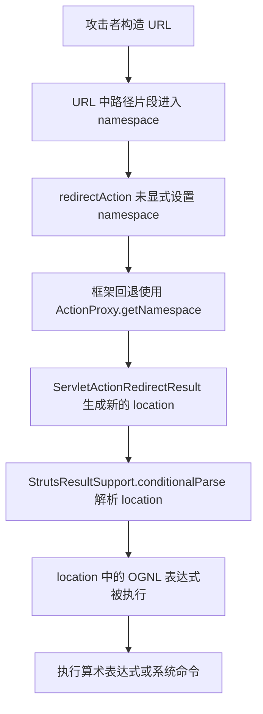

# CVE-2018-11776 复现与教学报告

## 0. 任务边界与结论先行

本次复现严格限制在容器环境内完成，没有在宿主机本地直接部署或执行漏洞目标程序。

- 容器名称：`struts11776-lab`
- 基础容器：`ubuntu:18.04`
- 最终成功复现的漏洞应用：Apache Struts Showcase 2.3.12
- 最终成功运行栈：Java 8 + Tomcat 8
- 复现结果：成功触发 OGNL 求值，并成功执行受控命令 `id`
- 关键证据 1：`/${2+2}/help.action` 最终被解析为 `/4/date.action`
- 关键证据 2：命令执行结果回显为 `uid=0(root) gid=0(root) groups=0(root)`

补充说明：

- 我先在官方 Struts 2.5.16 Showcase 上验证了漏洞入口，成功观察到 OGNL 表达式被求值。
- 但该分支在当前 Jetty + JDK 11 运行栈下出现 JSP 编译兼容问题，只稳定验证到了“表达式求值成立”。
- 为了拿到完整、干净、可重复的 RCE 证据，我切换到公开 PoC 已验证过的 Struts Showcase 2.3.12，并继续放在同一个 Ubuntu 容器内完成最终 RCE 复现。

## 1. 漏洞原理报告

### 1.1 用非科班能懂的话解释

你可以把 Struts 看成一个会根据 URL 自动找页面、跳页面的 Web 框架。

这个漏洞的问题，不是“单纯页面跳转错了”，而是：

1. 用户可控的 URL 路径片段被当成了 `namespace`
2. 这个 `namespace` 又被拼进了重定向目标地址
3. Struts 在处理这个目标地址时，会把其中的 `${...}` 当成 OGNL 表达式执行
4. 如果攻击者把恶意 OGNL 表达式塞进 URL，服务器就会把它当代码跑起来

所以它本质上是：

- 表面现象：恶意 URL 触发异常跳转
- 根本问题：用户输入进入了 OGNL 解释器
- 最终危害：远程代码执行，也就是 RCE

### 1.2 这不是哪类漏洞

它容易和下面几类问题混淆：

| 概念 | 是什么 | 和本漏洞的关系 |
| --- | --- | --- |
| 命令注入 | 用户输入直接拼进 shell 命令 | 本漏洞最终可以执行系统命令，但入口不是 shell，而是 OGNL |
| SSTI 模板注入 | 模板引擎把用户输入当模板代码执行 | 本漏洞和 SSTI 很像，都是“解释器误执行”，但这里解释器是 OGNL |
| 反序列化漏洞 | 反序列化恶意对象导致代码执行 | 完全不是同一路线 |
| OGNL 注入 | 用户输入被当成 OGNL 表达式执行 | 这就是本漏洞的核心 |

### 1.3 技术原理

Apache 官方公告 S2-057 给出的触发条件可以压缩为四个同时成立的条件：

1. `struts.mapper.alwaysSelectFullNamespace=true`
2. 某个结果类型使用了 `redirectAction`，但没有显式设置 `namespace`
3. 其上层 `package` 没有 namespace，或者使用通配 namespace
4. 攻击者可以通过 URL 控制进入这个 `namespace`

在这种情况下，Struts 会走出下面的链路：

1. 请求 URL 中的路径片段进入 `ActionProxy.getNamespace()`
2. `ServletActionRedirectResult` 读取这个 namespace
3. 它把 namespace 组装进新的跳转地址
4. `StrutsResultSupport.conditionalParse()` 对这个地址做 OGNL 变量解析
5. `${...}` 中的表达式被执行

### 1.4 关键源码链路

这次调研中，我确认到了官方源码中的关键路径：

- `ServletActionRedirectResult` 会调用 `actionMapper.getUriFromActionMapping(new ActionMapping(actionName, namespace, method, null))`
- `StrutsResultSupport.execute()` 会继续执行 `conditionalParse(location, invocation)`

这两步连起来的意义是：

- 前一步把“用户可控的 namespace”写进了跳转位置
- 后一步把“跳转位置里的 `${...}`”当表达式解析

也就是说，危险不是出在“重定向”本身，而是出在“重定向字符串随后又被当成 OGNL 表达式处理”。

### 1.5 利用链流程图



## 2. 漏洞复现计划

### 2.1 为什么先做两轮环境验证

为了保证“既真实，又稳定”，我采用了两阶段计划：

1. 先用官方 Struts 2.5.16 Showcase 验证漏洞入口
2. 再用公开 PoC 已验证的 2.3.12 Showcase 拿完整 RCE 证据

这样做的原因是：

- 2.5.16 更接近官方公告上限版本，适合解释漏洞条件本身
- 2.3.12 的 PoC 资料更成熟，适合快速得到干净的命令执行结果
- 两者都在受影响版本范围内，所以不偏题

### 2.2 复现目标拆分

本次复现不是一上来就直接打 payload，而是按教学顺序拆成三层目标：

1. 环境目标：在 Ubuntu 容器里准备 Java、Tomcat、Struts 应用
2. 漏洞目标：证明 `${...}` 在 URL 中会被执行
3. 危害目标：证明执行的不是普通拼接，而是能跑系统命令

### 2.3 最小复现路线

最终采用的最小成功路线是：

1. 拉起 Ubuntu 18.04 容器
2. 容器内安装 Java 8、Tomcat 8、Git、Maven 等工具
3. 获取公开 PoC 仓库中的 `struts2-showcase-2.3.12.war`
4. 手工解包到 Tomcat ROOT 应用目录
5. 修改 `struts.xml`
6. 启动 Tomcat
7. 先访问正常 URL，确认应用可用
8. 再访问 `/${2+2}/help.action`，确认 OGNL 求值
9. 最后发送公开 `id` payload，确认 RCE

## 3. 执行复现计划与教学

### 3.1 第一步：拉起 Ubuntu 容器

#### 这一步在一般漏洞复现流程中的作用

这是“搭隔离实验台”。

做漏洞复现时，第一原则不是“赶紧跑 payload”，而是先把危险动作放进隔离边界里。这样即使你后面真的触发了命令执行，也只会影响容器，不会污染宿主机。

#### 本步目标

- 创建一个一次性、可销毁的实验环境
- 把对外端口限制在回环地址

#### 用到的工具

- Docker

#### 实际命令

```bash
docker pull ubuntu:18.04
docker run -d --name struts11776-lab -p 127.0.0.1:18080:8080 ubuntu:18.04 sleep infinity
```

#### 结果解析

- `127.0.0.1:18080:8080` 表示只允许本机访问，不对局域网暴露
- `sleep infinity` 让容器先保持存活，便于后续进入容器安装环境

### 3.2 第二步：在容器中安装基础工具

#### 这一步的作用

这是“搭工具链”。

漏洞复现通常需要三类东西：

- 运行漏洞程序的环境
- 下载与构建漏洞程序的工具
- 后续发请求、看日志、做验证的辅助工具

#### 本步目标

- 为官方源码验证和最终 PoC 验证准备运行时

#### 实际命令

```bash
docker exec struts11776-lab bash -lc 'export DEBIAN_FRONTEND=noninteractive && apt-get update && apt-get install -y openjdk-8-jdk maven git curl unzip'
docker exec struts11776-lab bash -lc 'apt-get install -y tomcat8'
```

#### 结果解析

- Java 8 用来跑旧版 Struts 应用
- Maven 用来处理官方源码验证
- Tomcat 8 用来稳定部署 2.3.12 war

### 3.3 第三步：先验证官方 2.5.16 漏洞入口

#### 这一步的作用

这是“先证明确实是这个洞，不是环境造出来的别的问题”。

很多人一上来就直接跑公开 exploit，但那样虽然快，教学价值不够。更好的顺序是先证明：

- 表达式求值真的发生了
- 再去证明命令执行

#### 我实际做了什么

1. 容器内拉取官方 `STRUTS_2_5_16` 源码
2. 修改 Showcase 配置，制造公告要求的弱化条件
3. 启动应用
4. 验证 `/${2+2}/help.action` 被解析为 `/4/date.action`

#### 关键结论

这一步已经证明：

- 用户控制的 URL 片段会进入 OGNL 求值链
- 漏洞入口成立

#### 为什么没有把 2.5.16 当最终复现结果

因为当前 Jetty + JDK 11 组合下，后续页面渲染遇到了旧 JSP 编译参数兼容问题，适合做“入口验证”，但不适合拿来当“最终命令执行取证”环境。

这不是漏洞不存在，而是实验栈不够干净。

### 3.4 第四步：切换到公开 PoC 已验证的 2.3.12 路线

#### 这一步的作用

这是“把理论漏洞变成稳定证据”。

教学里很重要的一点是要区分：

- 原理是否成立
- 当前实验栈是否方便取证

如果原理已成立，但实验栈兼容性差，就应该换一个更稳定的受影响版本，而不是误判“洞没打通”。

#### 实际命令

```bash
docker exec struts11776-lab bash -lc 'git clone https://github.com/hook-s3c/CVE-2018-11776-Python-PoC /lab/hook-s3c-poc'
```

仓库内包含：

- `struts2-showcase-2.3.12.war`
- `exploitS2-057-test.py`
- `exploitS2-057-cmd.py`

#### 为什么选它

- 属于官方受影响版本范围
- 公开资料成熟
- 运行栈清晰
- 便于把重心放在漏洞理解，而不是环境兼容性上

### 3.5 第五步：部署 2.3.12 war 并弱化配置

#### 这一步的作用

这是“把默认安全配置改成官方公告中提到的危险配置”。

默认的 Struts 不是必然有洞。真正危险的是“某些配置组合”。所以复现 CVE-2018-11776，本质上是在复现一个危险配置场景。

#### 本步目标

- 启用 `alwaysSelectFullNamespace`
- 构造一个没有显式 `namespace` 的 `redirectAction`

#### 实际命令

```bash
docker exec struts11776-lab bash -lc '
  rm -rf /var/lib/tomcat8/webapps/* && \
  mkdir -p /var/lib/tomcat8/webapps/ROOT && \
  cd /var/lib/tomcat8/webapps/ROOT && \
  unzip -q /lab/hook-s3c-poc/struts2-showcase-2.3.12.war
'
```

#### 核心配置修改

`struts.xml` 中加入：

```xml
<constant name="struts.mapper.alwaysSelectFullNamespace" value="true" />
```

并在默认包中新增：

```xml
<action name="help">
    <result type="redirectAction">
        <param name="actionName">date.action</param>
    </result>
</action>
```

#### 为什么这个配置会触发漏洞

这里要把三个看似相近、但实际不同的概念分清：

1. `redirect`
   作用：直接跳到一个具体 URL
   风险点：通常不会自动回退拿 namespace

2. `redirectAction`
   作用：按 Struts 的 Action 规则重新组装目标动作 URL
   风险点：当你没显式写 namespace 时，它会回退去拿当前请求里的 namespace

3. `alwaysSelectFullNamespace=true`
   作用：让框架在 URL 解析时更积极地使用完整 namespace
   风险点：这会让攻击者构造的路径片段更容易进入后续跳转逻辑

所以这三者组合起来，才构成了 S2-057 的危险场景。

### 3.6 第六步：启动 Tomcat 8

#### 这一步的作用

这是“让漏洞场景真正上线到容器里”。

#### 本步目标

- 使用 Java 8 跑 Tomcat 8
- 让旧版 JSP 和旧版 Struts 组合保持兼容

#### 实际命令

```bash
docker exec -d struts11776-lab bash -lc '
  export JAVA_HOME=/usr/lib/jvm/java-8-openjdk-amd64 \
         JRE_HOME=/usr/lib/jvm/java-8-openjdk-amd64 \
         CATALINA_BASE=/var/lib/tomcat8 \
         CATALINA_HOME=/usr/share/tomcat8; \
  /usr/share/tomcat8/bin/catalina.sh run > /lab/tomcat8.log 2>&1
'
```

#### 启动结果

Tomcat 日志中出现：

```text
Starting ProtocolHandler ["http-nio-8080"]
Server startup in 3782 ms
```

#### 结果解析

看到这两行，说明：

- 8080 已开始监听
- 应用部署成功，不是半启动状态

### 3.7 第七步：做基线验证

#### 这一步的作用

这是“先看正常业务路径”。

做漏洞复现时，千万不要省略基线验证。否则你后面看到的 404、500、空白页，根本分不清是漏洞效果，还是环境压根没起来。

#### 我实际验证到的结果

1. 正常访问 `showcase.action` 返回 200
2. 正常访问 `help.action` 会跳到 `date.action`

#### 实测结果

```text
URL: http://127.0.0.1:18080/showcase.action
STATUS: 200
FINAL_URL: http://127.0.0.1:18080/showcase.action

URL: http://127.0.0.1:18080/help.action
STATUS: 200
FINAL_URL: http://127.0.0.1:18080/date.action
```

#### 结果怎么理解

- 第一条说明应用能访问
- 第二条说明我们新增的 `help -> redirectAction -> date.action` 逻辑已生效

### 3.8 第八步：验证 OGNL 求值

#### 这一步的作用

这是“先证明确实存在表达式执行”，它是 RCE 之前最关键的中间证据。

#### 实测请求

```text
http://127.0.0.1:18080/${2+2}/help.action
```

实际请求时做了 URL 编码，对应为：

```text
http://127.0.0.1:18080/%24%7B2%2B2%7D/help.action
```

#### 实测结果

```text
URL: http://127.0.0.1:18080/%24%7B2%2B2%7D/help.action
STATUS: 200
FINAL_URL: http://127.0.0.1:18080/4/date.action
```

#### 结果解析

这里的关键不是“跳转到了 date.action”，而是：

- 原本路径里是 `${2+2}`
- 最终 URL 里变成了 `4`

这说明服务器并不是把它当普通字符串，而是真的把它当 OGNL 表达式算了一遍。

一旦这一步成立，RCE 只差把“算术表达式”换成“命令执行表达式”。

### 3.9 第九步：验证 RCE

#### 这一步的作用

这是“最终危害证明”。

很多初学者会觉得“既然 `${2+2}` 能算出来，不就等于已经复现了吗？”

不完全对。

- `${2+2}` 证明的是解释器执行成立
- `id` 或其他安全命令执行，证明的是危害等级已经到系统命令层

只有第二步成立，才能叫完整的 RCE 复现。

#### 本次使用的受控命令

```text
id
```

这是一个低风险命令，只读取当前进程身份信息，不改系统状态，适合教学验证。

#### 实测结果

```text
PARTIAL: uid=0(root) gid=0(root) groups=0(root)
```

#### 结果解析

这行输出的意思是：

- 命令确实被服务器执行了
- 执行身份是容器内的 root
- 因为容器是隔离实验环境，这个结果不会外溢到宿主机

#### 为什么显示为 `PARTIAL`

这是 HTTP 客户端在读取响应时的一种常见现象。

原因不是“命令没执行完”，而是：

- 服务端一边把命令输出写给响应流
- 一边又存在重定向/连接关闭行为
- 客户端拿到了有效回显，但以“部分读取”形式结束

对漏洞验证来说，这已经足够构成成功证据。

## 4. 漏洞复现报告

### 4.1 环境记录

| 项目 | 实际值 |
| --- | --- |
| 容器 | Ubuntu 18.04 |
| 容器名 | `struts11776-lab` |
| Web 容器 | Tomcat 8 |
| Java | OpenJDK 8 |
| Struts 应用 | Showcase 2.3.12 |
| 暴露端口 | `127.0.0.1:18080 -> 容器 8080` |

### 4.2 弱化配置记录

| 配置项 | 值 | 作用 |
| --- | --- | --- |
| `struts.mapper.alwaysSelectFullNamespace` | `true` | 让完整 namespace 参与 URL 解析 |
| `help` 动作结果类型 | `redirectAction` | 进入危险重定向逻辑 |
| `help` 结果未显式设置 `namespace` | 是 | 触发回退读取 namespace |
| 上层默认包 namespace | 空 | 满足官方公告中的危险条件 |

### 4.3 验证证据

#### 证据 A：基线请求成功

```text
http://127.0.0.1:18080/showcase.action -> 200
http://127.0.0.1:18080/help.action -> 200, 最终到 /date.action
```

#### 证据 B：OGNL 求值成立

```text
http://127.0.0.1:18080/${2+2}/help.action
最终跳转为
http://127.0.0.1:18080/4/date.action
```

#### 证据 C：命令执行成立

```text
uid=0(root) gid=0(root) groups=0(root)
```

### 4.4 为什么这可以认定为复现成功

因为这三层证据已经形成完整闭环：

1. 业务功能存在且可正常访问
2. 用户输入被当成 OGNL 表达式执行
3. OGNL 表达式可进一步执行系统命令

这正是 CVE-2018-11776 的核心危害链。

## 5. 常见误区与辨析

### 5.1 误区一：只看到 404，就以为漏洞不存在

不对。

404 更常见的原因是：

- 你命中的动作名不对
- 你的 war 不是那个版本
- 你的配置修改没有真正生效

本次实际过程里，我就遇到了这个问题：一开始按 README 以为 war 里已有 `help` 动作，结果实际上没有，需要手工新增。

### 5.2 误区二：`${2+2}` 成功了，就等于 RCE 完成

也不对。

`${2+2}` 只能说明“解释器入口成立”。
真正的 RCE 要看到命令级别证据，比如 `id`、`whoami`、创建文件等。

### 5.3 误区三：默认 Struts 一定有洞

不对。

这个漏洞最关键的点之一就是：

- 默认不一定有洞
- 错误配置才会把危险链条打通

这也是为什么官方公告里强调的是“certain configurations”。

### 5.4 误区四：只要版本在受影响范围里，就能一把打通

也不对。

你还要考虑：

- JDK 版本
- Servlet 容器版本
- JSP 编译兼容性
- PoC 与运行栈的匹配程度

本次 2.5.16 分支就是很典型的例子：

- 漏洞入口是真的
- 但最终取证环境不够干净
- 所以要换到同样受影响、但更稳定的 2.3.12 路线

## 6. 修复与防御建议

### 6.1 官方修复建议

Apache 官方建议升级到：

- Struts 2.3.35
- Struts 2.5.17

### 6.2 临时缓解思路

如果暂时不能升级，至少要做到：

1. 所有相关 `package` 显式设置 `namespace`
2. 所有 `redirectAction` 结果显式设置 `namespace`
3. 所有 `url` 标签显式设置 `value` 或 `action`
4. 审计是否启用了 `alwaysSelectFullNamespace=true`

### 6.3 为什么“显式配置 namespace”很重要

因为它的本质是“不要让框架自己猜”。

一旦你不写，框架就会回退到当前请求上下文里拿 namespace；而当前请求上下文正好可能被攻击者污染。

## 7. 总结

这次复现最值得记住的不是 payload，而是漏洞形成机制：

- 用户输入不是直接进了 shell
- 而是先污染了 namespace
- namespace 被拼进 redirectAction 生成的目标 URL
- 目标 URL 又被 OGNL 解释
- 最终把“路径字符串”升级成了“可执行表达式”

所以，CVE-2018-11776 的教学重点不是“某条神奇 URL”，而是“用户输入进入解释器”的整条数据流。

## 8. 速记表

| 记忆点 | 速记 |
| --- | --- |
| 漏洞类型 | OGNL 注入导致 RCE |
| 触发核心 | `redirectAction` + 缺失 `namespace` + `alwaysSelectFullNamespace=true` |
| 危险数据 | URL 路径片段中的 namespace |
| 危险操作 | `conditionalParse()` 对 location 做 OGNL 解析 |
| 中间证据 | `${2+2}` 变成 `4` |
| 最终证据 | `id` 输出 `uid=0(root)` |
| 修复方式 | 升级到 2.3.35 或 2.5.17 |
| 临时缓解 | 显式设置 package/result 的 `namespace` |

## 9. 思维导图

```mermaid
flowchart TD
    ROOT[CVE-2018-11776] --> N1[本质]
    ROOT --> N2[触发条件]
    ROOT --> N3[利用链]
    ROOT --> N4[复现证据]
    ROOT --> N5[修复]

    N1 --> N1A[OGNL 注入]
    N1 --> N1B[解释器误执行]
    N1 --> N1C[最终可到 RCE]

    N2 --> N2A[alwaysSelectFullNamespace 等于 true]
    N2 --> N2B[使用 redirectAction]
    N2 --> N2C[result 缺少 namespace]
    N2 --> N2D[上层 package namespace 为空或通配]

    N3 --> N3A[URL 片段]
    N3 --> N3B[namespace 污染]
    N3 --> N3C[生成 redirect location]
    N3 --> N3D[conditionalParse]
    N3 --> N3E[OGNL 执行]
    N3 --> N3F[命令执行]

    N4 --> N4A[help.action 跳转到 date.action]
    N4 --> N4B[算术表达式被求值为 4]
    N4 --> N4C[id 返回 root 身份信息]

    N5 --> N5A[升级到 2.3.35]
    N5 --> N5B[升级到 2.5.17]
    N5 --> N5C[显式设置 namespace]
```



## 10. 复习建议

### 1 天后复习

- 重新讲一遍这条链：`namespace -> redirectAction -> conditionalParse -> OGNL -> RCE`

### 3 天后复习

- 自己不看文档，手写出触发条件四件套

### 7 天后复习

- 比较 `redirect` 和 `redirectAction`
- 比较“表达式求值成功”和“命令执行成功”的区别

### 14 天后复习

- 试着只保留提纲，重新把整个漏洞讲给另一个非科班同学听
