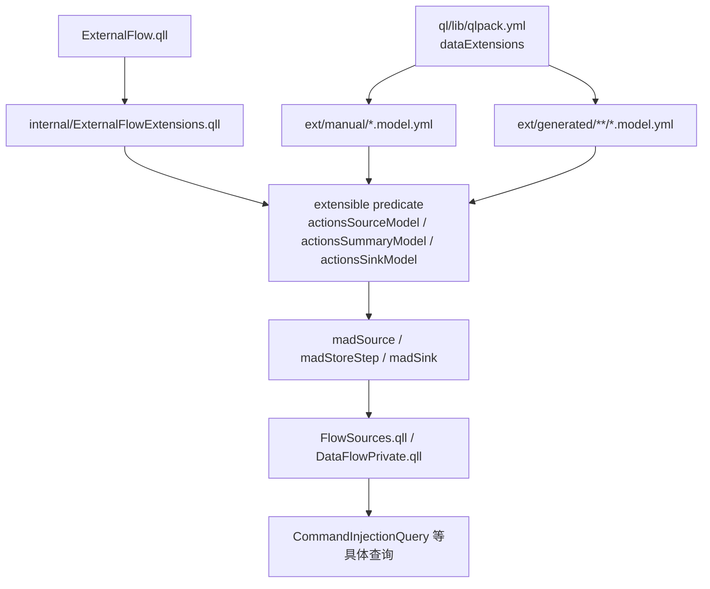

# `ExternalFlow.qll` 是如何溯源到 data extension YAML 的

> 目标文件：`/home/nyn/Desktop/Projects/SAST/sast_tools/codeql/actions/ql/lib/codeql/actions/dataflow/ExternalFlow.qll`  
> 这篇笔记只做一件事：从这个文件出发，层层往上追，证明它到底有没有用 data extension；如果用了，具体怎么一路连到 `qlpack.yml` 和 `.yml` 数据文件；最后再解释这些 YAML 行为什么真的会变成 CodeQL 分析里的 source / sink / step。

---

## 记忆卡片摘要

### 一句话结论

`ExternalFlow.qll` **确实用了 data extension**，但不是“直接读 YAML 文件”，而是通过 3 个 `extensible predicate` 间接使用：

- `actionsSourceModel(...)`
- `actionsSummaryModel(...)`
- `actionsSinkModel(...)`

它们声明在 `internal/ExternalFlowExtensions.qll`，真正的数据来自：

- `ql/lib/ext/manual/*.model.yml`
- `ql/lib/ext/generated/**/*.model.yml`

这些路径又是由 `ql/lib/qlpack.yml` 的 `dataExtensions:` 字段注册的。

### 溯源总路线

1. `ExternalFlow.qll` 调用 `Extensions::actionsSourceModel / actionsSummaryModel / actionsSinkModel`
2. `internal/ExternalFlowExtensions.qll` 把这 3 个谓词声明成 `extensible predicate`
3. `qlpack.yml` 用 `dataExtensions:` 声明要加载哪些 `.yml`
4. `ext/manual/*.model.yml` 和 `ext/generated/**/*.model.yml` 往这些谓词里加数据
5. `codeql resolve extensions` 证明这些 `.yml` 已经被解析进 `actionsSourceModel / actionsSummaryModel / actionsSinkModel`
6. `ExternalFlow.qll` 再把这些数据翻译成：
   - `madSource`
   - `madStoreStep`
   - `madSink`
7. 其他库文件和安全查询继续消费它们，真正让分析“跑起来”

### 最重要的理解

可以把机制想成 4 层：

- 第 1 层：`ExternalFlow.qll`
  像“翻译器”，把静态数据模型翻译成数据流规则
- 第 2 层：`extensible predicate`
  像“预留插槽”
- 第 3 层：`qlpack.yml`
  像“装载清单”
- 第 4 层：`.model.yml`
  像“往插槽里填表格行”

### 溯源图（Mermaid）



---

## 1. 先直接回答：`ExternalFlow.qll` 到底有没有用 data extension？

有。

最硬的证据就在文件开头：

```ql
private import internal.ExternalFlowExtensions as Extensions
```

然后下面 3 个谓词都只是转发：

```ql
predicate actionsSourceModel(
  string action, string version, string output, string kind, string provenance
) {
  Extensions::actionsSourceModel(action, version, output, kind, provenance)
}

predicate actionsSummaryModel(
  string action, string version, string input, string output, string kind, string provenance
) {
  Extensions::actionsSummaryModel(action, version, input, output, kind, provenance)
}

predicate actionsSinkModel(
  string action, string version, string input, string kind, string provenance
) {
  Extensions::actionsSinkModel(action, version, input, kind, provenance)
}
```

这说明：

- `ExternalFlow.qll` 自己没有把 source/sink/summary 写死在代码里
- 它依赖 `internal.ExternalFlowExtensions.qll` 提供这些数据

这就是第一层“间接使用 data extension”的证据。

### 非科班版理解

你可以把 `ExternalFlow.qll` 理解成一个“规则解释器”。

它不会自己说：

- 哪个 Action 的哪个 output 是 source
- 哪个 Action 的哪个 input 是 sink
- 哪个 Action 会把 input 写进 env/output

它只会说：

> “如果有人把这些信息填到 `actionsSourceModel / actionsSummaryModel / actionsSinkModel` 里，我就按这些信息构造数据流规则。”

所以，`ExternalFlow.qll` 用 data extension 的方式，不是“读 YAML 文本”，而是“读 extensible predicate 里已经注入好的行”。

---

## 2. 第一跳：从 `ExternalFlow.qll` 追到 `ExternalFlowExtensions.qll`

路径：

- `ExternalFlow.qll`
- `internal/ExternalFlowExtensions.qll`

`internal/ExternalFlowExtensions.qll` 内容非常关键：

```ql
extensible predicate actionsSourceModel(
  string action, string version, string output, string kind, string provenance
);

extensible predicate actionsSummaryModel(
  string action, string version, string input, string output, string kind, string provenance
);

extensible predicate actionsSinkModel(
  string action, string version, string input, string kind, string provenance
);
```

这一步说明了两件事：

1. `ExternalFlow.qll` 用的确实不是普通谓词，而是 **extensible predicate**
2. 这 3 个谓词天然支持被 data extension YAML 追加数据

### 什么叫 `extensible predicate`？

非科班比喻：

- 普通 predicate 像“写死在程序里的函数”
- extensible predicate 像“程序里预留好的空表”

CodeQL 允许你用 YAML 往这个空表里继续加行。

所以这里的 3 个 `actions*Model` 可以理解为 3 张表：

- `actionsSourceModel`
  记录“哪些 Action 输出是 source”
- `actionsSummaryModel`
  记录“哪些 Action 会把哪个输入传播到哪个输出或环境变量”
- `actionsSinkModel`
  记录“哪些 Action 输入位置是危险 sink”

---

## 3. 第二跳：从 `extensible predicate` 追到 `qlpack.yml`

只声明 `extensible predicate` 还不够。  
还要有地方告诉 CodeQL：

> “你应该去哪些 `.yml` 文件里找可以注入这些 predicate 的数据。”

这个地方就是：

`/home/nyn/Desktop/Projects/SAST/sast_tools/codeql/actions/ql/lib/qlpack.yml`

关键内容：

```yaml
name: codeql/actions-all
version: 0.4.28-dev
library: true
...
dataExtensions:
  - ext/manual/*.model.yml
  - ext/generated/**/*.model.yml
  - ext/config/*.yml
```

这一步是整个机制里最容易被忽略、但最关键的一跳。

### `dataExtensions:` 到底在做什么？

它不是“定义模型内容”，而是“声明加载路径”。

可以把它想成：

- `ExternalFlowExtensions.qll`：先准备 3 个空插槽
- `qlpack.yml`：再说“去这几个目录里找填这些插槽的数据”

换句话说：

- `extensible predicate` 决定“**能不能被扩展**”
- `dataExtensions:` 决定“**去哪里找扩展数据**”

### 为什么这里有 3 组路径？

因为这个 pack 里不只 `ExternalFlow.qll` 一种模型：

- `ext/manual/*.model.yml`
  手工维护的模型
- `ext/generated/**/*.model.yml`
  自动生成的模型
- `ext/config/*.yml`
  其他配置型 data model，比如事件映射、危险命令等

这也解释了一个常见误区：

> data extension 不一定只服务某一个 `.qll` 文件。  
> 一个 pack 里可以有很多不同的 extensible predicate，都共用 `dataExtensions:` 机制。

---

## 4. 第三跳：从 `qlpack.yml` 追到具体 `.yml`

现在我们已经知道：

- `ExternalFlow.qll` 依赖 3 个 extensible predicate
- `qlpack.yml` 会加载 `ext/manual/*.model.yml`、`ext/generated/**/*.model.yml`

接下来要看的就是：

> 这些目录里，到底有没有 `.yml` 真正在往 `actionsSourceModel / actionsSummaryModel / actionsSinkModel` 填数据？

答案是：有，而且很多。

### 4.1 一个最简单的 source 例子

文件：

`ext/manual/karpikpl_list-changed-files-action.model.yml`

内容：

```yaml
extensions:
  - addsTo:
      pack: codeql/actions-all
      extensible: actionsSourceModel
    data:
      - ["karpikpl/list-changed-files-action", "*", "output.changed_files", "filename", "manual"]
```

这 1 行 tuple 对应 `actionsSourceModel` 的 5 个参数：

```ql
actionsSourceModel(action, version, output, kind, provenance)
```

所以逐列对应就是：

1. `action = "karpikpl/list-changed-files-action"`
2. `version = "*"`
3. `output = "output.changed_files"`
4. `kind = "filename"`
5. `provenance = "manual"`

### 非科班版理解

这行 YAML 的意思是：

> “如果 workflow 里用了 `karpikpl/list-changed-files-action`，那它的 `changed_files` 这个 output，要被当成一种 source，而且 source 类型叫 `filename`。”

这不是在说“整个 action 都是危险的”。  
它说的是：

- 这个 action 的某个 **具体输出槽位**
- 是数据流分析里应该关心的 source

---

### 4.2 一个 summary + sink 混合例子

文件：

`ext/manual/bufbuild_buf-breaking-action.model.yml`

内容：

```yaml
extensions:
  - addsTo:
      pack: codeql/actions-all
      extensible: actionsSummaryModel
    data:
      - ["bufbuild/buf-breaking-action", "*", "input.buf_token", "env.BUF_TOKEN", "taint", "manual"]
  - addsTo:
      pack: codeql/actions-all
      extensible: actionsSinkModel
    data:
      - ["bufbuild/buf-breaking-action", "*", "input.input", "command-injection", "manual"]
      - ["bufbuild/buf-breaking-action", "*", "input.against", "command-injection", "manual"]
```

这说明同一个 `.yml` 文件可以同时往两个不同的 extensible predicate 填数据：

- 一部分填 `actionsSummaryModel`
- 一部分填 `actionsSinkModel`

### 逐列解释 `actionsSummaryModel`

谓词签名：

```ql
actionsSummaryModel(action, version, input, output, kind, provenance)
```

tuple：

```yaml
["bufbuild/buf-breaking-action", "*", "input.buf_token", "env.BUF_TOKEN", "taint", "manual"]
```

对应关系：

1. `action = "bufbuild/buf-breaking-action"`
2. `version = "*"`
3. `input = "input.buf_token"`
4. `output = "env.BUF_TOKEN"`
5. `kind = "taint"`
6. `provenance = "manual"`

人话：

> 这个 action 的 `buf_token` 输入，会以 taint 的方式流进环境变量 `BUF_TOKEN`。

### 逐列解释 `actionsSinkModel`

谓词签名：

```ql
actionsSinkModel(action, version, input, kind, provenance)
```

tuple：

```yaml
["bufbuild/buf-breaking-action", "*", "input.input", "command-injection", "manual"]
```

人话：

> 如果这个 action 的 `input` 参数可控，那它属于 `command-injection` 类 sink。

---

### 4.3 一个 generated 目录下的例子

文件：

`ext/generated/composite-actions/googlecloudplatform_dataflowtemplates.model.yml`

内容：

```yaml
extensions:
  - addsTo:
      pack: codeql/actions-all
      extensible: actionsSinkModel
    data:
     - ["googlecloudplatform/magic-modules", "*", "input.repo", "code-injection", "generated"]
  - addsTo:
      pack: codeql/actions-all
      extensible: actionsSourceModel
    data:
     - ["googlecloudplatform/magic-modules", "*", "output.changed-files", "filename", "manual"]
```

这个例子说明：

- `ext/generated` 里的文件也和 `ext/manual` 一样，会直接往同一批 extensible predicate 注入数据
- 区别主要是来源与维护方式，不是机制不同

---

## 5. 第四跳：怎么证明这些 `.yml` 真的被加载了？

看源码还不够，还要看 CodeQL 自己的“装载结果”。

我在当前环境执行了：

```bash
codeql resolve extensions /home/nyn/Desktop/Projects/SAST/sast_tools/codeql/actions/ql/lib
```

它输出的是一份 JSON，里面明确列出了：

- 哪个 predicate
- 来自哪个 `.yml`
- 一共加载了多少行

### 5.1 机器证据：source 例子被加载了

从 `/tmp/actions-resolve-extensions.json` 可见：

```json
{
  "predicate" : "actionsSourceModel",
  "file" : "/home/nyn/Desktop/Projects/SAST/sast_tools/codeql/actions/ql/lib/ext/manual/karpikpl_list-changed-files-action.model.yml",
  "rowCount" : 1
}
```

这就把 3 件事钉死了：

1. 这个 `.yml` 的确被 `qlpack.yml` 找到了
2. 它的内容被注入到了 `actionsSourceModel`
3. 注入行数是 1

### 5.2 机器证据：summary + sink 例子也被加载了

同一份输出里还有：

```json
{
  "predicate" : "actionsSummaryModel",
  "file" : "/home/nyn/Desktop/Projects/SAST/sast_tools/codeql/actions/ql/lib/ext/manual/bufbuild_buf-breaking-action.model.yml",
  "rowCount" : 1
}
{
  "predicate" : "actionsSinkModel",
  "file" : "/home/nyn/Desktop/Projects/SAST/sast_tools/codeql/actions/ql/lib/ext/manual/bufbuild_buf-breaking-action.model.yml",
  "rowCount" : 2
}
```

这说明：

- 这份 `.yml` 里两个 `addsTo` 块都生效了
- summary 行 1 条
- sink 行 2 条

### 非科班版理解

如果把 `.qll` 想成程序，把 `.yml` 想成配置表，那 `codeql resolve extensions` 就像：

> “把程序启动后实际读到了哪些配置表，列给你看。”

它不是推理，不是猜测，而是当前 pack 的真实装载结果。

---

## 6. 到这里还不够：`ExternalFlow.qll` 怎么把这些行变成真正的数据流规则？

现在我们已经证明：

- 有 extensible predicate
- 有 `dataExtensions:` 路径
- 有具体 `.yml`
- 有 CLI 证明这些 `.yml` 被加载进 predicate

但用户真正关心的通常是最后一步：

> “这些行为什么会让分析结果改变？”

答案就在 `ExternalFlow.qll` 的 3 个核心谓词里：

- `madSource`
- `madStoreStep`
- `madSink`

---

## 7. `madSource`：YAML 里的 source 行，怎样变成真正的 source？

关键代码（简化理解）：

```ql
predicate madSource(DataFlow::Node source, string kind, string fieldName) {
  exists(Uses uses, string action, string version |
    actionsSourceModel(action, version, fieldName, kind, _) and
    uses.getCallee() = action.toLowerCase() and
    ...
  )
}
```

这段逻辑做了几件事：

1. 从 `actionsSourceModel(...)` 里拿一行
2. 找当前 workflow 里有没有 `uses:` 调用到了同名 action
3. 版本是否匹配
4. 看 `fieldName` 前缀是 `env.` 还是 `output.`
5. 决定 source 节点到底落在哪个 AST / dataflow node 上

### 7.1 用 `karpikpl/list-changed-files-action` 这个例子逐步跑一遍

YAML 行：

```yaml
["karpikpl/list-changed-files-action", "*", "output.changed_files", "filename", "manual"]
```

#### 第一步：action 名称匹配

`madSource` 会检查：

```ql
uses.getCallee() = action.toLowerCase()
```

也就是：

- workflow 里的某个 `uses:` 步骤
- 必须真的是 `karpikpl/list-changed-files-action`

#### 第二步：版本匹配

这行里版本是 `*`，所以逻辑是：

- 任意版本都接受

#### 第三步：看 output 还是 env

这行的 `fieldName = "output.changed_files"`

所以会走 `output.%` 分支：

```ql
fieldName.trim().matches("output.%") and
source.asExpr() = uses
```

这一步很怪，第一次看很容易不明白：

- 为什么 source 节点不是某个“具体 output 表达式”
- 而是整个 `uses` 步骤本身？

答案要结合下一步。

---

## 8. 一个非常关键的细节：为什么 `output.*` source 先落在整个 `uses` 步骤上？

答案在 `DataFlowPrivate.qll` 里。

它有专门的“补读”规则：

```ql
predicate stepsCtxLocalStep(Node nodeFrom, Node nodeTo) {
  exists(Uses astFrom, StepsExpression astTo |
    madSource(nodeFrom, _, "output." + ["*", astTo.getFieldName()]) and
    astFrom = nodeFrom.asExpr() and
    astTo = nodeTo.asExpr() and
    astTo.getTarget() = astFrom
  )
}
```

注释写得很直白：

> 因为当前没法直接把 source 声明成“从非空 access path 开始”，所以先把 source 放在 step 节点上，再额外补一个 local flow step，模拟从 step 读出具体 output 字段。

### 非科班版比喻

把一个 Action 步骤想成一个大箱子，箱子里有很多格子：

- `output.changed_files`
- `output.foo`
- `output.bar`

现在 data extension 的 source 机制不方便直接说：

> “第 3 格是 source”

所以它采取折中办法：

1. 先把“整个箱子”标成可能有 source
2. 再额外加一条规则说：
   “当有人去读 `changed_files` 这个格子时，就把 taint 从箱子导到这个格子”

这就是 `madSource + stepsCtxLocalStep/needsCtxLocalStep` 的组合机制。

---

## 9. `madStoreStep`：YAML 里的 summary 行，怎样变成数据流里的“写入一步”？

关键代码：

```ql
predicate madStoreStep(DataFlow::Node pred, DataFlow::Node succ, DataFlow::ContentSet c) {
  exists(Uses uses, string action, string version, string input, string output |
    actionsSummaryModel(action, version, input, output, "taint", _) and
    c = any(DataFlow::FieldContent ct | ct.getName() = output.replaceAll("output.", "")) and
    uses.getCallee() = action.toLowerCase() and
    ...
    succ.asExpr() = uses
  )
}
```

这里最重要的 3 个点：

1. 它只消费 `actionsSummaryModel(..., "taint", ...)`
2. 它把 summary 行翻译成“store step”
3. 这个 step 会把 taint 写进某个带字段名的内容槽位 `ContentSet`

### 9.1 用 `bufbuild/buf-breaking-action` 的 summary 行跑一遍

YAML：

```yaml
["bufbuild/buf-breaking-action", "*", "input.buf_token", "env.BUF_TOKEN", "taint", "manual"]
```

#### 第一步：挑出这行

`madStoreStep` 只看：

```ql
actionsSummaryModel(action, version, input, output, "taint", _)
```

所以：

- 这行会被消费
- 如果某行 kind 不是 `"taint"`，就不会被这个谓词消费

这是一个很重要的观察点：

> 就 `ExternalFlow.qll` 这个文件本身而言，它只拿 taint 类 summary 去建 `madStoreStep`。

#### 第二步：把 output 名字变成一个“带标签的格子”

```ql
c = any(DataFlow::FieldContent ct | ct.getName() = output.replaceAll("output.", ""))
```

如果 output 是：

- `output.foo`

那么会变成字段名 `foo`。

如果 output 是：

- `env.BUF_TOKEN`

这个文件这里没有剥掉 `env.`，所以你可以把 `ContentSet` 粗略理解为：

> “在这个 action 步骤上，给某个命名槽位记一笔：这里写入了 tainted 内容。”

#### 第三步：决定 pred 是谁

`madStoreStep` 对输入前缀分别处理：

- `env.%`
  从 action 所在作用域里的环境变量表达式取值
- `input.%`
  从 action 的 `with:` 参数表达式取值
- `artifact`
  从特殊的 artifact download step 取值

在这个例子里：

- `input = "input.buf_token"`

所以 pred 会落在：

```ql
uses.getArgumentExpr("buf_token")
```

也就是：

> 这个 action 的 `with: buf_token: ...` 对应的表达式

#### 第四步：决定 succ 是谁

```ql
succ.asExpr() = uses
```

也就是说，写入动作发生在这个 action 步骤本身。

### 非科班版比喻

`madStoreStep` 像是在说：

> “把这个输入值，塞进这个 action 步骤盒子上的某个标记槽位里。”

后面其他规则再从盒子上的某个槽位把值读出来。

---

## 10. `madStoreStep` 为什么能真的进入全局数据流？

还要再看一跳：

`DataFlowPrivate.qll` 里的 `storeStep(...)`：

```ql
predicate storeStep(Node node1, ContentSet c, Node node2) {
  fieldStoreStep(node1, node2, c) or
  madStoreStep(node1, node2, c) or
  envToOutputStoreStep(node1, node2, c) or
  ...
}
```

这说明：

- `madStoreStep` 不是孤零零的辅助 predicate
- 它被接进了 Actions 数据流引擎使用的核心 `storeStep`

也就是说，一旦 YAML 行命中 `madStoreStep`：

- 它就不再只是“一个普通布尔谓词”
- 它会进入真正的 store/read 数据流语义里

### 非科班版理解

前面 `madStoreStep` 只是把“buf_token 会流进 env.BUF_TOKEN”翻译成了一条中间规则。  
而 `storeStep` 这一步相当于把这条中间规则正式接入“全局水管系统”。

没有这一跳，YAML 行只是“被看见了”；  
有了这一跳，它才真正“开始导水”。

---

## 11. `madSink`：YAML 里的 sink 行，怎样变成查询真正使用的 sink？

关键代码：

```ql
predicate madSink(DataFlow::Node sink, string kind) {
  exists(Uses uses, string action, string version, string input |
    actionsSinkModel(action, version, input, kind, _) and
    uses.getCallee() = action.toLowerCase() and
    ...
  )
}
```

### 用 `bufbuild/buf-breaking-action` 的 sink 行跑一遍

YAML：

```yaml
["bufbuild/buf-breaking-action", "*", "input.input", "command-injection", "manual"]
```

它的意思是：

- 如果 workflow 里用了 `bufbuild/buf-breaking-action`
- 那么它的 `input` 这个参数位置
- 对 `command-injection` 查询来说是 sink

`madSink` 的逻辑会把：

```ql
input.trim().matches("input.%") and
sink.asExpr() = uses.getArgumentExpr(input.trim().replaceAll("input.", ""))
```

翻译成：

- sink 节点就是 `with: input: ...` 对应的表达式

### 最后一跳：安全查询如何消费 `madSink`

例如：

`codeql/actions/security/CommandInjectionQuery.qll`

```ql
private class CommandInjectionSink extends DataFlow::Node {
  CommandInjectionSink() { madSink(this, "command-injection") }
}
```

这就把 data extension 中的 YAML 行，直接接进了命令注入查询。

#### 非科班版理解

`madSink(this, "command-injection")` 可以直白理解为：

> “凡是被外部模型标成 command-injection sink 的地方，都算这个查询的 sink。”

所以 YAML 不是“给文档看的元数据”，而是实打实参与 query 逻辑的。

---

## 12. `madSource` 怎样进入真正的 source 集合？

看：

`codeql/actions/dataflow/FlowSources.qll`

```ql
class MaDSource extends RemoteFlowSource {
  string sourceType;

  MaDSource() { madSource(this, sourceType, _) }

  override string getSourceType() { result = sourceType }
}
```

这一步相当于说：

- 只要 `madSource(...)` 成立
- 这个节点就会成为 `MaDSource`
- 而 `MaDSource` 又是 `RemoteFlowSource`

接着再看某个具体查询，比如 `CommandInjectionQuery.qll`：

```ql
predicate isSource(DataFlow::Node source) { source instanceof RemoteFlowSource }
```

这说明：

- 由 YAML 产生的 `madSource`
- 会变成 `MaDSource`
- `MaDSource` 属于 `RemoteFlowSource`
- `RemoteFlowSource` 再被具体安全查询当作 source

所以 source 这条链完整是：

`YAML 行 -> actionsSourceModel -> madSource -> MaDSource -> RemoteFlowSource -> 具体查询的 source`

---

## 13. 这一套机制到底在声明什么、应用什么？

到这里我们可以把 CodeQL data extension 机制拆成两个阶段。

### 13.1 声明阶段

声明阶段解决：

> “有哪些扩展点？去哪里读扩展数据？”

对应文件：

- `internal/ExternalFlowExtensions.qll`
  声明 3 个 `extensible predicate`
- `ql/lib/qlpack.yml`
  声明 `dataExtensions:` 路径
- `ext/**/*.yml`
  提供具体行

### 13.2 应用阶段

应用阶段解决：

> “这些行进入分析后，具体改变了哪些数据流规则？”

对应文件：

- `ExternalFlow.qll`
  把行翻译成 `madSource / madStoreStep / madSink`
- `FlowSources.qll`
  把 `madSource` 接成真正 source
- `DataFlowPrivate.qll`
  把 `madStoreStep` 接成真正 store step，并为 output/env 补本地读写规则
- `CommandInjectionQuery.qll` 等安全查询
  把 `madSink(..., "<kind>")` 接成真正 sink

### 最简总结

可以把整个过程记成一句话：

> YAML 负责“填表”，`ExternalFlow.qll` 负责“读表并翻译成规则”，数据流引擎和具体查询负责“真正使用这些规则”。

---

## 14. 为什么这套设计很合理？

如果没有 data extension，这个 pack 就只能把所有 Action 模型硬编码进 `.qll`：

- 每新增一个 Action，就得改 QL 代码
- 很难区分手工模型、自动模型、配置模型
- 很难单独做版本管理和批量生成

用了 data extension 之后：

- `.qll` 负责机制
- `.yml` 负责数据
- `qlpack.yml` 负责装载

这就是非常典型的“代码写规则，数据写事实”。

对非科班来说，可以把它想成：

- `.qll` = Excel 公式
- `.yml` = Excel 数据表
- `qlpack.yml` = 告诉程序去哪张表读数据

---

## 15. 最后给一个“从头走到尾”的完整例子

我们用这 3 行 YAML 做一条完整故事线：

```yaml
["karpikpl/list-changed-files-action", "*", "output.changed_files", "filename", "manual"]
["bufbuild/buf-breaking-action", "*", "input.buf_token", "env.BUF_TOKEN", "taint", "manual"]
["bufbuild/buf-breaking-action", "*", "input.input", "command-injection", "manual"]
```

### 第一步：被加载

`qlpack.yml` 的 `dataExtensions:` 路径把对应 `.yml` 文件纳入 pack。

### 第二步：被注入

这些行进入：

- `actionsSourceModel`
- `actionsSummaryModel`
- `actionsSinkModel`

### 第三步：被翻译

`ExternalFlow.qll` 翻译成：

- `madSource`
- `madStoreStep`
- `madSink`

### 第四步：被接入分析

- `madSource -> MaDSource -> RemoteFlowSource`
- `madStoreStep -> storeStep`
- `madSink -> CommandInjectionSink`

### 第五步：真的影响结果

当 workflow 里存在匹配的 `uses:` step 时：

- 某些 output 会成为 source
- 某些 input 会被当成 sink
- 某些 input 到 env/output 的传播会被建成 taint step

这就是 `ExternalFlow.qll` 用 data extension 的完整闭环。

---

## 16. 结论

### 结论 1

`ExternalFlow.qll` **确实用了 data extension**。

但方式不是直接打开 `.yml` 文件，而是：

- 通过 `internal.ExternalFlowExtensions.qll` 里的 3 个 `extensible predicate`
- 读取已经由 CodeQL pack 机制注入好的数据

### 结论 2

从 `ExternalFlow.qll` 往上追，完整路径是：

1. `ExternalFlow.qll`
2. `internal/ExternalFlowExtensions.qll`
3. `ql/lib/qlpack.yml` 的 `dataExtensions:`
4. `ext/manual/*.model.yml`、`ext/generated/**/*.model.yml`
5. `codeql resolve extensions` 的装载结果

### 结论 3

从 “声明” 到 “应用” 的完整机制是：

1. `.qll` 先声明 extensible predicate
2. `qlpack.yml` 告诉 CodeQL 去哪些 `.yml` 里找数据
3. `.yml` 用 `addsTo + extensible + data` 填行
4. CodeQL 在 pack 解析阶段把这些行注入 predicate
5. `ExternalFlow.qll` 把这些行翻译成 source/store/sink 规则
6. 其他数据流库和安全查询继续消费这些规则

---

## 参考来源与验证

### 本地源码

- `/home/nyn/Desktop/Projects/SAST/sast_tools/codeql/actions/ql/lib/codeql/actions/dataflow/ExternalFlow.qll`
- `/home/nyn/Desktop/Projects/SAST/sast_tools/codeql/actions/ql/lib/codeql/actions/dataflow/internal/ExternalFlowExtensions.qll`
- `/home/nyn/Desktop/Projects/SAST/sast_tools/codeql/actions/ql/lib/qlpack.yml`
- `/home/nyn/Desktop/Projects/SAST/sast_tools/codeql/actions/ql/lib/ext/manual/karpikpl_list-changed-files-action.model.yml`
- `/home/nyn/Desktop/Projects/SAST/sast_tools/codeql/actions/ql/lib/ext/manual/bufbuild_buf-breaking-action.model.yml`
- `/home/nyn/Desktop/Projects/SAST/sast_tools/codeql/actions/ql/lib/ext/generated/composite-actions/googlecloudplatform_dataflowtemplates.model.yml`
- `/home/nyn/Desktop/Projects/SAST/sast_tools/codeql/actions/ql/lib/codeql/actions/dataflow/FlowSources.qll`
- `/home/nyn/Desktop/Projects/SAST/sast_tools/codeql/actions/ql/lib/codeql/actions/dataflow/internal/DataFlowPrivate.qll`
- `/home/nyn/Desktop/Projects/SAST/sast_tools/codeql/actions/ql/lib/codeql/actions/security/CommandInjectionQuery.qll`

### 本地命令验证

- `codeql resolve extensions /home/nyn/Desktop/Projects/SAST/sast_tools/codeql/actions/ql/lib`
- 结果已保存到：
  `/tmp/actions-resolve-extensions.json`
- Mermaid 溯源图已编译为：
  `/tmp/externalflow-trace.svg`

### 官方补充文档

- CodeQL data extensions / model pack 总体机制：
  <https://codeql.github.com/docs/codeql-language-guides/customizing-library-models-for-java-and-kotlin/>
- CodeQL pack 与 `dataExtensions:` 的总说明：
  <https://docs.github.com/en/code-security/codeql-cli/using-the-advanced-functionality-of-the-codeql-cli/creating-and-working-with-codeql-packs>
