# CodeQL Java 主要类/接口继承树（从 `Top` 出发）

- 文档来源：CodeQL Java/Kotlin 标准库文档（`codeql/java-all 8.1.0`）
- 索引页：https://codeql.github.com/codeql-standard-libraries/java/index.html
- 访问日期：2026-03-07
- 说明：CodeQL 存在多重继承（例如 `Field` 同时出现在 `Member` / `Variable` / `ExprParent` 分支）。下图为“主干版”继承树，仅保留主要类与接口语义节点。

```text
Top
├─ Container
│  ├─ File
│  └─ Folder
├─ Element
│  ├─ Member
│  │  ├─ Field            (also in Variable / ExprParent)
│  │  ├─ Callable
│  │  │  ├─ Constructor
│  │  │  └─ Method
│  │  └─ MemberType       (also in NestedType)
│  ├─ Variable
│  │  ├─ Field            (shared)
│  │  └─ LocalScopeVariable
│  │     ├─ LocalVariableDecl
│  │     └─ Parameter      (also direct subtype of Element)
│  ├─ Type
│  │  ├─ PrimitiveType
│  │  ├─ BooleanType
│  │  ├─ CharacterType
│  │  ├─ IntegralType
│  │  ├─ FloatingPointType
│  │  ├─ NumericType
│  │  ├─ NullType
│  │  ├─ VoidType
│  │  └─ RefType
│  │     ├─ Array
│  │     ├─ ClassOrInterface
│  │     │  ├─ Class
│  │     │  │  ├─ EnumType
│  │     │  │  ├─ Record
│  │     │  │  ├─ TopLevelClass
│  │     │  │  └─ NestedClass
│  │     │  │     └─ LocalClass (shared with LocalClassOrInterface)
│  │     │  ├─ Interface
│  │     │  │  ├─ AnnotationType
│  │     │  │  └─ FunctionalInterface
│  │     │  ├─ GenericType
│  │     │  │  ├─ GenericClass
│  │     │  │  └─ GenericInterface
│  │     │  └─ ParameterizedType
│  │     │     ├─ ParameterizedClass
│  │     │     └─ ParameterizedInterface
│  │     ├─ RawType
│  │     │  ├─ RawClass
│  │     │  └─ RawInterface
│  │     ├─ BoundedType
│  │     │  ├─ TypeVariable
│  │     │  └─ Wildcard
│  │     ├─ TopLevelType
│  │     │  └─ TopLevelClass
│  │     ├─ NestedType
│  │     │  ├─ LocalClassOrInterface
│  │     │  │  └─ LocalClass
│  │     │  └─ MemberType
│  │     └─ IntersectionType
│  ├─ CompilationUnit
│  ├─ Import
│  ├─ Package
│  ├─ Annotatable
│  ├─ Modifiable
│  └─ Exception
├─ ExprParent
│  ├─ Call
│  │  ├─ ConstructorCall
│  │  │  ├─ ClassInstanceExpr
│  │  │  ├─ SuperConstructorInvocationStmt (shared with Stmt)
│  │  │  └─ ThisConstructorInvocationStmt  (shared with Stmt)
│  │  └─ MethodCall
│  ├─ Expr
│  │  ├─ Literal
│  │  ├─ Assignment
│  │  ├─ BinaryExpr
│  │  ├─ UnaryExpr
│  │  ├─ VarAccess
│  │  ├─ SwitchExpr        (shared with StmtParent)
│  │  └─ WhenExpr          (shared with StmtParent)
│  ├─ Field              (shared)
│  ├─ FieldDeclaration
│  └─ Stmt
├─ StmtParent
│  ├─ Callable           (shared)
│  ├─ Stmt
│  │  ├─ ConditionalStmt
│  │  │  ├─ IfStmt
│  │  │  ├─ ForStmt
│  │  │  ├─ WhileStmt
│  │  │  └─ DoStmt
│  │  ├─ JumpStmt
│  │  │  ├─ BreakStmt
│  │  │  ├─ ContinueStmt
│  │  │  └─ YieldStmt
│  │  ├─ ReturnStmt
│  │  ├─ ThrowStmt
│  │  ├─ TryStmt
│  │  ├─ SwitchStmt
│  │  └─ SwitchCase
│  ├─ SwitchBlock
│  ├─ SwitchExpr           (shared with Expr)
│  └─ WhenExpr             (shared with Expr)
├─ JavadocParent
│  ├─ Javadoc
│  └─ JavadocTag
├─ JavadocElement
│  ├─ JavadocTag
│  └─ JavadocText
├─ KtComment
├─ CryptoAlgoSpec
├─ EntryPoint
└─ PermissionsConstruction
```

## Shared 重点（多重直接父类）

- `Field`：`ExprParent` + `Member` + `Variable`
- `Callable`：`Member` + `StmtParent`
- `Stmt`：`ExprParent` + `StmtParent`
- `SwitchExpr`：`Expr` + `StmtParent`
- `WhenExpr`：`Expr` + `StmtParent`
- `JavadocTag`：`JavadocElement` + `JavadocParent`
- `MemberType`：`Member` + `NestedType`
- `LocalClass`：`LocalClassOrInterface` + `NestedClass`
- `SuperConstructorInvocationStmt`：`ConstructorCall` + `Stmt`
- `ThisConstructorInvocationStmt`：`ConstructorCall` + `Stmt`
- `Parameter`：`Element` + `LocalScopeVariable`
- `TypeVariable`：`BoundedType` + `Modifiable`

## Mermaid 版本（主干继承树）

```mermaid
graph TD
  Top --> Container
  Container --> File
  Container --> Folder

  Top --> Element
  Element --> Member
  Member --> Field
  Member --> Callable
  Callable --> Constructor
  Callable --> Method
  Member --> MemberType

  Element --> Variable
  Variable --> Field
  Variable --> LocalScopeVariable
  LocalScopeVariable --> LocalVariableDecl
  LocalScopeVariable --> Parameter
  Element --> Parameter

  Element --> Type
  Type --> PrimitiveType
  Type --> BooleanType
  Type --> CharacterType
  Type --> IntegralType
  Type --> FloatingPointType
  Type --> NumericType
  Type --> NullType
  Type --> VoidType
  Type --> RefType

  RefType --> Array
  RefType --> ClassOrInterface
  ClassOrInterface --> ClassNode["Class"]
  ClassNode --> EnumType
  ClassNode --> Record
  ClassNode --> TopLevelClass
  ClassNode --> NestedClass
  NestedClass --> LocalClass
  ClassOrInterface --> Interface
  Interface --> AnnotationType
  Interface --> FunctionalInterface
  ClassOrInterface --> GenericType
  GenericType --> GenericClass
  GenericType --> GenericInterface
  ClassOrInterface --> ParameterizedType
  ParameterizedType --> ParameterizedClass
  ParameterizedType --> ParameterizedInterface
  RefType --> RawType
  RawType --> RawClass
  RawType --> RawInterface
  RefType --> BoundedType
  BoundedType --> TypeVariable
  Modifiable --> TypeVariable
  BoundedType --> Wildcard
  RefType --> TopLevelType
  TopLevelType --> TopLevelClass
  RefType --> NestedType
  NestedType --> LocalClassOrInterface
  LocalClassOrInterface --> LocalClass
  NestedType --> MemberType
  RefType --> IntersectionType

  Element --> CompilationUnit
  Element --> Import
  Element --> Package
  Element --> Annotatable
  Element --> Modifiable
  Element --> Exception

  Top --> ExprParent
  ExprParent --> Call
  Call --> ConstructorCall
  ConstructorCall --> ClassInstanceExpr
  ConstructorCall --> SuperConstructorInvocationStmt
  ConstructorCall --> ThisConstructorInvocationStmt
  Call --> MethodCall
  ExprParent --> Expr
  Expr --> Literal
  Expr --> Assignment
  Expr --> BinaryExpr
  Expr --> UnaryExpr
  Expr --> VarAccess
  Expr --> SwitchExpr
  Expr --> WhenExpr
  ExprParent --> Field
  ExprParent --> FieldDeclaration
  ExprParent --> Stmt

  Top --> StmtParent
  StmtParent --> Callable
  StmtParent --> Stmt
  Stmt --> ConditionalStmt
  ConditionalStmt --> IfStmt
  ConditionalStmt --> ForStmt
  ConditionalStmt --> WhileStmt
  ConditionalStmt --> DoStmt
  Stmt --> JumpStmt
  JumpStmt --> BreakStmt
  JumpStmt --> ContinueStmt
  JumpStmt --> YieldStmt
  Stmt --> ReturnStmt
  Stmt --> ThrowStmt
  Stmt --> TryStmt
  Stmt --> SwitchStmt
  Stmt --> SwitchCase
  StmtParent --> SwitchBlock
  StmtParent --> SwitchExpr
  StmtParent --> WhenExpr

  Top --> JavadocParent
  JavadocParent --> Javadoc
  JavadocParent --> JavadocTag
  Top --> JavadocElement
  JavadocElement --> JavadocTag
  JavadocElement --> JavadocText

  Top --> KtComment
  Top --> CryptoAlgoSpec
  Top --> EntryPoint
  Top --> PermissionsConstruction
```



## 关键参考页

- Top: https://codeql.github.com/codeql-standard-libraries/java/semmle/code/Location.qll/type.Location$Top.html
- Element: https://codeql.github.com/codeql-standard-libraries/java/semmle/code/java/Element.qll/type.Element$Element.html
- ExprParent / Expr:  
  https://codeql.github.com/codeql-standard-libraries/java/semmle/code/java/Expr.qll/type.Expr$ExprParent.html  
  https://codeql.github.com/codeql-standard-libraries/java/semmle/code/java/Expr.qll/type.Expr$Expr.html
- StmtParent / Stmt:  
  https://codeql.github.com/codeql-standard-libraries/java/semmle/code/java/Statement.qll/type.Statement$StmtParent.html  
  https://codeql.github.com/codeql-standard-libraries/java/semmle/code/java/Statement.qll/type.Statement$Stmt.html
- Type / RefType / ClassOrInterface:  
  https://codeql.github.com/codeql-standard-libraries/java/semmle/code/java/Type.qll/type.Type$Type.html  
  https://codeql.github.com/codeql-standard-libraries/java/semmle/code/java/Type.qll/type.Type$RefType.html  
  https://codeql.github.com/codeql-standard-libraries/java/semmle/code/java/Type.qll/type.Type$ClassOrInterface.html
- Generics 关键节点（TypeVariable / GenericType / ParameterizedType / RawType / BoundedType）:  
  https://codeql.github.com/codeql-standard-libraries/java/semmle/code/java/Generics.qll/type.Generics$TypeVariable.html  
  https://codeql.github.com/codeql-standard-libraries/java/semmle/code/java/Generics.qll/type.Generics$GenericType.html  
  https://codeql.github.com/codeql-standard-libraries/java/semmle/code/java/Generics.qll/type.Generics$ParameterizedType.html  
  https://codeql.github.com/codeql-standard-libraries/java/semmle/code/java/Generics.qll/type.Generics$RawType.html  
  https://codeql.github.com/codeql-standard-libraries/java/semmle/code/java/Generics.qll/type.Generics$BoundedType.html
- Member / Callable / Variable / Javadoc:  
  https://codeql.github.com/codeql-standard-libraries/java/semmle/code/java/Member.qll/type.Member$Member.html  
  https://codeql.github.com/codeql-standard-libraries/java/semmle/code/java/Member.qll/type.Member$Callable.html  
  https://codeql.github.com/codeql-standard-libraries/java/semmle/code/java/Variable.qll/type.Variable$Variable.html  
  https://codeql.github.com/codeql-standard-libraries/java/semmle/code/java/Javadoc.qll/type.Javadoc$JavadocParent.html
